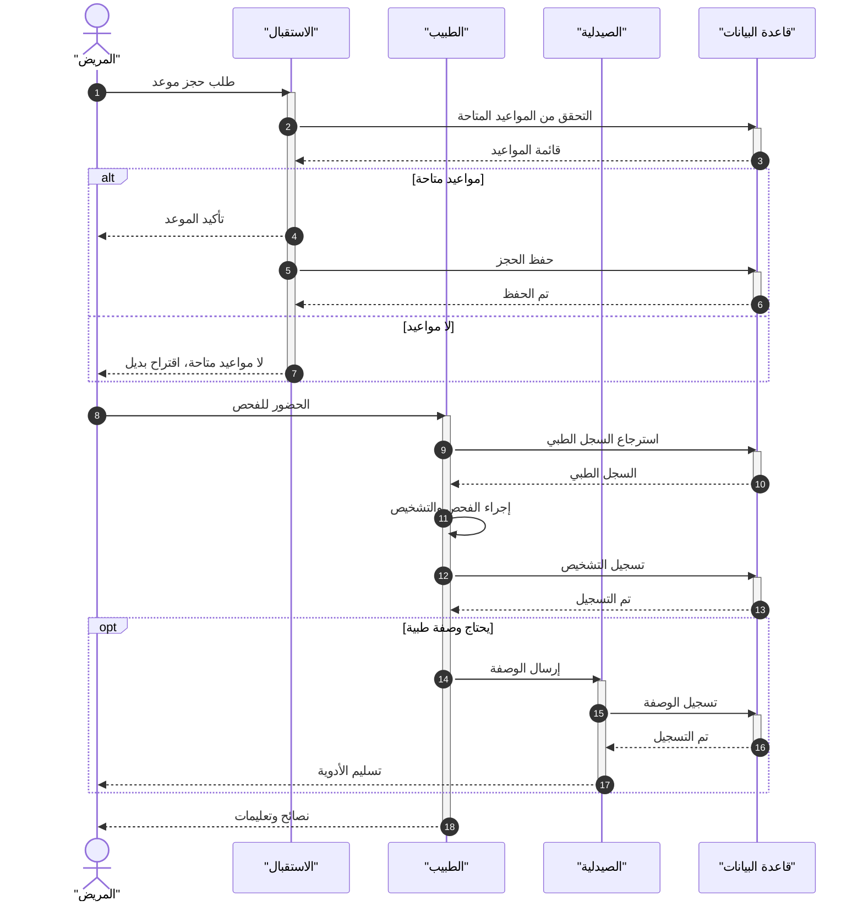
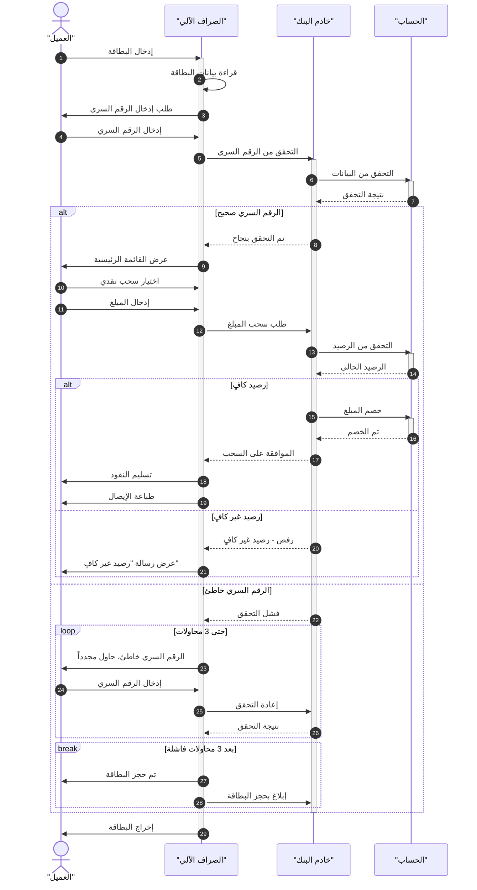

# مهارة تحويل Use Case إلى Sequence Diagram

## نظرة عامة

مخطط التسلسل (Sequence Diagram) هو نوع من مخططات التفاعل في UML يصف **كيف** و**بأي ترتيب** تعمل مجموعة من الكائنات (Objects) معاً. يركز على:
- **خطوط الحياة (Lifelines)**: العمليات والكائنات التي تعيش بشكل متزامن
- **الرسائل (Messages)**: المعلومات المتبادلة بينها لتنفيذ وظيفة معينة
- **الترتيب الزمني**: الأحداث تحدث من الأعلى إلى الأسفل

هناك نوعان:
- **Sequence Diagram العادي**: يمثل التفاعل بين كائنات داخلية متعددة
- **System Sequence Diagram (SSD)**: يعامل النظام كـ "صندوق أسود" ويركز على تفاعل الممثل الخارجي مع النظام ككتلة واحدة

---

## هيكل ملفات المهارة

```
usecase-to-sequence-diagram/
├── SKILL.md                              ← هذا الملف (التعليمات الرئيسية)
├── examples/                             ← أمثلة عملية مستقلة
│   ├── 01-hospital-management.md         ← نظام إدارة المستشفى
│   ├── 02-atm-system.md                  ← نظام الصراف الآلي
│   ├── 03-login-2fa.md                   ← تسجيل دخول مع مصادقة ثنائية
│   ├── 04-ecommerce-purchase.md          ← طلب شراء من متجر إلكتروني
│   ├── 05-flight-booking.md              ← حجز رحلة طيران (معقد)
│   └── 06-password-reset.md              ← إعادة تعيين كلمة المرور
└── references/                           ← مراجع تفصيلية
    └── mermaid-components-reference.md   ← مرجع شامل لجميع مكونات Mermaid
```

> **ملاحظة للوكيل**: عند الحاجة لتفاصيل أكثر عن مكون معين، اقرأ ملف `references/mermaid-components-reference.md`. وعند الحاجة لمثال مشابه للسيناريو المطلوب، اقرأ الملف المناسب من `examples/`.

---

## متى تستخدم هذه المهارة

استخدم هذه المهارة عندما يطلب المستخدم:
- إنشاء sequence diagram لأي عملية أو سيناريو
- تحويل use case إلى مخطط تسلسل
- توثيق تفاعل بين أنظمة أو مكونات
- نمذجة منطق إجراء معقد (تسجيل دخول، عملية شراء، سحب من ATM، إلخ)
- توثيق تدفق API أو خدمة ويب
- شرح كيف تتفاعل المكونات لإتمام عملية

---

## العناصر الأساسية لمخطط التسلسل

> **للمرجع الكامل**: اقرأ `references/mermaid-components-reference.md` للحصول على تفاصيل وأمثلة لكل مكون.

### 1. المشاركون (Participants)

| العنصر | الوصف | صيغة Mermaid |
|--------|-------|--------------|
| **كائن (Object)** | مستطيل بعنوان مسطّر — يمثل class أو نظام | `participant Name` |
| **ممثل (Actor)** | شكل عصا — كيان خارجي يتفاعل مع النظام | `actor Name` |
| **اسم مستعار** | تسمية مختصرة للعرض | `participant A as "Auth Service"` |
| **تجميع (Box)** | تجميع مشاركين مرتبطين بصرياً | `box "title" #color ... end` |
| **إنشاء ديناميكي** | مشارك يظهر أثناء التسلسل | `create participant C` |
| **تدمير** | إنهاء مشارك (✕ على خط الحياة) | `destroy C` |

**مثال التجميع:**
```
box "الخدمات الداخلية" #LightBlue
    participant API
    participant Auth
end
```

### 2. خط الحياة (Lifeline)
- خط **متقطع عمودي** يمتد لأسفل من كل مشارك
- يمثل مرور الزمن من الأعلى للأسفل
- طوله يعتمد على عدد الرسائل في التسلسل
- يُنشأ تلقائياً في Mermaid — لا تحتاج لرسمه يدوياً

### 3. صندوق التفعيل (Activation Box)
- مستطيل رفيع طويل على خط الحياة
- يمثل الفترة التي يكون فيها الكائن نشطاً (يعالج مهمة)
- كلما طالت المهمة، طال الصندوق
- **الطريقة الصريحة**: `activate Name` / `deactivate Name`
- **الطريقة المختصرة**: `Alice->>+Bob: طلب` (+ تفعّل) / `Bob-->>-Alice: رد` (- تعطّل)
- **يمكن التداخل**: تفعيل كائن وهو مفعّل أصلاً (nested activation)

### 4. أنواع الرسائل (Message Types) — القائمة الكاملة

| الرمز | الشكل | الاستخدام |
|-------|-------|-----------|
| `->` | خط صلب، سهم مفتوح | رسالة بسيطة |
| `-->` | خط متقطع، سهم مفتوح | رد بسيط |
| **`->>`** | **خط صلب، سهم مصمت** | **رسالة متزامنة** (المرسل ينتظر) |
| **`-->>`** | **خط متقطع، سهم مصمت** | **رد متزامن** |
| `-x` | خط صلب، علامة X | رسالة فاشلة/مفقودة |
| `--x` | خط متقطع، علامة X | رد فاشل/مفقود |
| **`-)`** | **خط صلب، سهم مفتوح** | **رسالة غير متزامنة** (fire-and-forget) |
| **`--)`** | **خط متقطع، سهم مفتوح** | **رد غير متزامن** |

| السيناريو العملي | السهم |
|-----------------|-------|
| استدعاء REST API | `->>` |
| رد REST API | `-->>` |
| إرسال حدث Kafka/Webhook | `-)` |
| إشعار Push/SMS/Email | `-)` |
| استعلام قاعدة بيانات | `->>` |
| رسالة timeout/فشلت | `-x` |
| رسالة ذاتية (عملية داخلية) | `A->>A:` |

### 5. الأجزاء المركبة (Combined Fragments) — القائمة الكاملة

| الجزء | الوصف | صيغة Mermaid | متى تستخدم |
|-------|-------|--------------|-----------|
| **alt/else** | اختيار حصري (if/else) | `alt ... else ... end` | مسارات نجاح/فشل |
| **opt** | اختياري (if بدون else) | `opt ... end` | خطوة قد تحدث أو لا |
| **loop** | تكرار | `loop ... end` | إعادة المحاولة، polling |
| **par/and** | تنفيذ متوازي | `par ... and ... end` | عمليات متزامنة |
| **critical/option** | منطقة حرجة + استثناء | `critical ... option ... end` | transactions |
| **break** | خروج مبكر | `break ... end` | خطأ يوقف التسلسل |
| **rect** | تمييز بصري بلون | `rect rgb(r,g,b) ... end` | تمييز مراحل |

### 6. الملاحظات (Notes)

```
note right of Alice: ملاحظة يمين
note left of Bob: ملاحظة يسار
note over Alice: ملاحظة فوق
note over Alice,Bob: ملاحظة ممتدة
note over Alice: سطر 1<br/>سطر 2   %% متعددة الأسطر
```

### 7. عناصر إضافية

| العنصر | الصيغة | الاستخدام |
|--------|--------|-----------|
| **ترقيم تلقائي** | `autonumber` | ترقيم كل رسالة |
| **تعليقات** | `%% نص` | لا تظهر في المخطط |
| **مرجع خارجي** | `ref over A,B: اسم المخطط` | الإشارة لمخطط فرعي آخر |
| **روابط تفاعلية** | `link A: Title @ URL` | روابط قابلة للنقر |
| **كلمة end محجوزة** | غلّفها: `"end"` أو `(end)` | تجنب خطأ بناء الجملة |

---

## خطوات التحويل: من Use Case إلى Sequence Diagram

### الخطوة 1: تحليل الـ Use Case

اقرأ وصف الـ use case واستخرج:

1. **العنوان**: ما هي العملية؟ (مثال: "تسجيل الدخول")
2. **المسار الرئيسي (Main Success Scenario)**: الخطوات المتسلسلة للعملية الناجحة
3. **المسارات البديلة (Alternative Paths)**: ماذا يحدث عند فشل خطوة؟
4. **الشروط المسبقة (Preconditions)**: ما الذي يجب توفره قبل البدء؟
5. **الشروط اللاحقة (Postconditions)**: ما النتيجة النهائية؟

### الخطوة 2: تحديد المشاركين (Participants)

اسأل نفسك هذه الأسئلة:

> **مَن يبدأ التفاعل؟** ← هذا هو الـ Actor الرئيسي
> **أي أنظمة أو واجهات تستقبل الطلب؟** ← هذه هي الكائنات الوسيطة
> **أي خدمات خلفية يجب أن تستجيب قبل اكتمال السيناريو؟** ← هذه كائنات داخلية

**قواعد تحديد المشاركين:**
- رتّب المشاركين من اليسار لليمين حسب **ترتيب التفاعل**
- الممثل (Actor) الخارجي يكون عادةً أقصى اليسار
- الأنظمة الداخلية/قواعد البيانات تكون أقصى اليمين
- لا تضف مشاركين لا يظهرون في أي رسالة

### الخطوة 3: تحديد الرسائل

لكل خطوة في الـ use case:

1. **مَن يرسل؟** (المصدر)
2. **مَن يستقبل؟** (الوجهة)
3. **ما المحتوى؟** (وصف الرسالة)
4. **هل ينتظر رداً؟** (متزامن `->>` أم غير متزامن `--)`)
5. **هل هناك رد؟** (استخدم `-->>` للرد)

**ملاحظة مهمة**: الكائنات يمكنها التواصل عبر المخطط ولا تحتاج أن تكون متجاورة. أي كائن يمكنه إرسال أو استقبال رسالة من أي كائن آخر.

### الخطوة 4: تحديد المسارات البديلة

- استخدم `alt/else` لحالات **إما/أو** (نجاح/فشل)
- استخدم `opt` لخطوات **اختيارية**
- استخدم `loop` لخطوات **متكررة**
- استخدم `par` لعمليات **متوازية**
- استخدم `break` لحالات **الخروج المبكر** (مثل خطأ يوقف التسلسل)

### الخطوة 5: بناء المخطط بصيغة Mermaid

اتبع هذا الهيكل:

```
sequenceDiagram
    autonumber

    %% تعريف المشاركين
    actor User as "المستخدم"
    participant UI as "واجهة المستخدم"
    participant API as "خادم API"
    participant DB as "قاعدة البيانات"

    %% المسار الرئيسي
    User->>UI: الإجراء الأول
    activate UI
    UI->>API: طلب معالجة
    activate API
    API->>DB: استعلام
    activate DB
    DB-->>API: نتيجة
    deactivate DB

    %% مسار بديل
    alt نجاح
        API-->>UI: بيانات ناجحة
        UI-->>User: عرض النتيجة
    else فشل
        API-->>UI: رسالة خطأ
        UI-->>User: عرض الخطأ
    end

    deactivate API
    deactivate UI
```

### الخطوة 6: المراجعة والتحقق

تحقق من القائمة التالية:

- [ ] كل رسالة مرسلة لها رد مناسب (إلا إذا كانت fire-and-forget)
- [ ] الرسائل مرتبة زمنياً من الأعلى للأسفل
- [ ] كل `activate` له `deactivate` مقابل
- [ ] كل `alt/opt/loop/par` له `end` مغلق
- [ ] لا يوجد مشارك بدون رسائل
- [ ] المسارات البديلة مغطاة (نجاح + فشل)
- [ ] الأسماء واضحة وتصف الوظيفة

---

## أمثلة عملية

> كل مثال موجود في ملف مستقل داخل مجلد `examples/` ويتضمن: وصف الـ use case، تحديد المشاركين، المخطط الكامل، والنقاط التعليمية.

| # | المثال | الملف | المفاهيم المغطاة |
|---|--------|-------|-----------------|
| 1 | **نظام إدارة المستشفى** | `examples/01-hospital-management.md` | `alt/else`, `opt`, `note over`, رسالة ذاتية, تعليقات |
| 2 | **نظام الصراف الآلي (ATM)** | `examples/02-atm-system.md` | `alt` متداخل, `loop`, `break`, مسارات بديلة متعددة |
| 3 | **تسجيل دخول مع 2FA** | `examples/03-login-2fa.md` | 6 مشاركين, أسماء API, `alt` متداخل, JWT Token |
| 4 | **طلب شراء إلكتروني** | `examples/04-ecommerce-purchase.md` | `par/and`, رسالة غير متزامنة `--)`, Microservices |
| 5 | **حجز رحلة طيران** | `examples/05-flight-booking.md` | `alt` ثلاثي, Rollback, Race Condition, 7 مشاركين |
| 6 | **إعادة تعيين كلمة المرور** | `examples/06-password-reset.md` | `opt`, ملاحظات أمنية, Token + Expiry, fire-and-forget |

---

## قالب سريع للبدء

### مثال 1: نظام إدارة المستشفى

**Use Case**: مريض يحجز موعداً، يتم فحصه، ويحصل على وصفة طبية.



### مثال 2: نظام ATM (الصراف الآلي)

**Use Case**: عميل يسحب مبلغاً من حسابه عبر الصراف الآلي.



### مثال 3: تسجيل دخول مع مصادقة ثنائية (2FA)

**Use Case**: مستخدم يسجل دخوله بكلمة مرور + رمز OTP.

```mermaid
sequenceDiagram
    autonumber
    actor User as "المستخدم"
    participant Browser as "المتصفح"
    participant API as "خادم API"
    participant Auth as "خدمة المصادقة"
    participant SMS as "خدمة الرسائل"
    participant DB as "قاعدة البيانات"

    User->>Browser: إدخال البريد وكلمة المرور
    activate Browser
    Browser->>API: POST /login {email, password}
    activate API
    API->>DB: البحث عن المستخدم
    activate DB
    DB-->>API: بيانات المستخدم
    deactivate DB

    API->>Auth: التحقق من كلمة المرور
    activate Auth
    Auth-->>API: نتيجة التحقق
    deactivate Auth

    alt كلمة المرور صحيحة
        API->>Auth: توليد رمز OTP
        activate Auth
        Auth->>SMS: إرسال OTP عبر رسالة نصية
        activate SMS
        SMS-->>Auth: تم الإرسال
        deactivate SMS
        Auth-->>API: في انتظار OTP
        deactivate Auth

        API-->>Browser: طلب إدخال رمز OTP
        Browser-->>User: عرض شاشة إدخال OTP

        User->>Browser: إدخال رمز OTP
        Browser->>API: POST /verify-otp {otp}
        API->>Auth: التحقق من OTP
        activate Auth

        alt OTP صحيح
            Auth-->>API: تحقق ناجح
            deactivate Auth
            API->>Auth: إنشاء JWT Token
            activate Auth
            Auth-->>API: JWT Token
            deactivate Auth
            API-->>Browser: 200 OK + Token
            Browser-->>User: توجيه للوحة التحكم
        else OTP خاطئ
            Auth-->>API: OTP غير صحيح
            deactivate Auth
            API-->>Browser: 401 Unauthorized
            Browser-->>User: رسالة خطأ
        end

    else كلمة المرور خاطئة
        API-->>Browser: 401 Unauthorized
        Browser-->>User: بيانات الدخول غير صحيحة
    end

    deactivate API
    deactivate Browser
```

### مثال 4: طلب شراء من متجر إلكتروني

**Use Case**: عميل يضيف منتجات للسلة ويكمل عملية الشراء.

```mermaid
sequenceDiagram
    autonumber
    actor Customer as "العميل"
    participant Web as "المتجر الإلكتروني"
    participant Cart as "خدمة السلة"
    participant Inventory as "خدمة المخزون"
    participant Payment as "بوابة الدفع"
    participant Order as "خدمة الطلبات"
    participant Email as "خدمة البريد"

    Customer->>Web: تصفح المنتجات
    activate Web
    Customer->>Web: إضافة منتج للسلة
    Web->>Cart: addItem(productId, qty)
    activate Cart
    Cart->>Inventory: checkStock(productId)
    activate Inventory
    Inventory-->>Cart: متوفر (الكمية)
    deactivate Inventory
    Cart-->>Web: تمت الإضافة
    deactivate Cart
    Web-->>Customer: تحديث السلة

    Customer->>Web: متابعة للدفع
    Web->>Cart: getCartSummary()
    activate Cart
    Cart-->>Web: ملخص السلة والمبلغ
    deactivate Cart
    Web-->>Customer: عرض صفحة الدفع

    Customer->>Web: إدخال بيانات الدفع
    Web->>Payment: processPayment(amount, cardDetails)
    activate Payment

    alt الدفع ناجح
        Payment-->>Web: تأكيد الدفع (transactionId)
        deactivate Payment

        par إنشاء الطلب وتحديث المخزون
            Web->>Order: createOrder(cartItems, transactionId)
            activate Order
            Order-->>Web: تأكيد الطلب (orderId)
            deactivate Order
        and
            Web->>Inventory: reserveStock(items)
            activate Inventory
            Inventory-->>Web: تم الحجز
            deactivate Inventory
        end

        Web->>Email: sendConfirmation(orderId, customerEmail)
        activate Email
        Email-->>Customer: إيصال بالبريد الإلكتروني
        deactivate Email

        Web-->>Customer: عرض صفحة "تم الطلب بنجاح"

    else فشل الدفع
        Payment-->>Web: رفض الدفع (سبب الرفض)
        deactivate Payment
        Web-->>Customer: عرض رسالة خطأ الدفع
    end

    deactivate Web
```

---

## قالب سريع للبدء

عند تلقي طلب use case، استخدم هذا القالب كنقطة بداية:

```
sequenceDiagram
    autonumber

    %% === تعريف المشاركين ===
    actor [الممثل_الرئيسي] as "[الاسم المعروض]"
    participant [النظام_1] as "[الاسم المعروض]"
    participant [النظام_2] as "[الاسم المعروض]"
    participant [قاعدة_البيانات] as "[الاسم المعروض]"

    %% === المسار الرئيسي (Main Success Scenario) ===
    [الممثل]->>+[النظام_1]: [الإجراء الأول]
    [النظام_1]->>+[النظام_2]: [طلب معالجة]
    [النظام_2]->>+[قاعدة_البيانات]: [استعلام]
    [قاعدة_البيانات]-->>-[النظام_2]: [نتيجة]

    %% === المسار البديل ===
    alt [شرط النجاح]
        [النظام_2]-->>-[النظام_1]: [نتيجة ناجحة]
        [النظام_1]-->>-[الممثل]: [عرض النجاح]
    else [شرط الفشل]
        [النظام_2]-->>-[النظام_1]: [رسالة خطأ]
        [النظام_1]-->>-[الممثل]: [عرض الخطأ]
    end
```

---

## نصائح متقدمة

### 1. التفعيل المختصر
بدلاً من كتابة `activate`/`deactivate` منفصلة:
```
Alice->>+Bob: طلب       %% + تفعّل Bob
Bob-->>-Alice: رد       %% - تعطّل Bob
```

### 2. الرسالة الذاتية (Self-Message)
عندما يعالج كائن شيئاً داخلياً:
```
Server->>Server: التحقق من صلاحية التوكن
```

### 3. التعليقات
```
%% هذا تعليق لا يظهر في المخطط
```

### 4. ترتيب المشاركين
- رتّبهم حسب **ترتيب أول تفاعل** من اليسار لليمين
- ضع الممثل الخارجي أقصى اليسار
- ضع قاعدة البيانات أو الخدمات الخلفية أقصى اليمين
- الترتيب الشائع: `User → UI → API → Service → DB`

### 5. تسمية الرسائل
- استخدم أسماء **أفعال واضحة** (مثال: `POST /login` بدلاً من `إرسال`)
- اذكر **البيانات** المهمة (مثال: `{email, password}`)
- للردود استخدم **حالة HTTP** أو **وصف النتيجة**

### 6. متى تستخدم كل نوع من الأسهم

| السيناريو | السهم |
|-----------|-------|
| استدعاء API متزامن | `->>` |
| رد API | `-->>` |
| إرسال حدث (Event/Webhook) | `--)` |
| إشعار (Notification) | `--)` |
| استعلام قاعدة بيانات | `->>` |
| رد قاعدة بيانات | `-->>` |

---

## قائمة التحقق النهائية

قبل تسليم المخطط للمستخدم، تأكد من:

- [ ] **اكتمال المشاركين**: كل طرف في العملية ممثَّل
- [ ] **اكتمال الرسائل**: كل طلب له رد مناسب
- [ ] **المسار الرئيسي**: السيناريو الناجح مكتمل من البداية للنهاية
- [ ] **المسارات البديلة**: حالات الفشل والاستثناءات مغطاة
- [ ] **الترتيب الزمني**: الرسائل مرتبة من الأعلى للأسفل حسب الحدوث
- [ ] **التفعيل/التعطيل**: كل activate له deactivate مقابل
- [ ] **الإغلاق**: كل alt/opt/loop/par له end
- [ ] **الوضوح**: أسماء الرسائل واضحة وتصف ما يحدث فعلاً
- [ ] **صيغة Mermaid**: الكود صالح ويعمل بدون أخطاء
