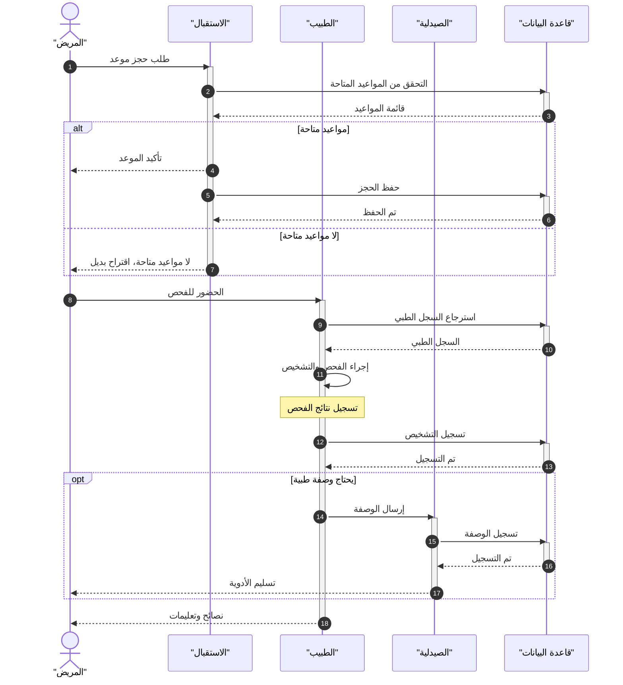

# مثال 1: نظام إدارة المستشفى

## وصف الـ Use Case

**العنوان**: حجز موعد وإجراء فحص طبي  
**الممثل الرئيسي**: المريض  
**الشروط المسبقة**: المريض مسجل في النظام  
**المسار الرئيسي**:
1. المريض يطلب حجز موعد من الاستقبال
2. الاستقبال يتحقق من المواعيد المتاحة
3. تأكيد الموعد وحفظ الحجز
4. المريض يحضر للفحص
5. الطبيب يسترجع السجل الطبي
6. الطبيب يجري الفحص ويسجل التشخيص
7. إذا لزم الأمر، يكتب وصفة طبية
8. الصيدلية تسلم الأدوية

**المسار البديل**:
- لا توجد مواعيد متاحة → اقتراح بديل

---

## تحديد المشاركين

| المشارك | النوع | الدور |
|---------|-------|-------|
| المريض | Actor | يبدأ التفاعل |
| الاستقبال | Participant | يدير المواعيد |
| الطبيب | Participant | يجري الفحص |
| الصيدلية | Participant | تصرف الأدوية |
| قاعدة البيانات | Participant | تخزن البيانات |

---

## المخطط

---

## النقاط التعليمية

1. **استخدام `alt/else`**: لتمثيل حالة توفر المواعيد أو عدمها
2. **استخدام `opt`**: لتمثيل خطوة اختيارية (الوصفة الطبية)
3. **استخدام `note over`**: لإضافة توضيح فوق مشارك
4. **الرسائل الذاتية**: `Doctor->>Doctor` تمثل عملية داخلية (الفحص)
5. **التعليقات**: `%%` لتقسيم المخطط إلى مراحل واضحة
