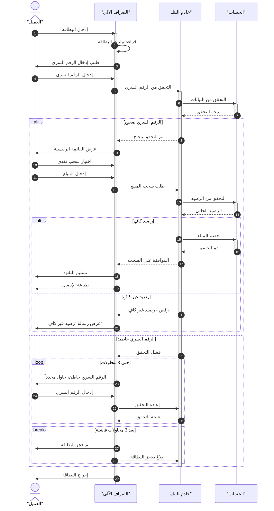

# مثال 2: نظام الصراف الآلي (ATM)

## وصف الـ Use Case

**العنوان**: سحب نقدي من الصراف الآلي  
**الممثل الرئيسي**: العميل  
**الشروط المسبقة**: العميل يملك بطاقة بنكية صالحة  
**المسار الرئيسي**:

1. العميل يدخل البطاقة
2. الصراف يقرأ بيانات البطاقة ويطلب الرقم السري
3. العميل يدخل الرقم السري
4. الصراف يتحقق من الرقم السري عبر خادم البنك
5. عرض القائمة الرئيسية
6. العميل يختار سحب نقدي ويحدد المبلغ
7. الصراف يتحقق من الرصيد
8. خصم المبلغ وتسليم النقود
9. طباعة الإيصال وإخراج البطاقة

**المسارات البديلة**:

- الرقم السري خاطئ → 3 محاولات ثم حجز البطاقة
- رصيد غير كافٍ → رفض العملية

---

## تحديد المشاركين

| المشارك      | النوع       | الدور                   |
| ------------ | ----------- | ----------------------- |
| العميل       | Actor       | يبدأ التفاعل            |
| الصراف الآلي | Participant | واجهة التفاعل           |
| خادم البنك   | Participant | يعالج العمليات المصرفية |
| الحساب       | Participant | يمثل حساب العميل        |

---

## المخطط

---

## النقاط التعليمية

1. **`alt` متداخل**: alt داخل alt لتمثيل قرارات متعددة المستويات
2. **`loop`**: لتمثيل تكرار محاولات إدخال الرقم السري
3. **`break`**: لتمثيل الخروج من التسلسل (حجز البطاقة)
4. **الرسالة الذاتية**: `ATM->>ATM` لعملية القراءة الداخلية
5. **تعدد المسارات البديلة**: التعامل مع أكثر من حالة فشل
