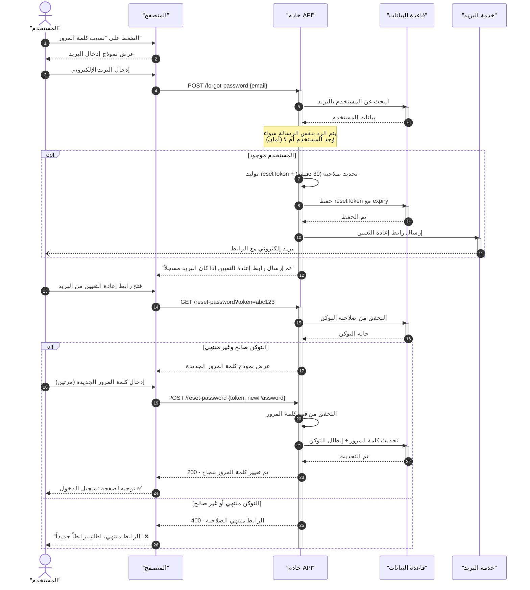

# مثال 6: إعادة تعيين كلمة المرور (Password Reset)

## وصف الـ Use Case

**العنوان**: إعادة تعيين كلمة مرور منسية  
**الممثل الرئيسي**: المستخدم  
**المسار الرئيسي**:
1. المستخدم يضغط "نسيت كلمة المرور"
2. إدخال البريد الإلكتروني
3. النظام يولّد رابط إعادة التعيين (مع Token ومدة صلاحية)
4. إرسال الرابط بالبريد
5. المستخدم يفتح الرابط
6. التحقق من صلاحية التوكن
7. إدخال كلمة المرور الجديدة
8. تحديث كلمة المرور وإبطال التوكن

---

## المخطط

---

## النقاط التعليمية

1. **`opt`**: العملية اختيارية — يتم إرسال البريد فقط إذا وُجد المستخدم
2. **ملاحظة أمنية**: الرد بنفس الرسالة لمنع تخمين البريد (Enumeration Attack)
3. **`note over` مع سطور متعددة**: استخدام ` ` لكسر السطر
4. **رسالة غير متزامنة `--)` **: إرسال البريد fire-and-forget
5. **نمط Token + Expiry**: نمط شائع في الأمان
