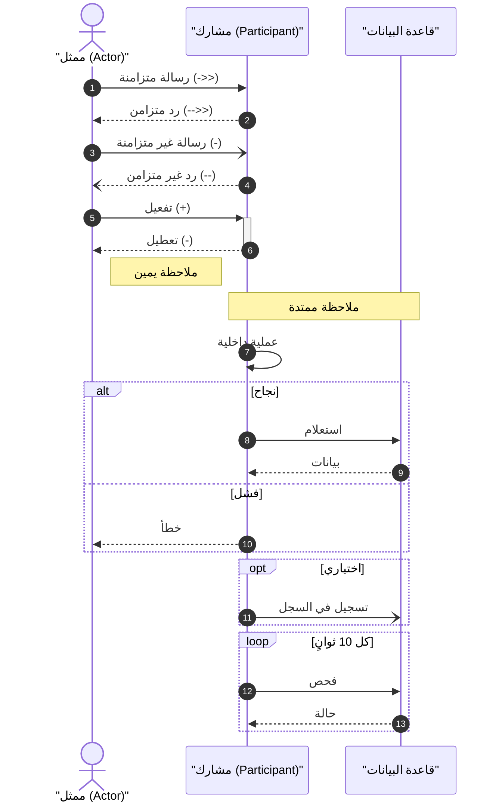

# مرجع شامل: جميع مكونات Sequence Diagram في Mermaid

> هذا المرجع يغطي **كل** عنصر ومكون متاح في صيغة Mermaid لمخططات التسلسل.
> المصادر: [Mermaid Official Docs](https://mermaid.js.org/syntax/sequenceDiagram.html) + [Lucidchart UML Tutorial](https://lucid.co/diagram/uml/sequence-diagram-tutorial)

---

## 1. بنية المخطط الأساسية

كل مخطط يبدأ بالكلمة المفتاحية `sequenceDiagram`:

```
sequenceDiagram
    [تعريف المشاركين]
    [الرسائل والتفاعلات]
```

---

## 2. المشاركون (Participants & Actors)

### 2.1 أنواع المشاركين

| النوع | الصيغة | الشكل | الاستخدام |
|-------|--------|-------|-----------|
| **مشارك ضمني** | استخدمه مباشرة في رسالة | مستطيل | يُنشأ تلقائياً عند أول استخدام |
| **مشارك صريح** | `participant Name` | مستطيل | تحكم بترتيب الظهور |
| **ممثل خارجي** | `actor Name` | شكل عصا (stick figure) | يمثل شخصاً أو نظاماً خارجياً |

### 2.2 الاسم المستعار (Alias)

```
participant A as "Authentication Service"
actor U as "المستخدم"
```

- الاسم المستعار يظهر في المخطط بدلاً من المعرّف
- المعرّف القصير يُستخدم في كتابة الرسائل

### 2.3 تجميع المشاركين في صناديق (Boxes)

```
box "الخدمات الداخلية" #LightBlue
    participant API
    participant Auth
    participant DB
end

box "الخدمات الخارجية" #LightGreen
    participant Payment
    participant SMS
end
```

- `box` يجمع مشاركين مرتبطين بصرياً
- يمكن تحديد لون خلفية اختياري بعد العنوان
- يُغلق بـ `end`

### 2.4 إنشاء مشارك ديناميكياً (Create)

```
create participant Carl
Alice->>Carl: مرحباً يا Carl!
```

- المشارك يظهر فقط عند وصول رسالة الإنشاء (لا يظهر من البداية)
- يُستخدم عندما يتم إنشاء كائن أثناء التسلسل

### 2.5 تدمير مشارك (Destroy)

```
Alice->>Bob: وداعاً
destroy Bob
```

- يظهر رمز ✕ على خط الحياة
- يُستخدم عندما يتم إنهاء/حذف كائن

---

## 3. خط الحياة (Lifeline)

- خط **متقطع عمودي** يمتد لأسفل من كل مشارك
- يمثل **مرور الزمن** من الأعلى إلى الأسفل
- يبدأ من المشارك ويمتد حتى آخر رسالة يشارك فيها
- **طوله** يعتمد على عدد الرسائل في التسلسل
- في Mermaid: يُنشأ تلقائياً — لا تحتاج لرسمه يدوياً

---

## 4. صندوق التفعيل (Activation Box)

مستطيل رفيع على خط الحياة يمثل الفترة التي يكون فيها الكائن **نشطاً** (يعالج مهمة).

### 4.1 الطريقة الصريحة

```
Alice->>Bob: طلب
activate Bob
Bob-->>Alice: رد
deactivate Bob
```

### 4.2 الطريقة المختصرة (+ و -)

```
Alice->>+Bob: طلب       %% + يفعّل Bob
Bob-->>-Alice: رد        %% - يعطّل Bob
```

### 4.3 تفعيل متداخل (Nested Activation)

```
Alice->>+Bob: طلب خارجي
Bob->>+Bob: معالجة داخلية
Bob-->>-Bob: انتهت المعالجة
Bob-->>-Alice: الرد
```

- يمكن تفعيل نفس المشارك عدة مرات متداخلة
- كل `+` يجب أن يقابله `-`

---

## 5. أنواع الرسائل (Message Types) — القائمة الكاملة

### 5.1 جدول شامل لجميع أنواع الأسهم

| الرمز | الشكل | النوع | الوصف |
|-------|-------|-------|-------|
| `->` | خط صلب، سهم مفتوح | Solid line, open arrow | رسالة بسيطة بدون دلالة خاصة |
| `-->` | خط متقطع، سهم مفتوح | Dashed line, open arrow | رد بسيط |
| `->>` | خط صلب، سهم مصمت | Solid line, filled arrow | **رسالة متزامنة** (المرسل ينتظر) |
| `-->>` | خط متقطع، سهم مصمت | Dashed line, filled arrow | **رد متزامن** |
| `-x` | خط صلب، علامة X | Solid line, cross | **رسالة متزامنة فاشلة/مفقودة** |
| `--x` | خط متقطع، علامة X | Dashed line, cross | **رد فاشل/مفقود** |
| `-)` | خط صلب، سهم مفتوح | Solid line, open arrowhead | **رسالة غير متزامنة** (المرسل لا ينتظر) |
| `--)` | خط متقطع، سهم مفتوح | Dashed line, open arrowhead | **رد غير متزامن** |

### 5.2 متى تستخدم كل نوع

| السيناريو | السهم المناسب | السبب |
|-----------|--------------|-------|
| استدعاء REST API | `->>` | المرسل ينتظر الرد |
| رد REST API | `-->>` | خط متقطع = رد |
| إرسال حدث Kafka/RabbitMQ | `-)` | fire-and-forget |
| Webhook callback | `--)` | رد غير متزامن |
| استعلام قاعدة بيانات | `->>` | عملية متزامنة |
| رد قاعدة بيانات | `-->>` | خط متقطع = رد |
| إشعار Push/SMS | `-)` | لا انتظار |
| رسالة فشلت/timeout | `-x` | لم تصل الرسالة |
| عملية داخلية | `->>` (نفس الكائن) | رسالة ذاتية |

### 5.3 الرسالة الذاتية (Self-Message)

```
Server->>Server: التحقق من صلاحية التوكن
```

- سهم يخرج من المشارك ويعود إليه
- يمثل عملية داخلية (validation, computation, etc.)

---

## 6. الملاحظات (Notes)

### 6.1 أنواع الملاحظات

```
note right of Alice: ملاحظة على يمين Alice
note left of Bob: ملاحظة على يسار Bob
note over Alice: ملاحظة فوق Alice
note over Alice,Bob: ملاحظة ممتدة فوق Alice و Bob
```

### 6.2 ملاحظة متعددة الأسطر

```
note over Alice: السطر الأول<br/>السطر الثاني<br/>السطر الثالث
```

- استخدم `<br/>` لكسر السطر داخل الملاحظة

---

## 7. الأجزاء المركبة (Combined Fragments) — القائمة الكاملة

### 7.1 البديل (alt/else) — if/else

```
alt شرط النجاح
    Alice->>Bob: مسار النجاح
else شرط الفشل
    Alice->>Bob: مسار الفشل
end
```

- يمثل **اختياراً بين مسارين أو أكثر** حصرياً
- يمكن إضافة عدة `else`

### 7.2 الاختياري (opt) — if بدون else

```
opt المستخدم يريد إيصال
    System->>Printer: طباعة الإيصال
end
```

- يمثل جزءاً **اختيارياً** قد يُنفذ أو لا يُنفذ
- لا يوجد مسار بديل

### 7.3 التكرار (loop)

```
loop كل 5 ثوانٍ
    Monitor->>Server: فحص الحالة
    Server-->>Monitor: الحالة
end
```

- يمثل **تكرار** مجموعة رسائل
- الشرط يُكتب بعد `loop`

### 7.4 التنفيذ المتوازي (par/and)

```
par إرسال البريد
    System->>EmailSvc: إرسال بريد
and إرسال SMS
    System->>SMSSvc: إرسال رسالة
and تحديث السجلات
    System->>DB: تحديث
end
```

- يمثل عمليات تُنفذ **بالتوازي** (في نفس الوقت)
- يمكن إضافة عدة `and`

### 7.5 المنطقة الحرجة (critical/option)

```
critical إنشاء الطلب
    Service->>DB: INSERT order
    DB-->>Service: OK
option فشل قاعدة البيانات
    Service->>Service: Rollback
end
```

- يمثل **قسماً حرجاً** يجب أن يكتمل بالكامل (مثل transaction)
- `option` يمثل مسار الخطأ/الاستثناء

### 7.6 الكسر (break)

```
break حدث خطأ فادح
    System->>User: رسالة خطأ
end
```

- يمثل **خروجاً مبكراً** من التسلسل
- يوقف التنفيذ الطبيعي ويخرج

### 7.7 التجميع (rect) — تمييز بصري

```
rect rgb(200, 220, 255)
    Alice->>Bob: هذه المنطقة مميزة بلون
    Bob-->>Alice: رد
end
```

- لا يغير المنطق — فقط يضيف **خلفية ملونة** لمنطقة
- مفيد لتمييز مراحل مختلفة بصرياً

---

## 8. الترقيم التلقائي (Autonumber)

```
sequenceDiagram
    autonumber
    Alice->>Bob: رسالة 1
    Bob-->>Alice: رسالة 2
```

- يضيف أرقام تسلسلية لكل رسالة تلقائياً
- مفيد جداً للإشارة لرسائل محددة في المناقشات

---

## 9. التعليقات

```
%% هذا تعليق — لا يظهر في المخطط
Alice->>Bob: رسالة  %% تعليق في نهاية السطر
```

- استخدم `%%` لإضافة تعليقات
- مفيدة لتقسيم المخطط إلى أقسام

---

## 10. الروابط التفاعلية (Links)

```
participant Alice
link Alice: Dashboard @ https://example.com/dashboard
link Alice: Docs @ https://docs.example.com
```

- يضيف روابط قابلة للنقر على المشارك
- مفيد لربط المخطط بالتوثيق أو الأنظمة الفعلية

---

## 11. أرقام مرجعية (Refs)

```
ref over Alice,Bob: راجع مخطط المصادقة
```

- يشير لمخطط آخر أو عملية فرعية
- يظهر كمستطيل ممتد فوق المشاركين المحددين

---

## 12. الكلمات المحجوزة

> **تحذير**: الكلمة `end` محجوزة لإغلاق الأجزاء المركبة.  
> إذا احتجت استخدامها في نص رسالة، غلّفها بأقواس أو علامات اقتباس:

```
Alice->>Bob: هذا هو (end) العملية      ✅
Alice->>Bob: هذا هو "end" العملية      ✅
Alice->>Bob: هذا هو end العملية         ❌ خطأ!
```

---

## 13. ملخص بصري لجميع العناصر


