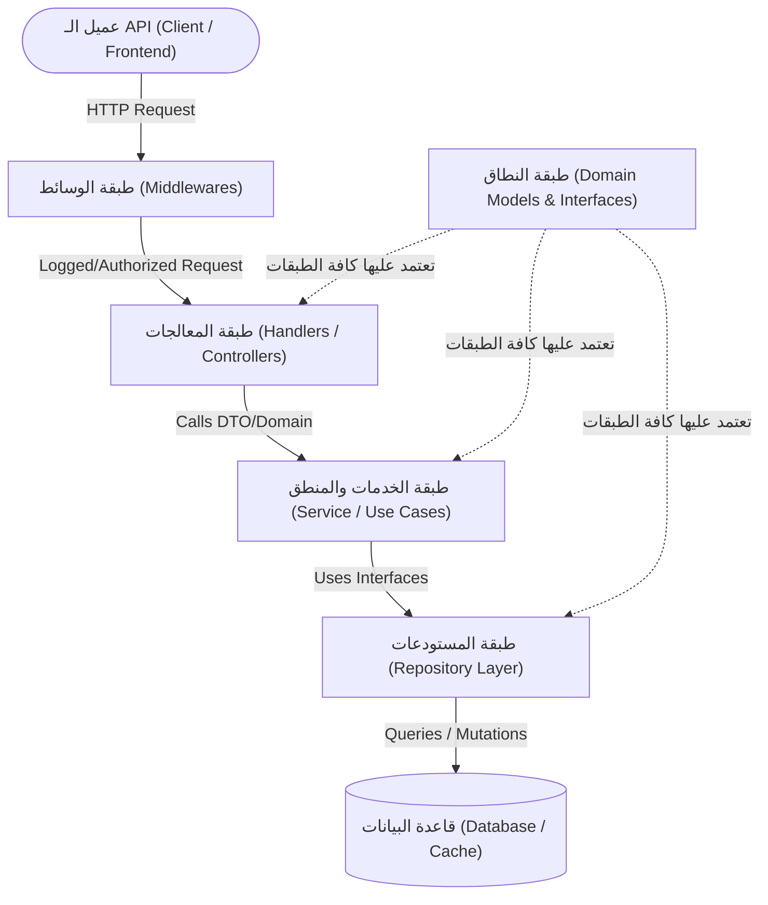

# توثيق الهيكل المعماري لمشروع YouTrack Backend

يقوم هذا المشروع على نمط **Clean Architecture** (المعمارية النظيفة) و **Standard Go Project Layout**، بهدف فصل الاهتمامات (Separation of Concerns)، وتحقيق سهولة التوسع (Scalability)، وإمكانية اختبار الكود (Testability) دون الاعتماد الشديد على أطر عمل أو قواعد بيانات محددة.

---

## 1. المخطط المعماري العام وتدفق البيانات (Data Flow)

تنتقل البيانات والطلبات عبر طبقات معمارية واضحة ومحددة الاتجاه:



---

## 2. تفصيل الطبقات المعمارية (Architectural Layers)

### 1️⃣ طبقة النطاق (`internal/domain/`)
- **الدور**: قلب التطبيق وقوانين العمل الأساسية (Core Business Entities & Interfaces).
- **الخصائص**:
  - لا تعتمد على أي مكتبات خارجية خاصة بقواعد البيانات أو الـ Web Frameworks.
  - تحتوي على نماذج البيانات (`User`, `Project`, `Issue`).
  - تحتوي على عقود وواجهات المستودعات والخدمات (Interfaces).

---

### 2️⃣ طبقة المستودعات والبيانات (`internal/repository/`)
- **الدور**: المسؤولة عن جلب وحفظ البيانات من وإلى مصادر التخزين (PostgreSQL, MySQL, Redis, إلخ).
- **الخصائص**:
  - تنفذ الواجهات (Interfaces) المعرفة في طبقة `domain`.
  - تخفي تفاصيل الاستعلامات و SQL والاتصال بقاعدة البيانات عن بقية التطبيق.
  - تمكننا من تبديل قاعدة البيانات مستقبلاً دون المساس بمنطق العمل (Business Logic).

---

### 3️⃣ طبقة منطق العمل والخدمات (`internal/service/`)
- **الدور**: عقل التطبيق وحالات الاستخدام (Use Cases / Business Logic).
- **الخصائص**:
  - تحتوي على القواعد المنطقية، مثل: التحقق من الصلاحيات، إرسال الإشعارات، معالجة إنشاء مهمة جديدة أو تغيير حالتها.
  - تتواصل مع طبقة `repository` عبر الـ Interfaces لتخزين أو استرجاع البيانات.
  - معزولة تماماً عن بروتوكول النقل (لا تعرف إن كان الطلب جاء عبر HTTP أو gRPC أو CLI).

---

### 4️⃣ طبقة المعالجات والواجهات (`internal/handler/`)
- **الدور**: استقبال طلبات المستخدم عبر بروتوكول النقل (HTTP / REST API).
- **الخصائص**:
  - فك وتفسير البيانات الواردة (Request Parsing / JSON Decoding / Validation).
  - تمرير البيانات إلى طبقة `service`.
  - تشفير الردود وإرجاع كود الاستجابة المناسب (HTTP Status Codes & JSON Encoding).

---

### 5️⃣ طبقة الوسائط (`internal/middleware/`)
- **الدور**: تنفيذ عمليات مشتركة قبل وصول الطلب للمعالج أو بعد الانتهاء منه (Cross-Cutting Concerns).
- **أمثلة**:
  - تسجيل الطلبات وزمن الاستجابة (`Logger`).
  - التحقق من التوكن وجلسات الدخول (`Authentication & Authorization / JWT`).
  - التعافي من الأخطاء غير المتوقعة ومنع توقف الخادم (`Recovery/CORS/Rate Limiting`).

---

### 6️⃣ نقطة الانطلاق والتهيئة (`cmd/api/` & `internal/config/`)
- **`cmd/api/main.go`**: نقطة البداية لتشغيل الخادم، ربط وحقن الاعتماديات (Dependency Injection)، وإدارة الإيقاف الآمن (Graceful Shutdown).
- **`internal/config/`**: قراءة وإدارة المتغيرات البيئية والتكوين.

---

## 3. شجرة الملفات الكاملة للمشروع

```text
youtrack_backend/
├── cmd/
│   └── api/
│       └── main.go                 # نقطة الدخول وربط الاعتماديات وتشغيل الخادم
├── internal/
│   ├── config/
│   │   └── config.go               # تحميل إعدادات البيئة والتطبيق
│   ├── domain/
│   │   └── models.go               # نماذج البيانات والواجهات الأساسية (Entities)
│   ├── repository/                 # استعلامات والتعامل مع قاعدة البيانات
│   ├── service/                    # منطق الأعمال وحالات الاستخدام (Business Logic)
│   ├── handler/
│   │   └── health.go               # معالجات الـ HTTP
│   └── middleware/
│       └── logger.go               # وسائط الحماية والتسجيل
├── pkg/                            # حزم وأدوات عامة ومساعدة
├── docs/
│   └── architecture.md             # ملف التوثيق المعماري
├── .env.example                    # قالب متغيرات البيئة
├── .gitignore                      # ملف تجاهل Git
├── Makefile                        # أوامر الأتمتة السريعة
└── go.mod                          # إدارة حزم Go
```

---

## 4. فوائد هذا الهيكل (Why This Architecture?)

1. **فصل المسؤوليات (Separation of Concerns)**: كل ملف وطبقة لها مسؤولية واضحة ومحددة.
2. **قابلية الاختبار (Testability)**: إمكانية كتابة Unit Tests لطبقة `service` بسهولة باستخدام Mock Repositories.
3. **الاستقلالية عن الأطر الخارجية**: يمكن ترقية مكتبات الـ HTTP أو تبديل محرك قاعدة البيانات بدون إعادة كتابة منطق العمل.
4. **سهولة الصيانة والعمل الجماعي**: بنية منظمة ومألوفة لمطوري Go تجعل التوسع في إضافة ميزات جديدة أمراً بسيطاً وسلساً.
