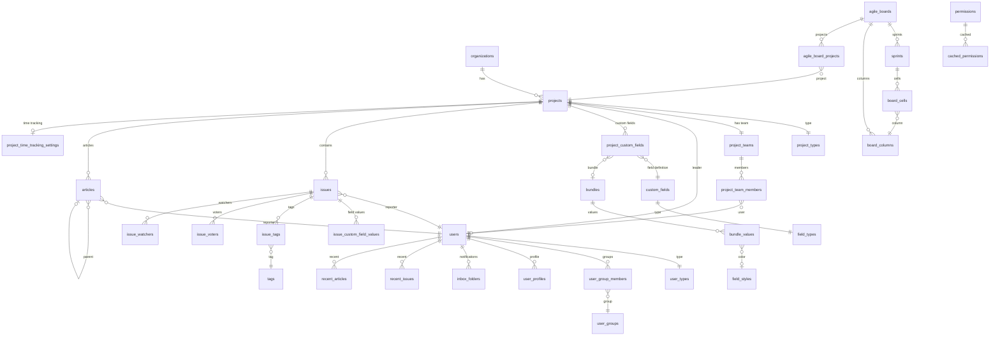

# تحليل طلبات YouTrack API واستنباط قاعدة البيانات

## ملخص التحليل

تم تحليل **69 ملف طلب** في مجلد `docs/requests/`. كل ملف يحتوي على:
1. **رابط الطلب (URL)** مع حقول الاستعلام (`fields`)
2. **استجابة JSON** التي تكشف بنية البيانات

تم تحديد نوعين من المصادر:
- `youtrack.jetbrains.com` — بيانات YouTrack الرسمية (نسخة عامة)
- `osm.youtrack.cloud` — مثيل YouTrack خاص (بيئة التطوير)

---

## تصنيف الطلبات حسب المجال

| المجال | أرقام الطلبات | الوصف |
|---|---|---|
| **المستخدم والمصادقة** | 1, 4, 29, 32, 33, 37, 38, 40, 43, 66 | بيانات المستخدم، الملف الشخصي، المجموعات |
| **المشاريع** | 21, 25, 62 | إعدادات وبيانات المشاريع |
| **الإعدادات العامة** | 2, 3, 5, 11, 19, 46, 49, 59, 60 | إعدادات النظام، الترخيص، L10N |
| **الأذونات** | 20, 26, 30 | صلاحيات المستخدمين والأدوار |
| **الحقول المخصصة** | 34, 52, 53, 54 | تعريفات حقول المشروع |
| **تتبع الوقت** | 55, 56, 57, 58 | أنواع العمل، السمات، التقديرات |
| **القضايا (Issues)** | 7, 12, 14, 15, 17, 67, 69 | القضايا والحقول والفلاتر |
| **البحث** | 16 | مساعد البحث والاقتراحات |
| **الإشعارات** | 8, 9, 45 | صندوق الوارد والإشعارات |
| **لوحة المشروع** | 13, 23 | لوحة التحكم والـ widgets |
| **Agile/Sprints** | 63, 64, 65 | لوحات الأجايل والسباقات |
| **المقالات** | 68 | قاعدة المعرفة |
| **التطبيقات/Workflows** | 50 | تطبيقات وسير العمل |
| **الخدمات** | 24 | خدمات Hub |
| **المنظمات** | 22 | التنظيمات |
| **VCS** | 42 | خوادم إدارة النسخ |
| **الأدوات** | 6, 10 | أدوات لوحة التحكم، الميزات |

---

## قاعدة البيانات المُستنبطة

### 1. `users` — المستخدمون

```sql
CREATE TABLE users (
    id              VARCHAR(20) PRIMARY KEY,    -- "2-1", "11-2095841"
    login           VARCHAR(100) NOT NULL UNIQUE,
    email           VARCHAR(255),
    full_name       VARCHAR(255),
    name            VARCHAR(255),
    avatar_url      TEXT,
    user_type_id    VARCHAR(50),                -- FK → user_types.id
    is_email_verified BOOLEAN DEFAULT FALSE,
    guest           BOOLEAN DEFAULT FALSE,
    online          BOOLEAN DEFAULT FALSE,
    banned          BOOLEAN DEFAULT FALSE,
    ban_badge       TEXT,
    can_read_profile BOOLEAN DEFAULT TRUE,
    is_locked       BOOLEAN DEFAULT FALSE,
    ring_id         VARCHAR(100)                -- UUID في Hub
);
```

> [!NOTE]
> المصدر: [request1.txt](file:///home/osmsoftwareengineering/StudioProjects/youtrack_backend/docs/requests/request1.txt), [request32.txt](file:///home/osmsoftwareengineering/StudioProjects/youtrack_backend/docs/requests/request32.txt), [request33.txt](file:///home/osmsoftwareengineering/StudioProjects/youtrack_backend/docs/requests/request33.txt)

---

### 2. `user_types` — أنواع المستخدمين

```sql
CREATE TABLE user_types (
    id      VARCHAR(50) PRIMARY KEY,    -- "STANDARD_USER"
    name    VARCHAR(100) NOT NULL       -- "Standard user"
);
```

---

### 3. `projects` — المشاريع

```sql
CREATE TABLE projects (
    id              VARCHAR(20) PRIMARY KEY,    -- "0-0", "22-59"
    name            VARCHAR(255) NOT NULL,
    short_name      VARCHAR(50) NOT NULL UNIQUE, -- "DEMO", "FIN"
    project_type_id VARCHAR(50),                -- "DEFAULT"
    pinned          BOOLEAN DEFAULT FALSE,
    icon_url        TEXT,
    template        BOOLEAN DEFAULT FALSE,
    archived        BOOLEAN DEFAULT FALSE,
    restricted      BOOLEAN DEFAULT FALSE,
    has_articles    BOOLEAN DEFAULT FALSE,
    is_demo         BOOLEAN DEFAULT FALSE,
    fields_sorted   BOOLEAN DEFAULT FALSE,
    query           TEXT,
    issues_url      TEXT,
    description     TEXT,
    leader_id       VARCHAR(20),                -- FK → users.id
    team_id         VARCHAR(20),                -- FK → project_teams.id
    organization_id VARCHAR(20),                -- FK → organizations.id
    creation_time   BIGINT,
    from_email      VARCHAR(255),
    from_personal   VARCHAR(255),
    reply_to_email  VARCHAR(255),
    email_delimiter TEXT,
    use_email_delimiter BOOLEAN DEFAULT FALSE,
    supports_email_delimiter BOOLEAN DEFAULT FALSE,
    default_visibility_group_id VARCHAR(20),    -- FK → user_groups.id
    default_smtp    TEXT,
    source_template VARCHAR(20),
    audit_target_id VARCHAR(100)
);
```

> [!NOTE]
> المصدر: [request21.txt](file:///home/osmsoftwareengineering/StudioProjects/youtrack_backend/docs/requests/request21.txt), [request25.txt](file:///home/osmsoftwareengineering/StudioProjects/youtrack_backend/docs/requests/request25.txt), [request62.txt](file:///home/osmsoftwareengineering/StudioProjects/youtrack_backend/docs/requests/request62.txt)

---

### 4. `project_types` — أنواع المشاريع

```sql
CREATE TABLE project_types (
    id VARCHAR(50) PRIMARY KEY    -- "DEFAULT"
);
```

---

### 5. `organizations` — المنظمات

```sql
CREATE TABLE organizations (
    id              VARCHAR(20) PRIMARY KEY,    -- "1-0"
    key             VARCHAR(100),
    name            VARCHAR(255),
    icon_url        TEXT,
    projects_count  INT DEFAULT 0
);
```

> [!NOTE]
> المصدر: [request22.txt](file:///home/osmsoftwareengineering/StudioProjects/youtrack_backend/docs/requests/request22.txt)

---

### 6. `user_groups` — مجموعات المستخدمين

```sql
CREATE TABLE user_groups (
    id              VARCHAR(20) PRIMARY KEY,    -- "6-0", "103-0", "4-1"
    name            VARCHAR(255) NOT NULL,       -- "Registered Users", "All Users"
    group_type      VARCHAR(50),                -- "RegisteredUsersGroup", "AllUsersGroup", "NestedGroup"
    all_users_group BOOLEAN DEFAULT FALSE,
    icon            TEXT,
    description     TEXT,
    audit_target_id VARCHAR(100),
    is_updatable    BOOLEAN DEFAULT FALSE,
    is_removable    BOOLEAN DEFAULT FALSE,
    team_for_project_id VARCHAR(20)             -- FK → projects.id
);
```

---

### 7. `user_group_members` — عضوية المجموعات

```sql
CREATE TABLE user_group_members (
    user_id  VARCHAR(20),    -- FK → users.id
    group_id VARCHAR(20),    -- FK → user_groups.id
    PRIMARY KEY (user_id, group_id)
);
```

---

### 8. `project_teams` — فرق المشروع

```sql
CREATE TABLE project_teams (
    id      VARCHAR(20) PRIMARY KEY,    -- "5-0", "5-1"
    name    VARCHAR(255),               -- "Demo project Team"
    project_id VARCHAR(20)              -- FK → projects.id
);
```

---

### 9. `project_team_members` — أعضاء فريق المشروع

```sql
CREATE TABLE project_team_members (
    team_id VARCHAR(20),    -- FK → project_teams.id
    user_id VARCHAR(20),    -- FK → users.id
    PRIMARY KEY (team_id, user_id)
);
```

> [!NOTE]
> المصدر: [request27.txt](file:///home/osmsoftwareengineering/StudioProjects/youtrack_backend/docs/requests/request27.txt)

---

### 10. `issues` — القضايا/المهام

```sql
CREATE TABLE issues (
    id                  VARCHAR(20) PRIMARY KEY,    -- "2-49066"
    id_readable         VARCHAR(50) NOT NULL,        -- "DEMO-16"
    number_in_project   INT,
    summary             TEXT NOT NULL,
    description         TEXT,
    project_id          VARCHAR(20) NOT NULL,        -- FK → projects.id
    reporter_id         VARCHAR(20),                 -- FK → users.id
    creator_id          VARCHAR(20),                 -- FK → users.id
    updater_id          VARCHAR(20),                 -- FK → users.id
    created             BIGINT,                      -- timestamp ms
    updated             BIGINT,
    resolved            BIGINT,
    votes               INT DEFAULT 0,
    is_draft            BOOLEAN DEFAULT FALSE,
    unauthenticated_reporter BOOLEAN DEFAULT FALSE,
    can_undo_comment    BOOLEAN DEFAULT FALSE,
    can_add_public_comment BOOLEAN DEFAULT TRUE
);
```

> [!NOTE]
> المصدر: [request67.txt](file:///home/osmsoftwareengineering/StudioProjects/youtrack_backend/docs/requests/request67.txt)

---

### 11. `issue_custom_field_values` — قيم الحقول المخصصة للقضايا

```sql
CREATE TABLE issue_custom_field_values (
    id                      VARCHAR(20) PRIMARY KEY,
    issue_id                VARCHAR(20) NOT NULL,   -- FK → issues.id
    project_custom_field_id VARCHAR(20),             -- FK → project_custom_fields.id
    name                    VARCHAR(255),
    field_type              VARCHAR(50),             -- "$type"
    has_state_machine       BOOLEAN DEFAULT FALSE,
    is_updatable            BOOLEAN DEFAULT FALSE,
    visible_on_list         BOOLEAN DEFAULT FALSE,
    paused_time             BIGINT
);
```

---

### 12. `issue_field_enum_values` — قيم Enum/State/User لحقول القضايا

```sql
CREATE TABLE issue_field_enum_values (
    id              VARCHAR(20) PRIMARY KEY,
    name            VARCHAR(255),
    localized_name  VARCHAR(255),
    description     TEXT,
    is_resolved     BOOLEAN,
    color_id        VARCHAR(20),            -- FK → field_styles.id
    login           VARCHAR(100),           -- للنوع user
    email           VARCHAR(255),
    full_name       VARCHAR(255),
    avatar_url      TEXT,
    presentation    VARCHAR(255),
    minutes         INT,                    -- للنوع period
    text            TEXT,                   -- للنوع text
    build_integration TEXT,
    build_link      TEXT,
    archived        BOOLEAN DEFAULT FALSE
);
```

---

### 13. `custom_fields` — تعريفات الحقول المخصصة (عامة)

```sql
CREATE TABLE custom_fields (
    id              VARCHAR(20) PRIMARY KEY,    -- "161-0"
    name            VARCHAR(255) NOT NULL,       -- "Priority", "State", "Assignee"
    localized_name  VARCHAR(255),
    ordinal         INT DEFAULT 0,
    aliases         TEXT,                        -- "for, assigned to"
    field_type_id   VARCHAR(50)                  -- FK → field_types.id
);
```

> [!NOTE]
> المصدر: [request52.txt](file:///home/osmsoftwareengineering/StudioProjects/youtrack_backend/docs/requests/request52.txt), [request34.txt](file:///home/osmsoftwareengineering/StudioProjects/youtrack_backend/docs/requests/request34.txt)

---

### 14. `field_types` — أنواع الحقول

```sql
CREATE TABLE field_types (
    id              VARCHAR(50) PRIMARY KEY,    -- "enum[1]", "state[1]", "user[1]"
    presentation    VARCHAR(100),
    value_type      VARCHAR(50),                -- "enum", "state", "user", "period", "integer", etc.
    is_bundle_type  BOOLEAN DEFAULT FALSE,
    is_multi_value  BOOLEAN DEFAULT FALSE
);
```

---

### 15. `project_custom_fields` — الحقول المخصصة لكل مشروع

```sql
CREATE TABLE project_custom_fields (
    id              VARCHAR(20) PRIMARY KEY,    -- "189-0"
    project_id      VARCHAR(20) NOT NULL,        -- (من السياق)
    custom_field_id VARCHAR(20) NOT NULL,         -- FK → custom_fields.id
    bundle_id       VARCHAR(20),                 -- FK → bundles.id
    field_type      VARCHAR(80),                 -- "$type": "EnumProjectCustomField" etc.
    can_be_empty    BOOLEAN DEFAULT TRUE,
    empty_field_text VARCHAR(255),               -- "No Priority", "Unassigned"
    has_running_job BOOLEAN DEFAULT FALSE,
    ordinal         INT DEFAULT 0,
    is_spent_time   BOOLEAN DEFAULT FALSE,
    is_estimation   BOOLEAN DEFAULT FALSE,
    is_public       BOOLEAN DEFAULT TRUE,
    is_sla_field    BOOLEAN DEFAULT FALSE
);
```

---

### 16. `bundles` — حزم القيم

```sql
CREATE TABLE bundles (
    id              VARCHAR(20) PRIMARY KEY,    -- "163-3"
    bundle_type     VARCHAR(50) NOT NULL,        -- "EnumBundle", "StateBundle", "VersionBundle", etc.
    name            VARCHAR(255),
    is_updateable   BOOLEAN DEFAULT FALSE
);
```

---

### 17. `bundle_values` — قيم الحزم (Enum, State, Version, Build, User...)

```sql
CREATE TABLE bundle_values (
    id              VARCHAR(20) PRIMARY KEY,
    bundle_id       VARCHAR(20) NOT NULL,       -- FK → bundles.id
    name            VARCHAR(255),
    description     TEXT,
    localized_name  VARCHAR(255),
    is_resolved     BOOLEAN,
    archived        BOOLEAN DEFAULT FALSE,
    color_id        VARCHAR(20),                -- FK → field_styles.id
    ordinal         INT DEFAULT 0,
    -- خاص بـ Version:
    release_date    BIGINT,
    released        BOOLEAN,
    -- خاص بـ Build:
    build_integration TEXT,
    build_link      TEXT,
    assemble_date   BIGINT,
    -- خاص بـ Owned:
    owner_id        VARCHAR(20),                -- FK → users.id
    -- خاص بـ User:
    login           VARCHAR(100),
    avatar_url      TEXT,
    auto_attach     BOOLEAN DEFAULT FALSE
);
```

---

### 18. `field_styles` — أنماط/ألوان الحقول

```sql
CREATE TABLE field_styles (
    id          VARCHAR(20) PRIMARY KEY,    -- "0"
    background  VARCHAR(20),                -- "#fff"
    foreground  VARCHAR(20)                 -- "#444"
);
```

---

### 19. `tags` — الوسوم

```sql
CREATE TABLE tags (
    id              VARCHAR(20) PRIMARY KEY,
    name            VARCHAR(255) NOT NULL,
    color_id        VARCHAR(20),            -- FK → field_styles.id
    is_deletable    BOOLEAN DEFAULT FALSE,
    is_updatable    BOOLEAN DEFAULT FALSE,
    is_usable       BOOLEAN DEFAULT FALSE
);
```

---

### 20. `issue_tags` — ربط القضايا بالوسوم

```sql
CREATE TABLE issue_tags (
    issue_id VARCHAR(20),    -- FK → issues.id
    tag_id   VARCHAR(20),    -- FK → tags.id
    PRIMARY KEY (issue_id, tag_id)
);
```

---

### 21. `issue_voters` — التصويت على القضايا

```sql
CREATE TABLE issue_voters (
    issue_id VARCHAR(20),    -- FK → issues.id
    user_id  VARCHAR(20),    -- FK → users.id
    has_vote BOOLEAN DEFAULT FALSE,
    PRIMARY KEY (issue_id, user_id)
);
```

---

### 22. `issue_watchers` — مراقبو القضايا

```sql
CREATE TABLE issue_watchers (
    issue_id VARCHAR(20),    -- FK → issues.id
    user_id  VARCHAR(20),    -- FK → users.id
    has_star BOOLEAN DEFAULT FALSE,
    PRIMARY KEY (issue_id, user_id)
);
```

---

### 23. `visibility` — إعدادات الرؤية

```sql
CREATE TABLE visibility (
    id              VARCHAR(20) PRIMARY KEY,
    visibility_type VARCHAR(50),                -- "UnlimitedVisibility", "LimitedVisibility"
    entity_type     VARCHAR(50),                -- "Issue", "Article", "Comment"
    entity_id       VARCHAR(20)
);
```

---

### 24. `visibility_permitted_users` / `visibility_permitted_groups`

```sql
CREATE TABLE visibility_permitted_users (
    visibility_id VARCHAR(20),    -- FK → visibility.id
    user_id       VARCHAR(20),    -- FK → users.id
    PRIMARY KEY (visibility_id, user_id)
);

CREATE TABLE visibility_permitted_groups (
    visibility_id VARCHAR(20),    -- FK → visibility.id
    group_id      VARCHAR(20),    -- FK → user_groups.id
    PRIMARY KEY (visibility_id, group_id)
);
```

---

### 25. `articles` — المقالات (قاعدة المعرفة)

```sql
CREATE TABLE articles (
    id                      VARCHAR(20) PRIMARY KEY,    -- "186-0"
    id_readable             VARCHAR(50),                 -- "DEMO-A-1"
    summary                 TEXT NOT NULL,
    project_id              VARCHAR(20),                 -- FK → projects.id
    reporter_id             VARCHAR(20),                 -- FK → users.id
    parent_article_id       VARCHAR(20),                 -- FK → articles.id (self-ref)
    ordinal                 INT DEFAULT 0,
    has_unpublished_changes BOOLEAN DEFAULT FALSE,
    has_children            BOOLEAN DEFAULT FALSE,
    has_star                BOOLEAN DEFAULT FALSE,
    is_updatable            BOOLEAN DEFAULT FALSE,
    is_deletable            BOOLEAN DEFAULT FALSE,
    collaborative_draft_id  VARCHAR(100),
    updated                 BIGINT
);
```

> [!NOTE]
> المصدر: [request68.txt](file:///home/osmsoftwareengineering/StudioProjects/youtrack_backend/docs/requests/request68.txt)

---

### 26. `recent_issues` — القضايا الأخيرة للمستخدم

```sql
CREATE TABLE recent_issues (
    id       VARCHAR(20) PRIMARY KEY,
    user_id  VARCHAR(20),     -- FK → users.id
    issue_id VARCHAR(20),     -- FK → issues.id
    pinned   BOOLEAN DEFAULT FALSE,
    date     BIGINT
);
```

---

### 27. `recent_articles` — المقالات الأخيرة للمستخدم

```sql
CREATE TABLE recent_articles (
    id         VARCHAR(20) PRIMARY KEY,
    user_id    VARCHAR(20),      -- FK → users.id
    article_id VARCHAR(20),      -- FK → articles.id
    pinned     BOOLEAN DEFAULT FALSE,
    date       BIGINT
);
```

---

### 28. `permissions` — الأذونات

```sql
CREATE TABLE permissions (
    id      VARCHAR(100) PRIMARY KEY,    -- "jetbrains.jetpass.project-read"
    key     VARCHAR(100),
    name    VARCHAR(255)                 -- "Read Project Full"
);
```

> [!NOTE]
> المصدر: [request26.txt](file:///home/osmsoftwareengineering/StudioProjects/youtrack_backend/docs/requests/request26.txt)

---

### 29. `cached_permissions` — صلاحيات المستخدم المُخزنة

```sql
CREATE TABLE cached_permissions (
    id              VARCHAR(100),               -- permission_id
    user_id         VARCHAR(20),
    is_global       BOOLEAN DEFAULT FALSE,
    PRIMARY KEY (id, user_id)
);
```

---

### 30. `cached_permission_projects` — المشاريع المرتبطة بالصلاحيات

```sql
CREATE TABLE cached_permission_projects (
    permission_id   VARCHAR(100),
    project_id      VARCHAR(20),    -- FK → projects.id
    PRIMARY KEY (permission_id, project_id)
);
```

---

### 31. `agile_boards` — لوحات الأجايل

```sql
CREATE TABLE agile_boards (
    id                      VARCHAR(20) PRIMARY KEY,    -- "204-1", "204-3"
    name                    VARCHAR(255),
    is_demo                 BOOLEAN DEFAULT FALSE,
    is_updatable            BOOLEAN DEFAULT FALSE,
    favorite                BOOLEAN DEFAULT FALSE,
    flat_backlog            BOOLEAN DEFAULT FALSE,
    hide_orphans_swimlane   BOOLEAN DEFAULT FALSE,
    orphans_at_the_top      BOOLEAN DEFAULT FALSE,
    colorize_custom_fields  BOOLEAN DEFAULT FALSE,
    card_on_several_sprints BOOLEAN DEFAULT FALSE,
    owner_id                VARCHAR(20),                -- FK → users.id
    estimation_field_id     VARCHAR(20),                -- FK → custom_fields.id
    original_estimation_field_id VARCHAR(20),            -- FK → custom_fields.id
    backlog_id              VARCHAR(20),                -- FK → saved_queries.id
    created_with_original   BOOLEAN DEFAULT FALSE
);
```

> [!NOTE]
> المصدر: [request63.txt](file:///home/osmsoftwareengineering/StudioProjects/youtrack_backend/docs/requests/request63.txt), [request64.txt](file:///home/osmsoftwareengineering/StudioProjects/youtrack_backend/docs/requests/request64.txt)

---

### 32. `agile_board_projects` — مشاريع لوحة الأجايل

```sql
CREATE TABLE agile_board_projects (
    agile_id    VARCHAR(20),    -- FK → agile_boards.id
    project_id  VARCHAR(20),    -- FK → projects.id
    PRIMARY KEY (agile_id, project_id)
);
```

---

### 33. `sprints` — السباقات

```sql
CREATE TABLE sprints (
    id          VARCHAR(20) PRIMARY KEY,    -- "218-1", "218-3"
    agile_id    VARCHAR(20),                -- FK → agile_boards.id
    name        VARCHAR(255),               -- "Unscheduled"
    start       BIGINT,
    finish      BIGINT,
    goal        TEXT,
    ordinal     INT DEFAULT 0,
    archived    BOOLEAN DEFAULT FALSE,
    is_default  BOOLEAN DEFAULT FALSE,
    is_started  BOOLEAN DEFAULT FALSE,
    report_id   VARCHAR(20)
);
```

---

### 34. `board_columns` — أعمدة اللوحة

```sql
CREATE TABLE board_columns (
    id          VARCHAR(20) PRIMARY KEY,    -- "205-3"
    agile_id    VARCHAR(20),                -- FK → agile_boards.id
    collapsed   BOOLEAN DEFAULT FALSE,
    ordinal     INT DEFAULT 0,
    is_resolved BOOLEAN DEFAULT FALSE,
    is_visible  BOOLEAN DEFAULT TRUE,
    color_id    VARCHAR(20),                -- FK → field_styles.id
    parent_id   VARCHAR(20),                -- FK → board_columns.id (self-ref)
    wip_limit_min INT,
    wip_limit_max INT
);
```

---

### 35. `board_column_field_values` — قيم حقول الأعمدة

```sql
CREATE TABLE board_column_field_values (
    id          VARCHAR(20) PRIMARY KEY,
    column_id   VARCHAR(20),    -- FK → board_columns.id
    name        VARCHAR(255),
    presentation VARCHAR(255),
    ordinal     INT DEFAULT 0,
    is_resolved BOOLEAN DEFAULT FALSE,
    can_update  BOOLEAN DEFAULT FALSE
);
```

---

### 36. `board_cells` — خلايا اللوحة

```sql
CREATE TABLE board_cells (
    id          VARCHAR(50) PRIMARY KEY,    -- "orphans.205-3"
    column_id   VARCHAR(20),                -- FK → board_columns.id
    row_id      VARCHAR(50),                -- FK → board_rows
    issues_count INT DEFAULT 0,
    too_many_issues BOOLEAN DEFAULT FALSE
);
```

---

### 37. `swimlane_settings` — إعدادات مسارات السباحة

```sql
CREATE TABLE swimlane_settings (
    id                  VARCHAR(20) PRIMARY KEY,
    agile_id            VARCHAR(20),            -- FK → agile_boards.id
    enabled             BOOLEAN DEFAULT FALSE,
    field_id            VARCHAR(20),            -- FK → custom_fields.id
    default_card_type   VARCHAR(50)
);
```

---

### 38. `saved_queries` — الاستعلامات المحفوظة

```sql
CREATE TABLE saved_queries (
    id          VARCHAR(20) PRIMARY KEY,    -- "11-7"
    name        VARCHAR(255),
    query       TEXT,
    folder_id   VARCHAR(255),
    is_updatable BOOLEAN DEFAULT FALSE,
    visible_for_id VARCHAR(20),
    updateable_by_id VARCHAR(20)
);
```

---

### 39. `inbox_folders` — مجلدات الإشعارات

```sql
CREATE TABLE inbox_folders (
    id              VARCHAR(50) PRIMARY KEY,    -- "direct", "subscription", "system"
    user_id         VARCHAR(20),                -- FK → users.id
    last_seen       BIGINT DEFAULT 0,
    last_notified   BIGINT DEFAULT 0,
    enabled         BOOLEAN DEFAULT TRUE
);
```

> [!NOTE]
> المصدر: [request8.txt](file:///home/osmsoftwareengineering/StudioProjects/youtrack_backend/docs/requests/request8.txt)

---

### 40. `work_time_settings` — إعدادات وقت العمل

```sql
CREATE TABLE work_time_settings (
    id                          SERIAL PRIMARY KEY,
    minutes_a_day               INT DEFAULT 480,
    minutes_a_day_presentation  VARCHAR(10),        -- "8h"
    days_a_week                 INT DEFAULT 5,
    first_day_of_week           INT DEFAULT 0
);
```

---

### 41. `work_days` — أيام العمل

```sql
CREATE TABLE work_days (
    settings_id INT,            -- FK → work_time_settings.id
    day_number  INT,            -- 1-7
    PRIMARY KEY (settings_id, day_number)
);
```

> [!NOTE]
> المصدر: [request2.txt](file:///home/osmsoftwareengineering/StudioProjects/youtrack_backend/docs/requests/request2.txt)

---

### 42. `work_item_types` — أنواع عناصر العمل

```sql
CREATE TABLE work_item_types (
    id          VARCHAR(20) PRIMARY KEY,    -- "187-0"
    name        VARCHAR(255),               -- "Development", "Testing"
    color_id    VARCHAR(20),                -- FK → field_styles.id
    auto_attach BOOLEAN DEFAULT FALSE,
    description TEXT
);
```

> [!NOTE]
> المصدر: [request57.txt](file:///home/osmsoftwareengineering/StudioProjects/youtrack_backend/docs/requests/request57.txt)

---

### 43. `project_time_tracking_settings` — إعدادات تتبع الوقت لكل مشروع

```sql
CREATE TABLE project_time_tracking_settings (
    id          VARCHAR(20) PRIMARY KEY,    -- "195-0"
    project_id  VARCHAR(20),                -- FK → projects.id
    enabled     BOOLEAN DEFAULT FALSE,
    estimate_field_id VARCHAR(20),          -- FK → project_custom_fields.id
    time_spent_field_id VARCHAR(20)         -- FK → project_custom_fields.id
);
```

---

### 44. `dashboard_widgets` — أدوات لوحة التحكم

```sql
CREATE TABLE dashboard_widgets (
    id          VARCHAR(20) PRIMARY KEY,    -- "432-50"
    name        VARCHAR(255),
    key         VARCHAR(100),
    app_id      VARCHAR(20),
    app_name    VARCHAR(255),
    app_title   VARCHAR(255),
    description TEXT,
    extension_point VARCHAR(50),            -- "DASHBOARD_WIDGET"
    icon_path   TEXT,
    index_path  TEXT,
    configurable BOOLEAN DEFAULT FALSE,
    collapsed   BOOLEAN DEFAULT FALSE,
    borderless  BOOLEAN DEFAULT FALSE,
    show_header BOOLEAN DEFAULT TRUE,
    default_height VARCHAR(20),
    default_width  VARCHAR(20),
    vendor_name VARCHAR(255),
    vendor_email VARCHAR(255),
    vendor_url  TEXT,
    marketplace_id INT,
    app_icon_path TEXT,
    app_dark_icon_path TEXT,
    guard       TEXT
);
```

> [!NOTE]
> المصدر: [request6.txt](file:///home/osmsoftwareengineering/StudioProjects/youtrack_backend/docs/requests/request6.txt)

---

### 45. `project_dashboard_widgets` — أدوات لوحة المشروع

```sql
CREATE TABLE project_dashboard_widgets (
    id          VARCHAR(20) PRIMARY KEY,    -- "178-4"
    project_id  VARCHAR(20),                -- FK → projects.id
    widget_id   VARCHAR(20),                -- FK (embedding widget id)
    key         VARCHAR(10),
    x           INT DEFAULT 0,
    y           INT DEFAULT 0,
    width       INT DEFAULT 1,
    height      INT DEFAULT 1,
    settings    TEXT                         -- JSON
);
```

> [!NOTE]
> المصدر: [request23.txt](file:///home/osmsoftwareengineering/StudioProjects/youtrack_backend/docs/requests/request23.txt)

---

### 46. `vcs_hosting_servers` — خوادم VCS

```sql
CREATE TABLE vcs_hosting_servers (
    id              VARCHAR(20) PRIMARY KEY,    -- "182-0"
    url             TEXT,                        -- "https://github.com"
    server_type     VARCHAR(50),                 -- "GitHubServer", "GitLabServer", etc.
    is_predefined   BOOLEAN DEFAULT TRUE,
    app_id          VARCHAR(100),
    app_name        VARCHAR(255),
    application_id  VARCHAR(100),
    ssl_key_id      VARCHAR(20)
);
```

> [!NOTE]
> المصدر: [request42.txt](file:///home/osmsoftwareengineering/StudioProjects/youtrack_backend/docs/requests/request42.txt)

---

### 47. `services` — خدمات Hub

```sql
CREATE TABLE services (
    id               VARCHAR(100) PRIMARY KEY,
    name             VARCHAR(255),
    key              VARCHAR(255),
    home_url         TEXT,
    application_name VARCHAR(255),
    vendor           VARCHAR(255),
    version          VARCHAR(50),
    trusted          BOOLEAN DEFAULT FALSE
);
```

> [!NOTE]
> المصدر: [request24.txt](file:///home/osmsoftwareengineering/StudioProjects/youtrack_backend/docs/requests/request24.txt)

---

### 48. `feature_flags` — علامات الميزات

```sql
CREATE TABLE feature_flags (
    id      VARCHAR(255) PRIMARY KEY,       -- "jetbrains.youtrack.feature.commentReaction"
    enabled BOOLEAN DEFAULT FALSE
);
```

---

### 49. `user_profiles` — ملفات المستخدم التعريفية

```sql
CREATE TABLE user_profiles (
    user_id         VARCHAR(20) PRIMARY KEY,    -- FK → users.id
    -- General
    timezone_id     VARCHAR(100),               -- "Europe/Prague"
    locale_id       VARCHAR(20),                -- "en_US"
    date_pattern    VARCHAR(50),
    -- Notifications
    email_notifications_enabled BOOLEAN DEFAULT TRUE,
    mention_notifications_enabled BOOLEAN DEFAULT TRUE,
    auto_watch_on_create BOOLEAN DEFAULT TRUE,
    auto_watch_on_comment BOOLEAN DEFAULT TRUE,
    -- Appearance
    compact_mode    BOOLEAN DEFAULT FALSE,
    expand_navigation BOOLEAN DEFAULT TRUE,
    natural_comments_order BOOLEAN DEFAULT TRUE,
    use_markdown_editor BOOLEAN DEFAULT FALSE,
    -- Issues List
    show_sidebar    BOOLEAN DEFAULT TRUE,
    unresolved_issues_only BOOLEAN DEFAULT FALSE,
    -- Time Tracking
    period_format_id VARCHAR(20),
    is_time_tracking_available BOOLEAN DEFAULT FALSE
);
```

---

### 50. `global_settings` — الإعدادات العامة

```sql
CREATE TABLE global_settings (
    id                          SERIAL PRIMARY KEY,
    -- REST
    allow_all_origins           BOOLEAN DEFAULT FALSE,
    -- Image Text Recognition
    image_text_recognition_enabled BOOLEAN DEFAULT TRUE,
    -- System
    ocr_supported               VARCHAR(10),
    -- Notifications
    email_settings_enabled      BOOLEAN DEFAULT TRUE,
    email_settings_is_default   BOOLEAN DEFAULT TRUE,
    -- Frontend Config
    version                     VARCHAR(20),
    build                       VARCHAR(20),
    release_date                BIGINT,
    default_page                VARCHAR(100),
    context_path                VARCHAR(100),
    read_only                   BOOLEAN DEFAULT FALSE,
    statistics_enabled          BOOLEAN DEFAULT TRUE,
    helpdesk_enabled            BOOLEAN DEFAULT FALSE,
    max_upload_file_size        BIGINT,
    max_export_items            INT,
    sse_ping_timeout_ms         BIGINT
);
```

---

### 51. `filter_fields` — حقول الفلترة

```sql
CREATE TABLE filter_fields (
    id              VARCHAR(100) PRIMARY KEY,   -- "created", "resolved date"
    name            VARCHAR(255),
    field_type      VARCHAR(50),                -- "PredefinedFilterField", "CustomFilterField"
    custom_field_id VARCHAR(20)                 -- FK → custom_fields.id (nullable)
);
```

> [!NOTE]
> المصدر: [request69.txt](file:///home/osmsoftwareengineering/StudioProjects/youtrack_backend/docs/requests/request69.txt)

---

## مخطط العلاقات (ERD)



---

## ملخص الكيانات الأساسية

| # | الكيان | الجدول | عدد الطلبات المرتبطة |
|---|---|---|---|
| 1 | المستخدم | `users` | 8 |
| 2 | المشروع | `projects` | 6 |
| 3 | القضية/المهمة | `issues` | 7 |
| 4 | المقالة | `articles` | 2 |
| 5 | الحقل المخصص | `custom_fields` + `project_custom_fields` | 5 |
| 6 | لوحة الأجايل | `agile_boards` + `sprints` | 3 |
| 7 | الوسم | `tags` | 2 |
| 8 | الإذن | `permissions` | 3 |
| 9 | تتبع الوقت | `work_item_types` + `project_time_tracking_settings` | 4 |
| 10 | الإشعارات | `inbox_folders` | 2 |
| 11 | المنظمة | `organizations` | 1 |
| 12 | الخدمات | `services` | 1 |
| 13 | VCS | `vcs_hosting_servers` | 1 |
| 14 | الإعدادات العامة | `global_settings` | 5 |

> [!IMPORTANT]
> هذا المخطط مُستنبط من ردود API فقط وقد تحتاج بعض الجداول إلى تعديل عند الحصول على بيانات أكثر تفصيلاً. بعض الكيانات مثل `Comments` و `Attachments` و `IssueLinks` و `WorkItems` موجودة في حقول طلبات كبيرة (request7, request12, request14) لكن لم يتم عرض بياناتها بالكامل بسبب حجم الملفات.
