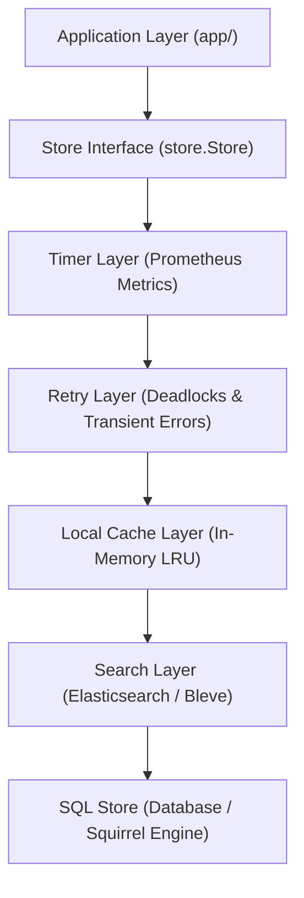
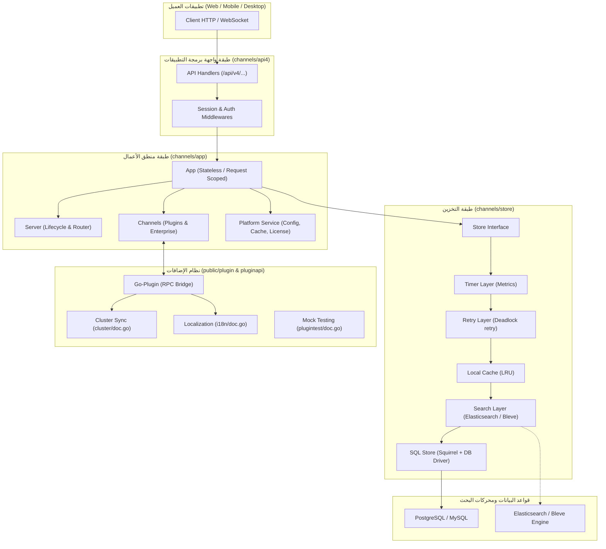

# تحليل ملفات `doc.go` في مشروع Mattermost Server

## 1. المقدمة والهدف

في بيئة تطوير لغة **Go (Golang)**، يُعد ملف `doc.go` هو المعيار القياسي لتوثيق الحزمة البرمجية (Package-level Documentation). يتم استخدامه لتوليد التوثيق الرسمي عبر أدوات مثل `godoc` أو `pkgsite`. 

في مشروع **Mattermost Server** (`/home/osm/mattermost/server`)، تلعب ملفات `doc.go` دورًا محوريًا في توثيق المعمارية البرمجية، حدود المسؤوليات بين الطبقات، أنماط التصميم (Design Patterns)، ومستويات الأمان والتحكم في الوصول.

تم العثور على **8 ملفات `doc.go`** رئيسية في المشروع، وتتوزع على نظامين أساسيين:
1. **نظام القنوات والخادم الأساسي (`channels/`)**: يمثل النواة الصلبة للخادم وقواعد البيانات والـ API.
2. **نظام الإضافات وامتدادات المطورين (`public/plugin` و `public/pluginapi`)**: يمثل واجهات برمجة الإضافات وعزل العمليات عبر RPC.

---

## 2. جدول ملخص لملفات `doc.go`

| المسار | الحزمة (Package) | الدور المعماري | النمط التصميمي الأساسي |
| :--- | :--- | :--- | :--- |
| `channels/app/doc.go` | `package app` | طبقة منطق الأعمال (Business Logic) | Request Context & Dependency Injection |
| `channels/api4/doc.go` | `package api4` | واجهة HTTP REST API | Layered Handlers & RBAC Security |
| `channels/store/doc.go` | `package store` | طبقة البيانات والتخزين | Decorator / Onion Layering & Repository |
| `channels/testlib/doc.go` | `package testlib` | أدوات مساعدة لاختبارات التكامل | Test Fixtures & Containerized Storage |
| `public/plugin/doc.go` | `package plugin` | بنية الإضافات والتواصل مع الخادم | HashiCorp go-plugin (RPC Bridge) |
| `public/plugin/plugintest/doc.go` | `package plugintest` | محاكاة واختبار الإضافات | Testify Mocking Framework |
| `public/pluginapi/cluster/doc.go` | `package cluster` | تزامن الإضافات في بيئات الكلاستر | Distributed Mutex & Synchronization |
| `public/pluginapi/i18n/doc.go` | `package i18n` | تدويل وترجمة النصوص | Translation Catalog & Localization |

---

## 3. التحليل المعماري التفصيلي لكل ملف

---

### 3.1. ملف `channels/app/doc.go` (طبقة منطق الأعمال)

* **المسار الكامل:** `/home/osm/mattermost/server/channels/app/doc.go`
* **الحزمة:** `package app`

#### الدور والمسؤولية
يمثل قلب النظام الذي يحتوي على جميع قواعد العمل والعمليات الوظيفية لمنصة Mattermost (إدارة المستخدمين، الفرق، القنوات، المنشورات، الإشعارات، التراخيص، والتكاملات الخارجية). يقع في المنتصف تماماً بين طبقة الـ API وطبقة الـ Store:

```text
┌─────────────────────────────────────────────────────────┐
│                   API Layer (api4)                      │
├─────────────────────────────────────────────────────────┤
│                Business Logic (app)                     │
├─────────────────────────────────────────────────────────┤
│                 Data Access (store)                     │
└─────────────────────────────────────────────────────────┘
```

#### المكونات الهيكلية الرئيسية (Core Structures)
1. **`App` Struct:** نقطة الدخول لجميع عمليات منطق الأعمال. ميزته المعمارية أنه **مكون وظيفي خالص لا يحتفظ بحالة دائمة (Stateless)**، ويتم إنشاؤه لكل طلب (`per request`).
2. **`Server` Struct:** يدير دورة حياة خادم HTTP، التوجيه (Routing)، والخدمات الأساسية، وإدارة دورة حياة الخدمات وحالة الكلاستر (Clustering).
3. **`Channels` Struct:** يحتوي على حالة القنوات ويدير الإضافات (Plugins)، تخزين الملفات، ومعالجة الصور، ويربط ميزات المؤسسات المتقدمة مثل LDAP و SAML والامتثال.
4. **`Platform Service`:** يدير الخدمات المشتركة وغير المرتبطة بكيان محدد (قواعد البيانات، إدارة الإعدادات، التخزين المؤقت، المقاييس، محركات البحث).

#### أنماط التصميم (Design Patterns)
* **Request Context Pattern:** تمرير `request.CTX` لجميع الدوال لتوفير إمكانية التتبع (Tracing)، السجلات (Logging)، والإلغاء (Cancellation).
* **Interface Segregation:** عزل ميزات المؤسسات داخل `einterfaces` لتمكين البناء النمطي.
* **Dependency Injection:** حقن التبعيات عبر هياكل `Server` و `Channels`.
* **Event-Driven Architecture:** إرسال الأحداث عبر WebSockets وخطافات الإضافات (Plugin Hooks).
* **معالجة الأخطاء:** الاعتماد الموحد على `model.AppError`.

---

### 3.2. ملف `channels/api4/doc.go` (واجهة REST API)

* **المسار الكامل:** `/home/osm/mattermost/server/channels/api4/doc.go`
* **الحزمة:** `package api4`

#### الدور والمسؤولية
يمثل الواجهة الأساسية بين تطبيقات العميل (Web, Desktop, Mobile) وخادم Mattermost عبر المسار الموحد `/api/v4/`.

#### مستويات معالجة الطلبات (Handler Types & Security Wrappers)
يوثق الملف وجود دوال معالجة مخصصة توفر مستويات مختلفة من الأمان والمصادقة:
1. `APIHandler`: للمسارات العامة التي لا تتطلب أي تسجيل دخول.
2. `APISessionRequired`: للمسارات التي تتطلب جلسة مستخدم مصادق عليها.
3. `APISessionRequiredTrustRequester`: للمسارات التي تتطلب مصادقة وطلبات موثوقة.
4. `CloudAPIKeyRequired`: مخصصة لـ Webhooks الخاصة بمنشآت Mattermost Cloud.
5. `RemoteClusterTokenRequired`: لتبادل البيانات بين مجمعات الخوادم البعيدة المترابطة.
6. `APILocal`: للتحكم المحلي بالخادم عبر الـ UNIX Socket بدون شبكة خارجية.

#### المسؤوليات الرئيسية
* التحقق الصارم من صحة المدخلات (Input Validation).
* التحقق من الصلاحيات والتحكم في الوصول المبني على الأدوار (RBAC).
* الحماية الأمنية الشاملة: الحماية من CSRF، تحديد معدل الطلبات (Rate Limiting)، والمصادقة الثنائية (MFA).
* توحيد صيغة الأخطاء وتحويل أخطاء طبقة الـ `app` إلى استجابات HTTP JSON قياسية مع رموز الحالة الملائمة.
* سجلات التدقيق الأمني (Audit Logging).

---

### 3.3. ملف `channels/store/doc.go` (طبقة التخزين والبيانات)

* **المسار الكامل:** `/home/osm/mattermost/server/channels/store/doc.go`
* **الحزمة:** `package store`

#### المعمارية الطبقية ونمط Decorator
يطبق نظام التخزين نمط المستودع (Repository Pattern) عبر طبقات متتالية، حيث تقوم كل طبقة بتغليف الطبقة التي تليها وإضافة ميزة معينة دون التأثير على منطق العمل:



#### المكونات الفرعية المشروحة في التوثيق
1. **SQL Store (`sqlstore/`):**
   * إدارة الاتصالات (Master / Replica).
   * بناء الاستعلامات باستخدام مكتبة `Squirrel`.
   * إدارة المعاملات (Transactions) ونظام تهجير الجداول التلقائي (Migrations & Rollback).
2. **Local Cache Layer (`localcachelayer/`):**
   * ذاكرة كاش داخلية بنظام LRU.
   * إبطال الكاش المتزامن عبر العناقيد (Cluster-aware Invalidation).
3. **Search Layer (`searchlayer/`):**
   * الفهرسة والبحث النصي الكامل عبر Elasticsearch و Bleve.
4. **Retry Layer (`retrylayer/`):**
   * إعادة المحاولة التلقائية عند تعارض الجداول أو قفل البيانات (Database Deadlocks).
5. **Timer Layer (`timerlayer/`):**
   * قياس أزمنة الاستعلامات وتحليل الاختناقات وربطها مع مقاييس Prometheus.
6. **معالجة الأخطاء الخاصة بالتخزين:**
   * توفير أخطاء دلالية مثل `store.ErrNotFound` و `store.ErrConflict`.

---

### 3.4. ملف `channels/testlib/doc.go` (أدوات الاختبارات)

* **المسار الكامل:** `/home/osm/mattermost/server/channels/testlib/doc.go`
* **الحزمة:** `package testlib`
* **المسؤولية:** توفير دوال مساعدة لإنشاء وإدارة بيئات اختبارات الوحدة واختبارات التكامل المتصلة بمخزن بيانات يعمل داخل حاويات Docker معزولة (Containerized Test Store).

---

### 3.5. ملف `public/plugin/doc.go` (نواة نظام الإضافات)

* **المسار الكامل:** `/home/osm/mattermost/server/public/plugin/doc.go`
* **الحزمة:** `package plugin`

#### التوثيق الفني الهام
* تمثل الحزمة الأساسية لبناء إضافات Mattermost المكتوبة بلغة Go وإدارتها من قبل الخادم.
* **توضيح معمارية الرموز ذات البادئة `Z_`:**
  * يوضح الملف سبب تصدير العديد من الأنواع التي تبدأ بالحرفين `Z_`؛ حيث صُممت لتكون عامة فقط لتسمح بالتوافق مع معمارية **HashiCorp `go-plugin`** وتبادل البيانات عبر بروتوكول `net/rpc`.
  * يحذر التوثيق المطورين صراحةً من استدعاء هذه الأنواع أو استخدامها مباشرة.

---

### 3.6. ملف `public/plugin/plugintest/doc.go` (محاكاة بيئة الإضافات)

* **المسار الكامل:** `/home/osm/mattermost/server/public/plugin/plugintest/doc.go`
* **الحزمة:** `package plugintest`
* **المسؤولية:** توفير كائنات محاكاة (Mocks) تم إنشاؤها باستخدام حزمة `testify/mock` لتمكين مطوري الإضافات من اختبار وظائفهم البرمجية بشكل معزول وموثوق دون الحاجة لتشغيل خادم Mattermost فعلي.

---

### 3.7. ملف `public/pluginapi/cluster/doc.go` (تزامن الإضافات في الكلاستر)

* **المسار الكامل:** `/home/osm/mattermost/server/public/pluginapi/cluster/doc.go`
* **الحزمة:** `package cluster`
* **المسؤولية:** توفير أدوات المزامنة (Synchronization Primitives / Mutexes) بين نسخ الإضافات التي تعمل عبر عدة خوادم في نفس عنقود Mattermost، لمنع تضارب العمليات المجدولة وحفظ اتساق البيانات.

---

### 3.8. ملف `public/pluginapi/i18n/doc.go` (التدويل والترجمة)

* **المسار الكامل:** `/home/osm/mattermost/server/public/pluginapi/i18n/doc.go`
* **الحزمة:** `package i18n`
* **المسؤولية:** تزويد الإضافات بواجهات برمجية لقراءة ملفات الترجمة وترجمة وتدويل الرسائل والنصوص البرمجية بحسب لغة المستخدم المفضلة.

---

## 4. المخطط المعماري الشامل لعلاقات الحزم



---

## 5. أبرز الدروس المستفادة من تصميم Mattermost

1. **فصل المسؤوليات (Separation of Concerns):** طبقة `api4` تهتم فقط بالبروتوكول والتحقق، بينما طبقة `app` مستقلة تماماً عن بروتوكول النقل (تتعامل مع البيانات والمنطق فقط)، وطبقة `store` لا تعرف شيئاً عن منطق التطبيق.
2. **استخدام نمط Decorator في التخزين:** إضافة المزايا الحيوية (المقاييس، إعادة المحاولة، الكاش، البحث) كطبقات شفافة فوق الـ SQL Store بدلاً من تلويث دوال قواعد البيانات الأصلية.
3. **التوثيق عبر `doc.go` كخارطة معمارية:** كتابة المعمارية والمخططات التوضيحية داخل `doc.go` يضمن فهم أي مطور للبنية التحتية فور قراءة الحزمة.
