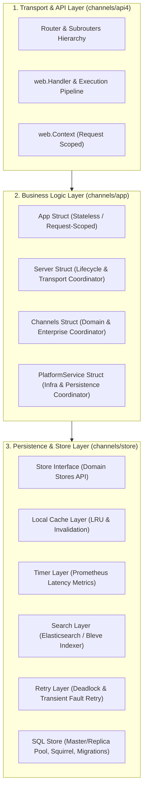

# دراسة مقارنة وتحليل معماري متعمق: بنية Mattermost Server مقابل YouTrack Backend

---

## 1. الملخص التنفيذي (Executive Summary)

يقدم هذا التقرير تحليلاً معماريًا تشريحيًا وشاملاً لبنية الخادم في مشروع **Mattermost Server** (`/home/osm/mattermost/server`) ومقارنته بالمشروع الحالي **YouTrack Backend** (`/home/osm/StudioProjects/youtrack_backend`).

يرتكز التحليل على ثلاثة محاور رئيسية:

1. **التشريح المعماري العميق** لملفات التوثيق والطبقات الأساسية (`channels/app`, `channels/api4`, `channels/store`).
2. **رصد الفروقات والانتهاكات المعمارية** لقواعد المعمارية النظيفة (Clean Architecture) ونقاط القصور في هيكل `youtrack_backend`.
3. **مقارنة المكاتب والاعتماديات (Dependencies & Libraries)** المستخدمة بين المشروعين عبر الطبقات الثلاث.

---

## 2. التحليل المعماري العميق لطبقات Mattermost Server

تتبع منصة Mattermost معمارية طبقية متقدمة ومنضبطة للغاية، تفصل بشكل صارم بين بروتوكولات النقل، منطق الأعمال، وخدمات التخزين والبنية التحتية.



---

### 2.1. تشريح طبقة منطق الأعمال (`channels/app/`)

- **ملف التوثيق:** `/home/osm/mattermost/server/channels/app/doc.go`

#### كيف بُنيت الهياكل الأربعة الأساسية (`App`, `Server`, `Channels`, `PlatformService`):

#### أ. هيكل `App` (The Request-Scoped Logic Facade)

- **التعريف:**
  ```go
  type App struct {
      ch *Channels
  }
  ```
- **الأسلوب المعماري:**
  - كائن **وظيفي خالص بدون حالة دائمة (Pure Functional & Stateless)**.
  - لا يتم الاحتفاظ بنسخة عامة وحيدة منه (Singleton)، بل يُنشأ مع كل طلب HTTP (`Request-Scoped`) عبر دالة البناء ذات الخيارات الوظيفية:
    ```go
    func New(options ...AppOption) *App
    ```
  - دوره هو ربط جميع دوال منطق الأعمال (مثل `CreatePost`, `GetChannel`, `AuthenticateUser`) بنسخة سياق الطلب الحالية، وتوفير واجهات وصول مختصرة إلى خادم النظام (`Srv()`)، والبيانات (`Store()`)، والسجلات (`Log()`).

#### ب. هيكل `Server` (The Lifecycle & Transport Coordinator)

- **التعريف والمسؤوليات:**
  - يمثل الكائن الحي الدائم للخادم (Long-lived Service Lifecycle Host).
  - يدير دورة حياة خوادم الشبكة:
    - `RootRouter`, `LocalRouter` (UNIX Socket), `Router` (Web/API/WS).
    - `http.Server` وخادم الوضع المحلي `localModeServer`.
  - يدير الخدمات الأساسية الداعمة: `JobServer`, `RateLimiter`, `EmailService`, `PushNotificationsHub`.
  - يحتوي على مؤشرات نحو `Channels` و `PlatformService`.

#### ج. هيكل `Channels` (The Domain & Enterprise Coordinator)

- **التعريف والمسؤوليات:**
  - يحتوي على حالة نطاق "المحادثات والقنوات" والميزات المؤسسية المتقدمة.
  - يدير بيئة الإضافات (`plugin.Environment`)، وتخزين الملفات (`filestore.FileBackend`)، والتخزين المؤقت الداخلي للقنوات.
  - يربط واجهات ميزات الـ Enterprise عبر واجهات معزولة (`einterfaces`): مثل `SAML`, `LDAP`, `Compliance`, `DataRetention`, `MessageExport`.

#### د. هيكل `PlatformService` (The Infrastructure & Persistence Coordinator)

- **التعريف والمسؤوليات:**
  - يمثل الطبقة التحتية المشتركة (Shared Infrastructure Foundation).
  - يدير كائنات التخزين الأساسية: `sqlstore.SqlStore`, `store.Store`, `config.Store`.
  - يدير مزود الكاش (`cache.Provider`)، كاش الجلسات والحالات (`sessionCache`, `statusCache`).
  - يدير محركات البحث (`searchengine.Broker`)، ومقاييس النظام ومزامنة رايات الميزات (`featureflag.Synchronizer`).

---

### 2.2. تشريح طبقة واجهة برمجة التطبيقات (`channels/api4/`)

- **ملف التوثيق:** `/home/osm/mattermost/server/channels/api4/doc.go`

#### أ. نظام التوجيه المعياري (`Routes`)

يتم تقسيم الـ Routers إلى هيكل هرمي دقيق (`Subrouters`):

- `api.BaseRoutes.APIRoot` (`/api/v4`)
- `api.BaseRoutes.Users` (`/api/v4/users`), `api.BaseRoutes.User` (`/api/v4/users/{user_id:[A-Za-z0-9]+}`)
- `api.BaseRoutes.Posts`, `Channels`, `Teams`, `Files`, `Plugins` ... إلخ.

#### ب. خط أنابيب المعالجة وحاويات الأمان (`Handler Wrappers`)

لا يتم تمرير دوال `http.HandlerFunc` التقليدية مباشرة، بل تمر عبر مغلفات أمان تضمن تطبيق السياسات:

1. `APIHandler`: للمسارات المفتوحة بدون مصادقة.
2. `APISessionRequired`: تفرض وجود جلسة مصادقة صالحة + التحقق من MFA.
3. `APISessionRequiredTrustRequester`: للمسارات التي تقبل الطلبات المباشرة الموثوقة (مثل رفع الملفات).
4. `CloudAPIKeyRequired`: للمسارات السحابية الموجهة من CWS.
5. `RemoteClusterTokenRequired`: للاتصال بين العناقيد الموزعة.
6. `APILocal`: للمسارات المحلية عبر UNIX Sockets بدون مصادقة شبكية ولكن بصلاحيات كاملة.

#### ج. سياق الطلب الموحد (`web.Context`)

كل دالة معالجة تستقبل:

```go
type handlerFunc func(*Context, http.ResponseWriter, *http.Request)
```

حيث يحتوي `Context` على:

- مرجع الـ `App` الخاص بالطلب.
- بيانات الجلسة `Session`، والمستخدم الحالي `User`.
- معرّف الطلب `RequestId` ومترجم النصوص `T` (i18n).
- دوال إرجاع الأخطاء القياسية: `c.Err = model.NewAppError(...)`.

---

### 2.3. تشريح طبقة التخزين والبيانات (`channels/store/`)

- **ملف التوثيق:** `/home/osm/mattermost/server/channels/store/doc.go`

#### معمارية التغليف سداسية الطبقات (6-Tier Decorator Architecture):

تم بناء التخزين بطريقة بحيث تغلف كل طبقة الطبقة التي تحتها بشفافية تامة دون تعديل كود الأعمال:

```text
Application Layer (app/)
        ↓
Store Interface (store.Store)
        ↓
  Local Cache Layer (localcachelayer: LRU in-memory + Cluster Invalidation)
        ↓
    Timer Layer (timerlayer: قياس أزمنة الاستعلامات وتسجيلها في Prometheus)
        ↓
   Search Layer (searchlayer: التزامن التلقائي مع محرك الفهرسة والبحث)
        ↓
    Retry Layer (retrylayer: إعادة المحاولة عند حدوث Deadlocks)
        ↓
    SQL Store (sqlstore: مجمع الاتصالات، بناء الاستعلامات عبر Squirrel، وإدارة Migrations)
```

#### كود تجميع الطبقات الفعلي في Mattermost (`platform/service.go`):

```go
searchStore := searchlayer.NewSearchLayer(
    retrylayer.New(ps.sqlStore),
    ps.SearchEngine,
    ps.Config(),
)

lcl, err := localcachelayer.NewLocalCacheLayer(
    timerlayer.New(searchStore, ps.metricsIFace),
    ps.metricsIFace,
    ps.clusterIFace,
    ps.cacheProvider,
    ps.Log(),
)
```

---

## 3. مقارنة تفصيلية بين Mattermost Server و YouTrack Backend

### 3.1. جدول المقارنة المعمارية

| العنصر المعماري                                 | تطبيق Mattermost Server                                                                 | الوضع الحالي في YouTrack Backend                                      | التقييم                  |
| :---------------------------------------------- | :-------------------------------------------------------------------------------------- | :-------------------------------------------------------------------- | :----------------------- |
| **نمط بناء `App`**                              | كائن وظيفي لحظي (`Request-Scoped`) يُنشأ لكل طلب عبر `app.New()`                        | كائن عام ثابت (`Singleton`) يتم إنشاؤه مرة واحدة عند تشغيل الخادم     | ⚠️ اختلاف جوهري          |
| **فصل البنية (`Server`, `Platform`, `Domain`)** | فصل دقيق بين `Server` (الشبكة), `PlatformService` (البنية التحتية), `Channels` (النطاق) | تجميع كل شيء داخل `App` مع وجود هيكل `Server` شكلي غير مستخدم         | ❌ نقص هيكلي             |
| **سياق الطلبات (`Context`)**                    | سياق غني مخصص (`web.Context`) يحتوي على `App`, `Session`, `User`, `Logger`, `T`         | استخدام `context.Context` الافتراضي مع تخزين `userID` فقط كمفتاح عام  | ⚠️ محدودية وظيفية        |
| **تغليف معالجات الـ API**                       | مغلفات أمان صارمة (`APISessionRequired`, `APIHandler`, `APILocal`)                      | `http.HandlerFunc` قياسية مع ميدلوير `JWTAuth` مجمع يغطي مسارات كاملة | ⚠️ ضعف التحكم الدقيق     |
| **معالجة واسترجاع الأخطاء**                     | نموذج موحد عالمي `model.AppError` مع معرفات الترجمة ورموز الـ HTTP                      | خليط بين `model.CustomError`, `writeError`, و `errors.New` غير موحدة  | ⚠️ تشتت في الأخطاء       |
| **طبقات التخزين (Store Layers)**                | 6 طبقات تزيين (Cache + Timer + Search + Retry + SQLStore)                               | اتصال مباشر عبر `pgxpool` إلى `sqlstore` بدون أي طبقات كاش أو تكرار   | ❌ نقص في الأداء والتحمل |
| **بناء الاستعلامات (SQL Building)**             | استخدام منشئ الاستعلامات `Squirrel` مع تجنب استعلامات النصوص الخام                      | نصوص SQL خام مجمعة يدوياً (Raw Strings)                               | ⚠️ صعوبة الصيانة والأمان |

---

## 4. الانتهاكات المعمارية المرصودة في مشروع YouTrack Backend

### ⚠️ الانتهاك الأول (حرج جداً): انتهاك اتجاه التبعيات (Dependency Inversion Violation)

- **المشكلة:**
  تم رصد قيام طبقة منطق الأعمال (`internal/app`) وكذلك طبقة التخزين وقواعد البيانات (`internal/store` و `internal/store/sqlstore`) باستيراد حزمة من طبقة الـ API:
  ```go
  // موجود داخل internal/app/issue.go, admin.go, user.go ... إلخ
  // وموجود داخل internal/store/store.go و sqlstore/*.go
  import "youtrack_backend/channels/api/fields"
  ```
- **سبب الخطأ المعماري:**
  في معمارية Clean Architecture، يجب أن تكون اتجاهات التبعيات دائمًا من الخارج إلى الداخل:
  $$\text{API (Transport)} \longrightarrow \text{App (Business Logic)} \longrightarrow \text{Store (Persistence)} \longrightarrow \text{Model (Core Domain)}$$
  لا يجوز إطلاقًا للطبقات الداخلية (`app` أو `store`) أن تستورد أو تعتمد على أي شيء موجود داخل طبقة النقل (`api`).
- **الحل المطلوب:**
  نقل حزمة `fields` من `internal/api/fields` إلى `internal/model/fields` أو `internal/shared/fields`.

---

### ⚠️ الانتهاك الثاني: انفصال هيكل `Server` عن مسارات الـ API (Divergent Routing Logic)

- **المشكلة:**
  يحتوي ملف `internal/app/server.go` على تعريف لهيكل `Server` يحاكي Mattermost:
  ```go
  type Server struct {
      RootRouter  *mux.Router
      LocalRouter *mux.Router
      Router      *mux.Router
      Server      *http.Server
  }
  ```
  بينما في المقابل:
  1. ملف `internal/api/api.go` تم تعليق (Comment out) كود مسارات Gorilla Mux فيه.
  2. ملف `internal/api/router.go` يقوم بإنشاء `http.NewServeMux()` جديد تمامًا ومستقل باستخدام ميزات Go 1.22 دون أي ارتباط بهيكل `Server`.
- **الحل المطلوب:**
  توحيد فلسفة التوجيه إما بتبني معمارية الموجهات الهرمية (Hierarchical Subrouters عبر Gorilla Mux مثل Mattermost) أو إعادة تصميم `Server` ليتوافق تمامًا مع معمارية Go 1.22 الموحدة.

---

### ⚠️ الانتهاك الثالث: غياب كائن الـ Context الموحد وتكرار استخراج البيانات (Context Starvation)

- **المشكلة:**
  كل معالج (Handler) داخل `internal/api/issue.go` أو `user.go` يضطر لتكرار:
  ```go
  userID, ok := CurrentUserID(r)
  fieldsStr := r.URL.Query().Get("fields")
  tree := fields.Parse(fieldsStr)
  ```
  بينما في Mattermost، يتم استخراج المستخدم، الجلسة، الحقول، اللغات، وإعدادات الطلب مرة واحدة في `web.Context` وتمريرها جاهزة للمعالج.

---

## 5. مقارنة شاملة للمكتبات والاعتماديات (Libraries & Dependencies)

### 5.1. طبقة الـ API و النقل (Transport & Routing)

| الوظيفة                       | المكاتب في Mattermost Server                     | المكاتب في YouTrack Backend                   | الحالة في مشروعنا       |
| :---------------------------- | :----------------------------------------------- | :-------------------------------------------- | :---------------------- |
| **الموجه (Router)**           | `github.com/gorilla/mux`                         | `net/http` (Go 1.22 Mux) + `gorilla/mux` معلق | مدمج جزئيًا / غير مستقر |
| **إدارة CORS**                | `github.com/rs/cors`                             | `github.com/rs/cors`                          | ✅ موجود ومتطابق        |
| **توثيق JWT**                 | توثيق الجلسات عبر التوكن الداخلي وقواعد البيانات | `github.com/golang-jwt/jwt/v5`                | ✅ موجود ومناسب         |
| **ضغط البيانات (Gzip)**       | `github.com/klauspost/compress/gzhttp`           | غير مستخدم                                    | ❌ غير موجود            |
| **معالجة التتبع والانهيارات** | `github.com/getsentry/sentry-go`                 | ميدلوير محلي بسيط `Recoverer`                 | ❌ يفتقر للتتبع المتقدم |

---

### 5.2. طبقة منطق الأعمال (Business Logic & App)

| الوظيفة                        | المكاتب في Mattermost Server                         | المكاتب في YouTrack Backend | الحالة في مشروعنا            |
| :----------------------------- | :--------------------------------------------------- | :-------------------------- | :--------------------------- |
| **السجلات المهيكلة (Logging)** | `github.com/mattermost/logr` / `mlog`                | `log` القياسي من Go         | ❌ يفتقر للـ Structured Logs |
| **المقاييس (Metrics)**         | `github.com/prometheus/client_golang`                | غير مستخدم                  | ❌ غير موجود                 |
| **توليد المعرفات (UUID)**      | `github.com/mattermost/mattermost/.../model.NewId()` | `github.com/google/uuid`    | ✅ موجود ومناسب              |
| **التشفير وكلمات المرور**      | `golang.org/x/crypto/bcrypt`                         | `golang.org/x/crypto`       | ✅ موجود ومتطابق             |
| **نظام المكونات الإضافية**     | `github.com/hashicorp/go-plugin`                     | غير مستخدم                  | ❌ غير موجود (ميزة متقدمة)   |

---

### 5.3. طبقة التخزين وقواعد البيانات (Store & Database)

| الوظيفة                              | المكاتب في Mattermost Server                      | المكاتب في YouTrack Backend               | الحالة في مشروعنا            |
| :----------------------------------- | :------------------------------------------------ | :---------------------------------------- | :--------------------------- |
| **برنامج تشغيل ومجمع DB**            | `database/sql` + `lib/pq` / `go-sql-driver/mysql` | `github.com/jackc/pgx/v5/pgxpool`         | ✅ حديث وممتاز لـ PostgreSQL |
| **بناء الاستعلامات (Query Builder)** | `github.com/Masterminds/squirrel`                 | استعلامات نصية يدوية (Raw SQL Strings)    | ❌ يفتقر لـ Query Builder    |
| **هجرة الجداول (Migrations)**        | `github.com/mattermost/morph`                     | سكربتات SQL يدوية داخل مجلد `migrations/` | ⚠️ يفتقر للمشغل التلقائي     |
| **محرك التخزين المؤقت (Cache)**      | مزود داخلي يدعم (In-memory LRU و Redis)           | غير موجود                                 | ❌ مفقود تماماً في Store     |
| **محرك البحث النصي**                 | `blevesearch/bleve` + `Elasticsearch`             | بحث نصي محلي مبسط عبر SQL `ILIKE`         | ⚠️ يحتاج تحسين مستقبلاً      |
| **إطار عمل الاختبارات والمحاكاة**    | `github.com/stretchr/testify` + `mockery`         | `github.com/stretchr/testify`             | ✅ موجود ومتطابق             |

---

## 6. الخريطة الموصى بها لإعادة الهيكلة (Restructuring Blueprint)

تمهيدًا لمرحلة خطة العمل التنفيذية (Implementation Plan)، هذه هي الخطوات الهيكلية الأساسية المقترحة:

```text
[المرحلة 1: تصحيح التبعيات المعمارية]
 └── نقل `internal/api/fields` إلى `internal/model/fields` وتحديث جميع المسارات.

[المرحلة 2: توحيد وهيكلة طبقة الـ API]
 ├── بناء `web.Context` موحد يحمل (App, User, FieldsTree, RequestID, Logger).
 └── إنشاء Wrapper موحد لمعالجات الطلبات (Handlers) لتقليل الكود المتكرر.

[المرحلة 3: تنظيم هياكل App و Server]
 ├── تحويل `App` إلى نمط نظيف يربط السياق والعمليات.
 └── توحيد منطق التوجيه بين `Server` و `Router`.

[المرحلة 4: ترقية طبقة التخزين Store]
 ├── اعتماد `Masterminds/squirrel` لتوليد استعلامات ديناميكية آمنة.
 └── إدخال طبقة Memory Cache (LRU) للبيانات المتكررة (مثل الصلاحيات والمستخدمين).
```
