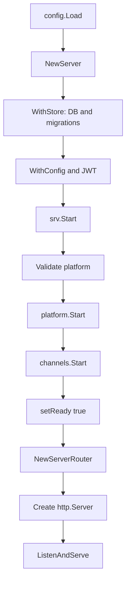

# تحليل دورة حياة الخادم: YouTrack Backend مقابل Mattermost Server

## 1. نطاق التحليل

يقارن هذا المستند دورة حياة الخادم داخل طبقة `channels/app` في مشروع YouTrack Backend مع دورة الحياة المنفذة في مشروع Mattermost Server الموجود في:

`/home/osm/mattermost/server`

التركيز هنا على الخادم كعملية طويلة العمر، وليس على مقارنة كل وظائف المنتج. وتشمل المقارنة:

- نقطة الدخول وتركيب الاعتماديات.
- التحقق من الإعدادات وتهيئة الموارد.
- تسجيل HTTP وWebSocket routes.
- فتح listeners وبدء استقبال الطلبات.
- تشغيل workers والمهام الخلفية.
- readiness وhealth.
- استقبال إشارات النظام.
- الإيقاف التدريجي وإغلاق الموارد.
- انتشار الأخطاء واختبارات دورة الحياة.

Mattermost مستخدم كمرجع ناضج لتنظيم lifecycle، وليس كمواصفة تلزم YouTrack بتنفيذ كل ميزاته مثل البريد أو التخزين المؤقت أو WebSocket إذا لم تكن ضمن متطلبات المنتج.

---

## 2. الخلاصة التنفيذية

يملك YouTrack Backend الهيكل الاسمي الصحيح تقريبا:

```text
NewServer -> Validate -> Start -> Run -> Shutdown
```

لكن المسؤوليات موزعة بين `cmd/server/main.go` و`channels/app/YouTrackServer` و`YouTrackChannels` وطبقة API. لذلك لا تمثل الدوال الحالية دورة تنفيذ واحدة مكتملة من البداية إلى النهاية.

في YouTrack:

1. `NewServer` ينشئ بعض الهياكل ويطبق الخيارات.
2. `Start` يتحقق من المنصة ويبدأها ويبدأ القنوات.
3. `Start` يعلن readiness قبل فتح منفذ HTTP.
4. `main` يركب API server بعد `Start`.
5. `main` هو الذي يستدعي `ListenAndServe`.
6. `YouTrackChannels.Start` يسجل signal handler إضافيا.
7. `Shutdown` قد يتوقف عند أول خطأ ولا يكمل إغلاق الموارد التالية.

في Mattermost:

1. `commands/server.go` ينسق عملية التشغيل.
2. `app.NewServer` يبني dependency graph مرتب حسب الاعتماديات.
3. routes والخدمات الأساسية تجهز قبل التشغيل.
4. `Server.Start` يضبط HTTP server ويفتح listener فعليا.
5. فشل bind يرجع كخطأ من مرحلة startup.
6. العمال والـ goroutines تسجل في lifecycle accounting.
7. `Server.Shutdown` يوقف المكونات بالترتيب وينتظر العمال قبل إغلاق الموارد التي يعتمدون عليها.

النتيجة الأساسية: YouTrack يملك lifecycle contract، لكنه لا يملك بعد lifecycle orchestration مركزيا ومتكاملا.

---

## 3. النموذج المفاهيمي

### 3.1. الهياكل الأساسية في YouTrack

| الهيكل | المسار | المسؤولية الحالية |
|---|---|---|
| `YouTrackApp` | `channels/app/app.go` | facade لمنطق الأعمال، ينشأ مع ربطه بـ `Channels` |
| `YouTrackServer` | `channels/app/youtrack_server.go` | حالة الخادم، routers، `http.Server`، المنصة، readiness |
| `YouTrackChannels` | `channels/app/youtrack_channels.go` | منسق خدمات النطاق وبعض المهام والإشارات |
| `YouTrackPlatformService` | `channels/app/platform/platform_service.go` | الإعدادات، store، logger، بدء وإيقاف موارد المنصة |

### 3.2. الهياكل المناظرة في Mattermost

| الهيكل | المسار | المسؤولية |
|---|---|---|
| `App` | `channels/app/app.go` | facade لمنطق الأعمال والخدمات |
| `Server` | `channels/app/server.go` | lifecycle coordinator، HTTP/local servers، listeners، jobs والخدمات |
| `Channels` | `channels/app/channels.go` | منسق وظائف النطاق |
| `PlatformService` | `channels/app/platform/platform_service.go` | store، cache، search، hub، workers والبنية التحتية |

الفارق ليس في وجود أربعة هياكل متشابهة، بل في مقدار ما يملكه `Server` فعليا من الموارد ومسؤوليات التشغيل.

---

## 4. نقاط الدخول وملكية orchestration

### 4.1. YouTrack

نقطة الدخول الفعلية هي `cmd/server/main.go`، وتسلسلها الحالي هو:

```text
config.Load()
  -> app.NewServer(WithStore, WithConfig, WithJWTSecret)
  -> srv.Start()
  -> api.NewServerRouter(srv)
  -> إنشاء http.Server
  -> signal.NotifyContext
  -> ListenAndServe()
```

هذا يسبب فصل lifecycle إلى جزأين:

- `srv.Start()` يهيئ المنصة والقنوات ويضبط readiness.
- `main` يركب router ويفتح socket ويملك HTTP serving.

أما `YouTrackServer.Run(ctx)` فيحاول تقديم مسار بديل، لكنه لا يستخدم `ctx` لإيقاف `ListenAndServe` أثناء التشغيل. فهو ينتظر انتهاء `ListenAndServe` أولا، ثم ينتظر `ctx.Done()`، وهو عكس السلوك المطلوب عند إلغاء context.

### 4.2. Mattermost

المسار المناظر يبدأ من:

- `cmd/mattermost/main.go`.
- `cmd/mattermost/commands/server.go`، وخاصة `runServer` أو المسار المكافئ له.
- `channels/app/server.go`.

تبقى إشارات النظام في طبقة command، بينما يعرف `Server` كيف يبدأ ويوقف مكوناته. هذا الفصل مهم لأن `channels/app` يمكن اختباره أو تشغيله من أكثر من entry point دون أن يسجل signal handlers على مستوى العملية بنفسه.

### 4.3. الحكم

الاختلاف المؤثر هو ملكية القرار:

- YouTrack: القرار موزع بين command وserver وchannels.
- Mattermost: command يملك orchestration الخارجي، و`Server` يملك موارد lifecycle الداخلية.

ينبغي أن يكون لكل resource مالك واحد واضح: من بدأه هو المسؤول عن إيقافه وانتظار انتهائه.

---

## 5. مرحلة البناء والتحقق

### 5.1. YouTrack

`NewServer` ينشئ `RootRouter` و`Router`، ثم يطبق `Option`، ثم ينشئ `PlatformService` افتراضيا عند الحاجة، ثم `YouTrackChannels`.

الملاحظات:

- في المسار الافتراضي يتم تجاهل خطأ `platform.New()` عبر `server.platform, _ = platform.New()`.
- `WithStore` ينشئ اتصال قاعدة البيانات ويشغل migrations أثناء تطبيق option، أي أن construction وresource acquisition متداخلان.
- options تعدل `PlatformService` مباشرة عبر setters.
- لا توجد خيارات رسمية للـ logger أو listener/server factory أو worker configuration أو metrics أو WebSocket.

`Validate` يفحص platform config وJWT وstore readiness، ثم ينشئ routers وcontext و`http.Server` عند الحاجة.

### 5.2. Mattermost

`NewServer` في `channels/app/server.go` يبني dependency graph بترتيب معلن، ويعيد الخطأ عند فشل مورد أساسي. الخيارات تصف كيفية بناء المنصة والـ store والـ cache والـ logger والـ jobs، ثم تنشأ الخدمات في مواضع يمكن التحكم فيها واختبارها.

هذا الفصل يجعل المراحل أوضح:

```text
Options
  -> dependency construction
  -> dependency validation
  -> service construction
  -> runtime start
```

### 5.3. النقص المؤكد في YouTrack

لا توجد مرحلة موحدة تمنع بدء التشغيل حتى تكتمل كل الاعتماديات الحرجة. توجد validation، لكنها لا تضمن أن كل مورد سيستخدمه runtime قد أنشئ وربط وربط lifecycle الخاص به.

---

## 6. تسلسل startup

### 6.1. التسلسل الحالي في YouTrack



المشكلة الرئيسية أن العقدة `setReady true` تسبق `ListenAndServe`. لذلك يمكن أن تقول health endpoint إن الخادم جاهز بينما لا يوجد listener يستقبل الاتصالات، أو بينما فشل bind سيظهر لاحقا في `main`.

كما أن API router يركب بعد `Start`. أما `Validate` فتنشئ `http.Server` باستخدام `RootRouter` إذا لم يكن موجودا، وهذا يفتح احتمال وجود server handler غير مكتمل إذا استُخدم المسار الداخلي بدلا من `main`.

### 6.2. التسلسل المناظر في Mattermost

التسلسل العام في Mattermost هو:

```text
load configuration
  -> create platform and store
  -> create domain services
  -> initialize API, WebSocket and web routes
  -> start platform and jobs
  -> bind TCP listener
  -> start HTTP serving
  -> notify supervisor that startup succeeded
```

لا يعود `Start` بنجاح قبل أن تتضح نتيجة bind. لذلك يستطيع entry point التمييز بين server بدأ فعليا وserver فشل في امتلاك عنوانه.

### 6.3. التحسين المطلوب

يجب اختيار أحد تصميمين واضحين:

1. `Server.Start(ctx)` يفتح listener ويبدأ serving، أو
2. `Server.Bind()` يفتح listener، ثم `Server.Serve()` يبدأ الخدمة، ثم `Server.Start` ينسق الاثنين.

في كلا التصميمين، لا تعلن readiness إلا بعد نجاح bind، وبعد بدء كل الموارد الحرجة.

---

## 7. HTTP routers وhealth

### 7.1. YouTrack

`channels/api/router.go` يبني API router ويركب middleware مثل rate limiting وCORS وlogging وrequest ID وrecovery وversioning.

يوجد مساران للصحة:

- `HealthHandler.Check` في `channels/api/health.go` يعتمد على `srv.IsReady()` ويعيد 503 قبل readiness أو بعد shutdown.
- `NewLocalRouter` في `channels/api/router.go` يعيد `200 healthy` دائما ولا يفحص readiness.

هذا يخلط بين دلالتين مختلفتين:

- **Liveness:** العملية ما زالت حية ويمكنها الرد.
- **Readiness:** العملية جاهزة لاستقبال traffic الحقيقي.

### 7.2. Mattermost

Mattermost يملك `RootRouter` و`LocalRouter` و`Router`، ويضيف local server عند الحاجة. كما يضبط HTTP server والـ timeouts والـ listener داخل lifecycle المركزي. endpoint النظام لديه دلالة application ping، وليس بالضرورة بديلا كاملا عن readiness probe.

### 7.3. الفجوة

وجود `IsReady` في YouTrack نقطة جيدة، لكن توقيته ومصدره غير كافيين. ينبغي فصل endpoints بوضوح:

```text
/live   -> العملية والـ process event loop يعملان
/ready  -> dependencies الحرجة جاهزة وlistener bound والخادم يقبل traffic
```

وينبغي أن يستخدم local health semantics نفسها أو أن يصرح بوضوح أنه liveness فقط.

---

## 8. قاعدة البيانات وطبقات store

### 8.1. YouTrack

`WithStore` يبني:

```text
PostgreSQL
  -> SqlStore
  -> retrylayer
  -> timerlayer
  -> PlatformService.store
```

وتنفذ `SqlStore` اختبار الاتصال، بينما تستدعي `PlatformService.Validate` `store.Ready` إن كان store موجودا.

الإيجابيات:

- migrations تفشل إنشاء الخادم عند الفشل.
- readiness لقاعدة البيانات موجودة.
- store interface يسمح بعزل جزء من الاختبارات.

النواقص lifecycle:

- لا يوجد store factory منفصل يفصل البناء عن acquisition.
- لا توجد طبقة cache أو search أو metrics ضمن lifecycle الحالي.
- لا يظهر من `PlatformService.Shutdown` accounting للموارد غير store.
- يجب التأكد أن wrappers تمرر `Close` إلى الطبقة الداخلية دائما.

### 8.2. Mattermost

Platform في Mattermost يملك store وcache وsearch وconfig store وخدمات أخرى، ويغلقها بعد إيقاف العمال الذين يعتمدون عليها. هذا الترتيب يقلل خطر استخدام مورد مغلق من goroutine ما زالت تعمل.

### 8.3. الحكم

الاختلاف في عدد الطبقات طبيعي بسبب اختلاف حجم المنتج. أما الفارق الضروري فهو أن كل طبقة موجودة في YouTrack يجب أن تكون ضمن ownership وshutdown contract، بغض النظر عن وجود cache أو search.

---

## 9. WebSocket

### 9.1. الحالة في YouTrack

لا توجد حاليا دورة WebSocket فعلية داخل `channels/app`. توجد endpoints في `channels/api/hub.go` لكنها REST endpoints، وليست WebSocket connection lifecycle.

لا توجد مكونات مقابلة لـ:

- WebSocket router.
- connection authentication handshake.
- connection registry أو hub broadcast.
- connection read/write pumps.
- إغلاق الاتصالات في shutdown.

### 9.2. الحالة في Mattermost

Mattermost يملك:

- `platform.WebSocketRouter`.
- `WebConn` وconnection state.
- `wsapi` لتسجيل handlers.
- authentication challenge.
- Hub لتسجيل الاتصالات وإرسال الرسائل.
- إيقاف hub والاتصالات ضمن shutdown.

### 9.3. التقييم

هذه ليست نقيصة lifecycle عامة إذا كان YouTrack HTTP-only. لكنها نقيصة parity وظيفية إذا كان المطلوب سلوك شبيه بـ Mattermost في التحديثات الفورية. لا ينبغي إضافة WebSocket لمجرد المقارنة قبل تثبيت متطلبات المنتج.

---

## 10. Background workers وgoroutines

### 10.1. YouTrack

`YouTrackChannels` يحتوي على `dndTask` و`schedulerPostTask` وsignal goroutine.

المشكلة المؤكدة أن `Stop` يلغي `dndTask` فقط، ولا يلغي `scheduledPostTask`. كما لا توجد آلية عامة لـ:

- تسجيل كل goroutine بدأه الخادم.
- إرسال cancellation موحد.
- انتظار انتهاء goroutines.
- تحديد worker pool أو حد أقصى للمهام.
- نشر أخطاء worker إلى سياسة واضحة.

### 10.2. Mattermost

Mattermost يملك نمطا صريحا عبر `PlatformService.Go` و`waitForGoroutines`. كما يستخدم `WaitGroup` لبعض worker pools، ويوقف queue والعمال ثم ينتظرهم قبل إغلاق store أو hub.

الفكرة القابلة للتعميم ليست نسخ أسماء Mattermost، بل تطبيق القاعدة التالية:

```text
كل goroutine يبدأه server
  -> يملك stop signal
  -> يسجل في accounting
  -> يحدد سلوك الخطأ
  -> ينتظر في shutdown
```

### 10.3. الأثر

بدون wait mechanism، قد تحدث race بين worker يستخدم store وبين `PlatformService.Shutdown` الذي يغلق store. وقد يستمر scheduled task بعد عودة shutdown للمستدعي.

---

## 11. Signal handling

### 11.1. YouTrack

`cmd/server/main.go` يستخدم `signal.NotifyContext`، وهذا مكان مناسب.

لكن `YouTrackChannels.Start` يستخدم أيضا `signal.Notify` ويسجل goroutine تستدعي `ch.Stop` ثم `server.Shutdown`. ينتج عن ذلك مالكان لإشارة SIGINT/SIGTERM:

```text
main signal handler
  -> server.Shutdown

channels signal handler
  -> channels.Stop
  -> server.Shutdown
```

`shutdownOnce` يقلل التكرار، لكنه لا يصلح الملكية التصميمية ولا يضمن وضوح ترتيب الإيقاف.

### 11.2. Mattermost

signal handling موجود في command layer. `Channels` لا يقرر إيقاف العملية كلها، ولا يسجل process-level signal handler كجزء من تهيئة الخدمة.

### 11.3. التوصية

يجب أن يملك entry point الإشارة مرة واحدة فقط، وأن يمرر cancellation إلى server:

```text
command receives SIGTERM
  -> cancel root context
  -> server.Run observes cancellation
  -> server.Shutdown executes once
```

---

## 12. Graceful shutdown

### 12.1. YouTrack الحالي

الترتيب في `YouTrackServer.Shutdown` هو تقريبا:

```text
setReady(false)
  -> channels.Stop
  -> http.Server.Shutdown
  -> platform.Shutdown
  -> cancel context
```

المشكلات:

1. `channels.Stop` يحدث قبل إيقاف قبول HTTP requests، رغم أن requests الجارية قد تعتمد على services في channels.
2. إذا فشل `ch.Stop` يحدث return مبكر، فلا يتم إيقاف HTTP أو platform.
3. إذا فشل HTTP shutdown لا يصل التنفيذ إلى platform shutdown.
4. لا يوجد worker drain عام.
5. لا يتم إلغاء `scheduledPostTask`.
6. `ctx` لا ينتقل إلى workers أو platform lifecycle.
7. الاستدعاء الثاني قد يعيد `nil` حتى لو فشل جزء من الاستدعاء الأول.
8. لا توجد قائمة أخطاء مجمعة تضمن رؤية كل مراحل الفشل.

### 12.2. Mattermost

يوقف Mattermost المكونات بطريقة تعتمد على علاقات الاعتماد، مع الاستمرار في إغلاق بقية الموارد عند فشل مرحلة واحدة. التسلسل العام:

```text
mark unready
  -> stop accepting new traffic
  -> drain HTTP/local connections
  -> stop WebSocket and hubs
  -> stop jobs and workers
  -> wait for goroutines
  -> close search/cache/store/config resources
  -> flush logger
  -> return combined shutdown errors
```

قد يختلف الترتيب التفصيلي بين إصدارات Mattermost، لكن المبدأ ثابت: لا تغلق dependency قبل المكونات التي تستخدمها، ولا تجعل خطأ مرحلة واحدة يمنع تنظيف الموارد الأخرى.

### 12.3. ترتيب مقترح لـ YouTrack

```text
mark unready
  -> stop accepting new traffic
  -> drain HTTP connections
  -> cancel channels tasks
  -> stop workers and wait
  -> close platform/store
  -> cancel internal context
  -> return aggregated errors
```

يجب اختبار هذا الترتيب مع worker حقيقي أو test double ينتظر إشارة الإيقاف.

---

## 13. انتشار الأخطاء وحالات lifecycle

### 13.1. YouTrack

الإيجابيات:

- أخطاء options وmigrations ترجع للمستدعي.
- `platform.Start` و`channels.Start` أخطاؤهما تصل إلى `Server.Start`.
- `Run` يميز `http.ErrServerClosed`.

النواقص:

- تجاهل خطأ `platform.New` في `NewServer` الافتراضي.
- bind error يحدث خارج `Server.Start` في `main`.
- أخطاء signal-triggered shutdown تسجل غالبا ولا تعود إلى مالك العملية.
- لا توجد حالة صريحة مثل `Created`, `Validated`, `Starting`, `Running`, `Stopping`, `Stopped`.

### 13.2. الحالة المقترحة

بدلا من `ready bool` وحدها، يمكن تمثيل lifecycle بحالة محمية:

```text
Created -> Validated -> Starting -> Running
Running -> Stopping -> Stopped
Starting -> Failed
```

ويجب منع الانتقالات غير الصحيحة، مثل بدء server بعد إيقافه أو استدعاء shutdown قبل اكتمال initialization دون تنظيف الموارد التي أنشئت فعلا.

---

## 14. الاختبارات الحالية والفجوات

### 14.1. ما يغطيه YouTrack

في `channels/app/server_lifecycle_test.go` توجد اختبارات لـ:

- بدء وإيقاف `PlatformService`.
- idempotency للإيقاف.
- فشل validation عند غياب config أو JWT.
- readiness flag قبل وبعد start وshutdown.
- health handler.
- HTTP integration باستخدام listener عشوائي.
- option ordering بصورة غير مباشرة.

هذه بداية مفيدة، لكنها لا تطابق مسار التشغيل الفعلي بالكامل لأن الاختبار يشغل `ListenAndServe` يدويا بعد `Start`، مثلما يفعل `main` حاليا.

### 14.2. اختبارات لازمة

| الاختبار | الهدف |
|---|---|
| `Run(ctx)` مع cancel | إثبات أن cancellation يوقف HTTP serving فعليا |
| فشل bind | يجب أن يفشل startup قبل إعلان readiness |
| readiness قبل listener | منع حالة ready الكاذبة |
| production-shaped startup | تشغيل الخادم بنفس ترتيب `cmd/server/main.go` |
| local socket | التحقق من local API وملكية socket وإزالته |
| scheduled task cancellation | منع استمرار task بعد shutdown |
| worker drain | إثبات انتظار العمال قبل إغلاق store |
| concurrent shutdown | التحقق من idempotency وحفظ الأخطاء |
| local health semantics | التمييز بين liveness وreadiness |
| router completeness | ضمان تركيب API قبل بدء serving |

### 14.3. Mattermost كمرجع للاختبارات

اختبارات Mattermost في `channels/app` و`platform` تغطي startup، listener failures، TLS، الموارد، panic logging، workers، والـ platform resources. القيمة الأهم هي اختبار lifecycle من منظور resource ownership، وليس عدد الاختبارات فقط.

---

## 15. الفروقات والنواقص مرتبة حسب الأولوية

### أولوية P0: صحة التشغيل والتوافر

1. readiness تعلن قبل bind.
2. `Run(ctx)` لا يوقف server عند cancellation.
3. API router يركب بعد `Start` في المسار الفعلي.
4. تجاهل خطأ `platform.New`.
5. ازدواجية signal handling.

### أولوية P1: سلامة الموارد

1. عدم إلغاء `scheduledPostTask`.
2. غياب worker accounting والانتظار.
3. early return في shutdown.
4. احتمال إغلاق store بينما goroutine ما زالت تستخدمه.
5. عدم وجود سياسة موحدة لأخطاء workers.

### أولوية P2: observability والتكامل

1. lifecycle state صريح بدلا من readiness flag فقط.
2. فصل liveness عن readiness.
3. timeout وسياسة موحدة لكل shutdown stage.
4. logger flush وإدارة lifecycle الخاصة به.
5. listener reference لتوفير معلومات دقيقة عن العنوان الفعلي.

### أولوية P3: parity اختيارية

1. WebSocket router وhub.
2. cache layer.
3. search service.
4. metrics server.
5. job server متقدم.
6. local supervision API إذا كانت مطلوبة تشغيليا.

لا ينبغي اعتبار P3 شرطا لصحة HTTP server الأساسي ما لم يتطلب المنتج هذه الوظائف.

---

## 16. lifecycle عام لأي server

التسلسل العام المقترح:

```mermaid
flowchart LR
    A[Load config] --> B[Validate config]
    B --> C[Create logger]
    C --> D[Build infrastructure]
    D --> E[Validate DB/cache/external dependencies]
    E --> F[Build domain services]
    F --> G[Register HTTP and WS routes]
    G --> H[Bind listeners]
    H --> I[Start workers]
    I --> J[Mark ready]
    J --> K[Wait for context or server error]
    K --> L[Mark unready]
    L --> M[Stop accepting traffic]
    M --> N[Drain connections]
    N --> O[Stop workers and wait]
    O --> P[Close services and stores]
    P --> Q[Flush logs and return errors]
```



### قواعد تنفيذية عامة

1. **التحقق قبل التشغيل:** لا يبدأ resource-dependent runtime قبل نجاح config وdependency validation.
2. **الربط قبل readiness:** لا تصبح الخدمة ready قبل نجاح bind وبدء المكونات الحرجة.
3. **مالك واحد لكل resource:** المكون الذي ينشئ listener أو worker أو goroutine يملك إيقافه وانتظار نهايته.
4. **إيقاف القبول قبل الإغلاق:** أوقف استقبال traffic ثم نفذ drain، وبعدها أغلق dependencies.
5. **لا early return في shutdown:** اجمع الأخطاء، واستمر في تنظيف بقية الموارد.
6. **كل goroutine قابلة للإيقاف:** cancellation أو quit signal، accounting، wait، وسياسة خطأ.
7. **الإشارة خارج طبقة المجال:** signal handling مسؤولية entry point، وليس domain channels.
8. **اختبارات تشبه الإنتاج:** يجب أن يستخدم اختبار lifecycle نفس ترتيب startup الموجود في entry point.

---

## 17. خارطة تنفيذ مقترحة لـ YouTrack

### المرحلة الأولى: توحيد المسار

- نقل تركيب API router إلى مرحلة ما قبل startup الفعلي.
- جعل `Server` يملك listener وHTTP serving، أو تعريف `Bind` و`Serve` بوضوح.
- إصلاح `Run(ctx)` لربط cancellation بـ `Server.Shutdown`.
- إزالة signal handler من `YouTrackChannels` وتركه في command layer.
- عدم تجاهل خطأ `platform.New`.

### المرحلة الثانية: readiness وshutdown

- إضافة lifecycle state محمية.
- إعلان readiness بعد bind وبدء workers الحرجة.
- فصل `/live` و`/ready` أو توثيق دلالة endpoint واحد بوضوح.
- إيقاف استقبال traffic قبل إيقاف services.
- إلغاء كل scheduled tasks.
- استخدام تجميع أخطاء shutdown.

### المرحلة الثالثة: workers والموارد

- إضافة `Go` و`Wait` أو abstraction مكافئ.
- تسجيل worker count وwait signal.
- تعريف worker pools bounded عند الحاجة.
- ضمان إغلاق wrappers والـ store الداخلي.
- إضافة timeout مستقل لكل shutdown stage عند الضرورة.

### المرحلة الرابعة: القدرات الاختيارية

- WebSocket lifecycle إذا تطلب المنتج تحديثات فورية.
- metrics وtracing وcache وsearch حسب المتطلبات التشغيلية.
- local supervision server إذا كان النشر يحتاج UNIX socket.

---

## 18. الخلاصة

YouTrack Backend لا يفتقر إلى أسماء lifecycle الأساسية، بل إلى اكتمال العلاقة بينها. `Validate` و`Start` و`Run` و`Shutdown` موجودة، لكن listener وrouter والإشارات والعمال موزعة خارج عقد واحد متماسك.

أهم إصلاحات correctness هي:

1. جعل startup يملك bind ونتيجة serving.
2. ربط cancellation بإيقاف HTTP فعلي.
3. إعلان readiness بعد نجاح listener فقط.
4. إزالة signal ownership من `YouTrackChannels`.
5. انتظار كل workers قبل إغلاق store.
6. تنفيذ shutdown لجميع المكونات حتى عند فشل مرحلة واحدة.

بعد هذه الإصلاحات يصبح من المنطقي تقييم WebSocket وcache وmetrics كقرارات منتج مستقلة، بدلا من خلطها مع الأساس الضروري لأي server production-ready.

---

## 19. مراجع الكود

### YouTrack Backend

- `channels/app/youtrack_server.go`
- `channels/app/youtrack_channels.go`
- `channels/app/platform/platform_service.go`
- `channels/app/options.go`
- `channels/app/server_lifecycle_test.go`
- `cmd/server/main.go`
- `channels/api/router.go`
- `channels/api/health.go`

### Mattermost Server

- `/home/osm/mattermost/server/channels/app/server.go`
- `/home/osm/mattermost/server/cmd/mattermost/commands/server.go`
- `/home/osm/mattermost/server/channels/app/platform/goroutines.go`
- `/home/osm/mattermost/server/channels/app/platform/websocket_router.go`
- `/home/osm/mattermost/server/channels/app/server_test.go`
- `/home/osm/mattermost/server/channels/app/platform/main_test.go`
