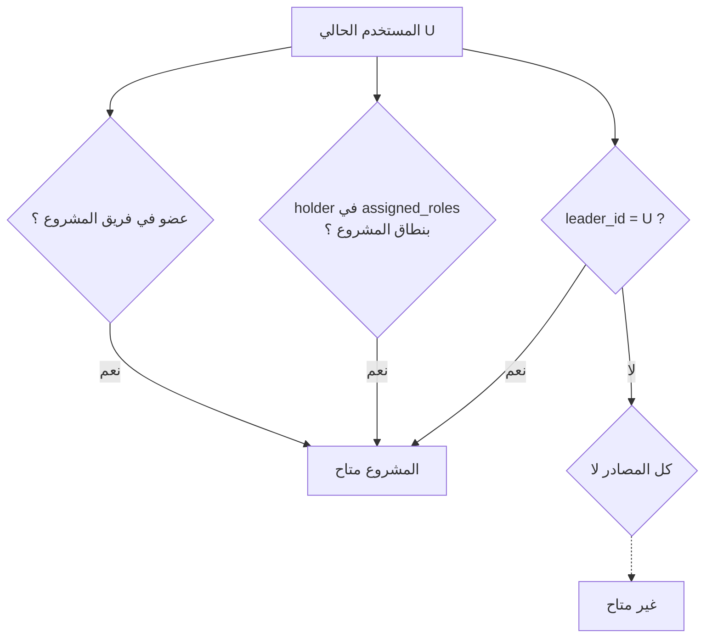
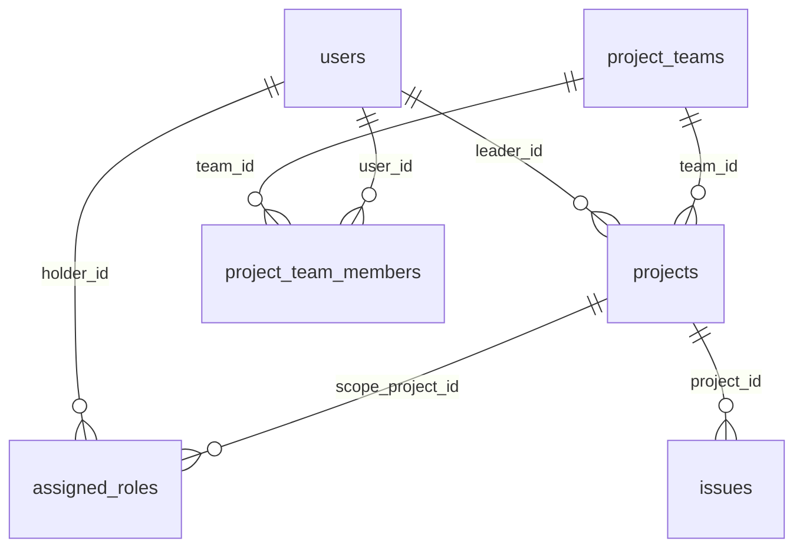
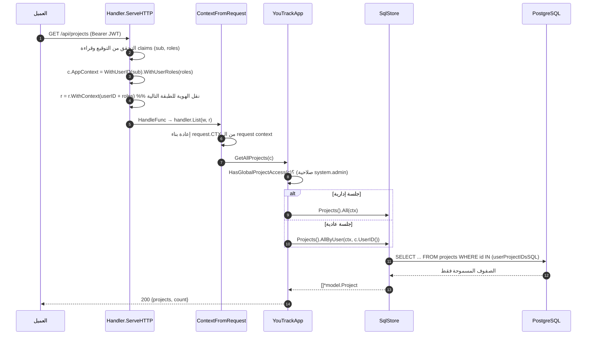

# تصفية المشاريع والقضايا بحسب المستخدم الحالي

> وثيقة مستقلة تشرح **كيف تتم** عملية تصفية البيانات (المشاريع، القضايا، والكيانات التابعة لها)
> على أساس هوية المستخدم الحالي، من استلام الطلب حتى استعلام قاعدة البيانات.
>
> الحالة: مُنفَّذة على قاعدة `youtrack_db` ومُتحقَّق منها ببيانات الاختبار (test1/test2/test3).

---

## 1. القاعدة المركزية للوصول

المشروع "متاح" للمستخدم `U` إذا تحقّق **أي** من المصادر الثلاثة التالية (منطق OR):

| # | مصدر الوصول | الجداول المستخدمة | المعنى |
| --- | -------------- | ------------------- | -------- |
| 1 | **قائد المشروع** | `projects.leader_id` | `U` هو قائد المشروع |
| 2 | **دور بنطاق المشروع** | `assigned_roles` (holder_type='user', scope_project_id) | `U` عُيّن بدور داخل هذا المشروع تحديداً |
| 3 | **عضوية فريق المشروع** | `project_teams` + `project_team_members` | `U` عضو في فريق المشروع |

**القضايا تتبع مشاريعها**: القضية `issue` متاحة فقط إذا كان `issue.project_id` من مشاريع المستخدم المتاحة.



النموذج المادي المستخدم:



---

## 2. مصدر الحقيقة الوحيد: `userProjectIDsSQL`

القاعدة أعلاه مكتوبة **مرة واحدة** كاستعلام فرعي مشترك في
[`channels/store/sqlstore/project_store.go:75`](../../channels/store/sqlstore/project_store.go)،
وتستهلكه كل استعلامات التصفية (المشاريع والقضايا) لضمان عدم تتباعد القواعد:

```sql
SELECT id FROM projects WHERE leader_id = $1                                   -- (1) قائد
UNION
SELECT ar.scope_project_id FROM assigned_roles ar                                -- (2) دور بنطاق
    WHERE ar.holder_id = $1 AND ar.holder_type = 'user' AND ar.scope_project_id IS NOT NULL
UNION
SELECT pt.project_id FROM project_teams pt                                       -- (3) عضوية فريق
    INNER JOIN project_team_members ptm ON ptm.team_id = pt.id
    WHERE ptm.user_id = $1 AND pt.project_id IS NOT NULL
```

`UNION` (وليس `UNION ALL`) يمنع تكرار الصفوف، ومعامل `$1` يُمرَّر ثلاث مرات (نفس المستخدم).

---

## 3. رحلة الطلب من HTTP إلى SQL



### 3.1 نقل هوية المستخدم (نقطة كانت مفقودة قبل هذا العمل)

قبل التطبيق كانت الهوية تُضبط على سياق `Handler` الداخلي فقط، بينما كل معالج يعيد بناء
سياقه عبر `ContextFromRequest(...)` — فكان `UserID()` فارغاً داخل طبقة `app`.
الإصلاح في [`channels/api/handlers.go:102`](../../channels/api/handlers.go):

```go
c.AppContext = c.AppContext.WithUserID(userID).WithUserRoles(roles).WithSessionToken(parts[1])
r = r.WithContext(withUserRoles(withUserID(r.Context(), userID), roles))
```

و[`channels/api/context.go:33-41, 74`](../../channels/api/context.go) يقرأان الهوية والأدوار
من سياق الطلب عند بناء `request.CTX`.

### 3.2 موضع كل طبقة

| الطبقة | الملف | المسؤولية |
| -------- | ------- | ----------- |
| API | [`channels/api/handlers.go`](../../channels/api/handlers.go) | التحقق من JWT واستخراج `sub` و`roles` |
| API | [`channels/api/context.go`](../../channels/api/context.go) | نقل الهوية إلى `request.CTX` |
| App | [`channels/app/authz.go:271`](../../channels/app/authz.go) | `HasGlobalProjectAccess` (تجاوز للجلسة الإدارية) |
| App | [`channels/app/project.go`](../../channels/app/project.go) | اختيار `All` أو `AllByUser` + حراسة الكيان المفرد |
| App | [`channels/app/issue.go`](../../channels/app/issue.go) | نفس المنطق للقضايا + التعليقات + الإنشاء |
| Store iface | [`channels/store/store.go:75-93`](../../channels/store/store.go) | تعريف `AllByUser` و`CanAccess*` |
| Store SQL | [`channels/store/sqlstore/project_store.go:86,109`](../../channels/store/sqlstore/project_store.go) | تنفيذ التصفية على المشاريع |
| Store SQL | [`channels/store/sqlstore/issue_store.go:84,124`](../../channels/store/sqlstore/issue_store.go) | تنفيذ التصفية على القضايا |

> `retrylayer` و`timerlayer` لا تحتاج تعديلاً: هما يغلّفان `store.Store` ككل ولا يغلّفان
> `ProjectStore`/`IssueStore` إلا عبر التضمين (embedding) الذي يوفّر الدوال الجديدة تلقائياً.

---

## 4. العمليات المُنفَّذة

| العملية | الدالة | الوصف |
| --------- | -------- | ------- |
| قائمة مشاريع مفلترة | `ProjectStore.AllByUser` | `WHERE id IN (userProjectIDsSQL) ORDER BY name` |
| وصول لمشروع مفرد | `ProjectStore.CanAccessProject` | `EXISTS(... id = $2 OR short_name = $2 AND id IN (...))` |
| قائمة قضايا مفلترة | `IssueStore.AllByUser` | `WHERE project_id IN (...)` + البحث النصي + الترتيب + `LIMIT` |
| وصول لقضية مفردة | `IssueStore.CanAccessIssue` | يقبل `id` الداخلي أو `id_readable` (مثل `T1A-1`) |

### 4.1 قائمة القضايا (بعد التصفية)

```sql
SELECT ... FROM issues
WHERE project_id IN (<userProjectIDsSQL>)          -- النطاق أولاً
  AND (summary ILIKE $2 OR id_readable ILIKE $2)   -- ثم البحث (مقوَّس)
ORDER BY updated DESC
LIMIT $3
```

> ملاحظة: `All` القديمة (غير المفلترة) تفتقد الأقواس حول شرط البحث
> (`WHERE summary ILIKE $1 OR id_readable ILIKE $1`)؛ النسخة الجديدة `AllByUser` تُصلح ذلك.

### 4.2 الكيانات المفردة: 404 وليس 403

عند طلب كيان لا يملكه المستخدم يُعاد **404 Not Found** (وليس 403) عمداً، حتى لا يكشف
الاستجابة وجود كيان لا يملكه المستخدم (منع تسريب المعلومات):

- `GetProject` / `GetProjectTeamAndLeader` → `requireProjectAccess`
- `GetIssue` / `GetIssueComments` → `requireIssueAccess`
- `CreateIssue` → `requireProjectAccess` على `projectId` المطلوب

### 4.3 تجاوز الجلسة الإدارية

```go
func (a *YouTrackApp) HasGlobalProjectAccess(c request.CTX) bool {
    return a.SessionHasPermission(c, PermissionSystemAdmin)
}
```

- عند `true`: تُستخدم `All` / `All` غير المفلترة (سلوك `/api/admin/*` السابق).
- عند `false`: تُستخدم `AllByUser` / حراسة الكيان المفرد.
- الأدوار تأتي من claim `roles` في الـ JWT (المستخدمون العاديون: `["user"]`).

---

## 5. بيانات الاختبار (migration رقم 15)

الملفان:
[`db/migrations/000015_seed_test_data.up.sql`](../../db/migrations/000015_seed_test_data.up.sql) و
[`000015_seed_test_data.down.sql`](../../db/migrations/000015_seed_test_data.down.sql)

| المستخدم | كلمة المرور | المشاريع (قائد) | القضايا |
| ---------- | ------------- | ------------------ | --------- |
| `test1` | `admin123` | `T1A` (proj-t1-a), `T1B` (proj-t1-b) | 6 |
| `test2` | `admin123` | `T2A` (proj-t2-a), `T2B` (proj-t2-b) | 6 |
| `test3` | `admin123` | — (لا شيء) | 0 |

### 5.1 ضمانات سلامة البيانات

1. **معاملة واحدة**: المشغّل `RunMigrationsFrom` في [`channels/store/sqlstore/migrate.go`](../../channels/store/sqlstore/migrate.go)
   يغلّف كل ملف في `BEGIN/COMMIT`، فلا حاجة لـ `BEGIN` داخل الملف، وأي خطأ يتراجع بالكامل.
2. **إعادة التشغيل**: كل إدراج يستخدم `ON CONFLICT ... DO NOTHING`.
3. **ترتيب المفاتيح الأجنبية**: `user_types` ← `project_types` ← `users` ← `user_profiles` ←
   `project_teams` ← `projects` ← ربط الفرق ← `project_team_members` ← `user_groups` ←
   `user_group_members` ← `issues` ← `roles` ← `permissions` ← `role_permissions` ←
   `assigned_roles` ← `cached_permissions` ← `cached_permission_projects`.
4. **علاقة دائرية** بين `projects.team_id` و `project_teams.project_id`: تُنشأ الفرق أولاً
   (بدون `project_id`) ثم تُربط بعد إدراج المشاريع.
5. **التراجع (down) — مملوكية الصفوف**: لا يُحذف أي صف إلا إذا طابق ما أدخله الملف الصاعد:
   `assigned_roles` بالـ 4 معرّفات، `role_permissions` بأزواجها الثلاثة، والصلاحيات والأدوار
   **بوصفها النصّي** (فتبقى أي صلاحية/دور سابق بنفس المعرّف وبوصف مختلف)، و`cached_*`
   مقصورة على المستخدمين الثلاثة والصلاحيات المبوذرة.
   أما `user_types` و`project_types` فتُترك عمداً لأنها صفوف مرجعية مشتركة ينشئها أيضاً
   `cmd/seeder`، ومفاتيحها الأجنبية `ON DELETE SET NULL` فلا يمنع بقاؤها أي migration لاحق.
6. **كلمات المرور**: مخزّنة كـ bcrypt hash فقط
   (`$2a$10$...`)، ولا يوجد نص صريح في أي ملف.

### 5.2 قيد مهم: NULL مقابل ''

دوال القراءة في المخزن تمسح أعمدة `NULL` في خانات Go من نوع `string`/`int64`،
فتُنتج خطأ `cannot scan NULL into *string` (يفشل الطلب). لذلك يملأ الـ migration
أعمدة النصوص والأرقام المنطقية بقيمة صريحة (`''` / `0` / `FALSE`) بدل `NULL`،
وإلا يفشل تسجيل الدخول أو قراءة القضية/المشروع التفصيلي.
الجداول المتأثرة اليوم: `users` (`avatar_url`, `ring_id`)، `projects` (كل الأعمدة النصية/المنطقية)،
`issues` (`resolved`). **يُنصح بإصلاح المخزن** للمسح الآمن مع NULL كخطوة لاحقة.

---

## 6. نتائج التحقق (مقيسة فعلياً على القاعدة)

| السيناريو | المتوقّع | النتيجة الفعلية |
| ----------- | ---------- | ------------------ |
| `test1` → `GET /api/projects` | T1A, T1B | ✅ `count=2 ['T1A','T1B']` |
| `test2` → `GET /api/projects` | T2A, T2B | ✅ `count=2 ['T2A','T2B']` |
| `test3` → `GET /api/projects` | `[]` | ✅ `count=0 []` |
| بلا توكن → `GET /api/projects` | 401 | ✅ 401 |
| `test1` → `GET /api/issues` | 6 قضايا T1 | ✅ `T1A-1..3, T1B-1..3` |
| `test2` → `GET /api/issues` | 6 قضايا T2 | ✅ `T2A-1..3, T2B-1..3` |
| `test3` → `GET /api/issues` | `[]` | ✅ `count=0 []` |
| `test1` → `GET /api/issues?query=login` | T1A-3 فقط | ✅ `count=1` |
| `test1` → `GET /api/issues/T1A-1` | 200 | ✅ 200 |
| `test1` → `GET /api/issues/T2A-1` | 404/403 | ✅ 404 |
| `test2` → `GET /api/issues/T1A-1` | 404/403 | ✅ 404 |
| `test1` → `GET /api/projects/proj-t1-a` | 200 | ✅ 200 |
| `test2` → `GET /api/projects/proj-t1-a` | 404/403 | ✅ 404 |
| `test1` → `GET /api/projects/T1A` (رمز مختصر) | 200 | ✅ 200 |
| `test3` → `GET /api/projects/proj-t1-a` | 404/403 | ✅ 404 |
| جلسة `system_admin` → `/api/projects` | كل المشاريع | ✅ `count=4` |
| دورة up → down → up | Counts صفر ثم كاملة | ✅ 0 → 3/4/12 → 3/4/12 |
| down مع وجود صفوف مشتركة مسبقة | تُحفظ | ✅ `roles`/`permissions` و`ar-later` باقية |

### 6.1 التحقق من استقلال مصادر الوصول

تم التحقق من أن كل فرع يعمل بمفرده (داخل معاملة ملغاة):

| الحالة المُحاكاة | النتيجة |
| ------------------ | --------- |
| `test3` عضو في `team-t1-a` فقط | يرى `T1A` |
| `test3` + دور `project_member` في `proj-t2-a` فقط | يرى `T2A` |
| `test1` قائد `T1A`/`T1B` | يرى `T1A`,`T1B` |

### 6.2 اختبارات آلية

ملف [`channels/api/access_scope_test.go`](../../channels/api/access_scope_test.go):

- `TestProjectsListIsScopedToCurrentUser` — تصفية القائمة + تمرير `userID` للمخزن.
- `TestIssuesListIsScopedToCurrentUser` — تصفحة القضايا + المستخدم الفارغ.
- `TestProjectGetByIDRejectsOtherUserProject` — 404 لغير المالك.
- `TestIssueGetByIDRejectsOtherUserIssue` — 404 لغير المالك.
- `TestAdminSessionSeesAllProjectsAndIssues` — تجاوز الجلسة الإدارية.
- `TestIssueQueryIsForwardedToScopedStore` — البحث يُطبَّق بعد النطاق.

```bash
go test ./...          # كل الاختبارات
go test ./channels/api -run Scoped -v
```

---

## 7. حدود التطبيق الحالية (خارج نطاق هذه المرحلة)

الحالات المفلترة الآن: `GET /api/projects`، `GET /api/projects/{id}`،
`GET /api/issues`، `GET /api/issues/{id}`، `GET /api/issues/{id}/comments`،
`POST /api/issues` (المشروع الهدف).

**لم تُفلتر بعد** (تحتاج نفس قاعدة `userProjectIDsSQL`):

- `GET /api/sortedIssues`
- `GET|POST /api/issuesGetter` و `/api/issuesGetter/count`
- `POST /api/search/assist` و `GET /api/search`
- Inbox / recent issues
- `GET /api/admin/projects` لمستخدم إداري فقط (سلوكه غير مُغيَّر)

طريقة الإضافة موحّدة: تمرير `c.UserID()` إلى استعلام جديد في المخزن وإدراج
`AND project_id IN (<userProjectIDsSQL>)`.

---

## 8. الأداء

الاستعلام الفرعي يُقيَّم مرة واحدة لكل طلب (PostgreSQL يحوّله إلى Hash Semi Join على
الصفوف الثلاثة). الحجم الحالي (4 مشاريع) لا يحتاج فهارس، لكن مع التوسّع يُنصح بـ:

```sql
CREATE INDEX idx_projects_leader        ON projects (leader_id);
CREATE INDEX idx_assigned_roles_holder  ON assigned_roles (holder_id, holder_type, scope_project_id);
CREATE INDEX idx_ptm_user               ON project_team_members (user_id, team_id);
CREATE INDEX idx_issues_project         ON issues (project_id);
```

---

## 9. إعادة تشغيل البذر أو التراجع عنه

```bash
# التطبيق: يبدأ تلقائياً عند إقلاع الخادم (غير مُطبَّق = يُطبَّق)
make run

# إعادة تطبيق يدوية على قاعدة موجودة
psql "$DSN" -v ON_ERROR_STOP=1 -f db/migrations/000015_seed_test_data.up.sql

# تراجع كامل
psql "$DSN" -v ON_ERROR_STOP=1 -f db/migrations/000015_seed_test_data.down.sql
```

تسجيل الدخول:

```bash
curl -s -X POST localhost:8099/api/auth/login \
  -H 'Content-Type: application/json' \
  -d '{"login":"test1","password":"admin123"}'
```
