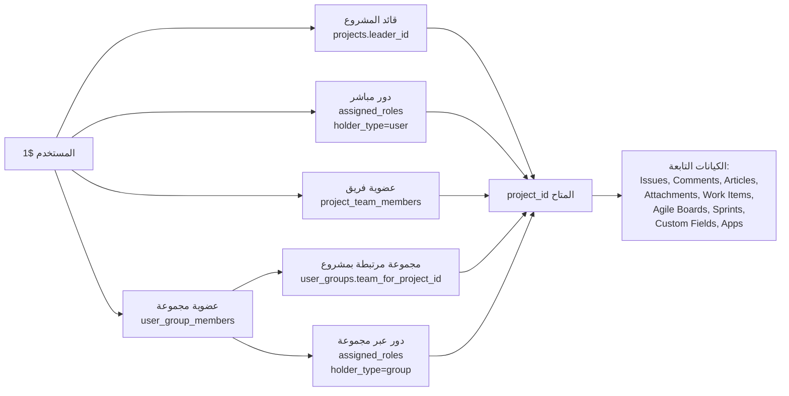

# استعلامات تصفية البيانات حسب المستخدم المسجل دخوله

> مرجع شامل لجميع استعلامات SQL التي تُرجع البيانات المتاحة للمستخدم الحالي
> بناءً على عضويته في **فرق المشاريع (Project Teams)** و**المجموعات (User Groups)** و**الأدوار المُعيَّنة (Assigned Roles)**.
>
> المعامل `$1` في كل الاستعلامات = `user_id` للمستخدم المسجل دخوله.

---

## ⚡ التعامل مع مستخدم system-admin

المستخدم الذي يملك دور `system-admin` (أو صلاحية `PermissionSystemAdmin`) **يتجاوز كل التصفية**
ويرى جميع البيانات بدون قيود. هذا مُطبق فعلاً في الكود:

### النمط المُطبق في طبقة App

```go
// channels/app/authz.go:271
func (a *YouTrackApp) HasGlobalProjectAccess(c request.CTX) bool {
    return a.SessionHasPermission(c, PermissionSystemAdmin)
}

// channels/app/project.go:44
func (a *YouTrackApp) GetAllProjects(c request.CTX) ([]*model.Project, *model.AppError) {
    if a.HasGlobalProjectAccess(c) {
        // ← admin: بدون تصفية
        projects, err = a.Store().Projects().All(ctx)
    } else {
        // ← مستخدم عادي: تصفية حسب المستخدم
        projects, err = a.Store().Projects().AllByUser(ctx, c.UserID())
    }
}
```

### كيف يُطبق على مستوى SQL

عند تنفيذ أي استعلام، المنطق هو:

```text
┌─────────────────────────────────────────────────────┐
│ هل المستخدم لديه صلاحية system-admin؟               │
│                                                     │
│   نعم → استخدم الاستعلام بدون WHERE (يرى كل شيء)    │
│   لا  → استخدم الاستعلام مع userAccessibleProjectIDs │
└─────────────────────────────────────────────────────┘
```

**مثال — جلب المشاريع:**

```sql
-- a═══════════════════════════════════════════════════════════════════
-- حالة system-admin: يرى كل المشاريع بدون قيود
-- a═══════════════════════════════════════════════════════════════════
SELECT * FROM projects ORDER BY name;

-- a═══════════════════════════════════════════════════════════════════
-- حالة المستخدم العادي: يرى مشاريعه فقط
-- a═══════════════════════════════════════════════════════════════════
SELECT * FROM projects WHERE id IN (userAccessibleProjectIDs($1)) ORDER BY name;
```

**مثال — جلب القضايا:**

```sql
-- system-admin
SELECT * FROM issues ORDER BY updated DESC;

-- مستخدم عادي
SELECT * FROM issues WHERE project_id IN (userAccessibleProjectIDs($1)) ORDER BY updated DESC;
```

### النمط في Go للتطبيق الموحد

```go
func (s *SqlProjectStore) GetAll(ctx context.Context, userID string, isAdmin bool) ([]*model.Project, error) {
    if isAdmin {
        // بدون فلتر
        return s.All(ctx)
    }
    // فلتر حسب المستخدم
    return s.AllByUser(ctx, userID)
}
```

### كيف يُحدد أن المستخدم admin؟

يتم عبر claim `roles` في JWT token:

- مستخدم عادي: `roles: ["user"]`
- مدير النظام: `roles: ["system_admin"]` أو `roles: ["user", "system_admin"]`

الفحص يتم في [`channels/app/authz.go`](../../channels/app/authz.go):

```go
func (a *YouTrackApp) SessionHasPermission(c request.CTX, permission string) bool {
    return RolesGrantPermission(c.UserRoles(), permission)
}
```

> **القاعدة**: التحقق من admin يتم **دائمًا في طبقة App** وليس في SQL.
> الاستعلامات في هذا الملف تفترض أن المستخدم **ليس** admin.
> إذا كان admin، يُستخدم استعلام بسيط بدون `WHERE` على الإطلاق.

---

## 0. الاستعلام الفرعي الأساسي: مشاريع المستخدم المتاحة

هذا هو **مصدر الحقيقة الوحيد** الذي تعتمد عليه جميع الاستعلامات اللاحقة.
يُرجع كل `project_id` يملك المستخدم صلاحية عليه من أي مصدر:

```sql
-- a═══════════════════════════════════════════════════════════════════
-- userAccessibleProjectIDs($1)
-- يُعيد جميع معرّفات المشاريع المتاحة للمستخدم $1
-- المصادر الثلاثة: قائد المشروع | دور بنطاق المشروع | عضوية فريق المشروع
-- المصادر الإضافية: عضوية مجموعة مرتبطة بالمشروع | دور عبر مجموعة
-- a═══════════════════════════════════════════════════════════════════

-- (1) المستخدم قائد المشروع
SELECT id FROM projects WHERE leader_id = $1

UNION

-- (2) المستخدم لديه دور مُعيَّن مباشرة بنطاق المشروع
SELECT ar.scope_project_id
FROM assigned_roles ar
WHERE ar.holder_id = $1
  AND ar.holder_type = 'user'
  AND ar.scope_project_id IS NOT NULL

UNION

-- (3) المستخدم عضو في فريق المشروع (project_team_members)
SELECT pt.project_id
FROM project_teams pt
INNER JOIN project_team_members ptm ON ptm.team_id = pt.id
WHERE ptm.user_id = $1
  AND pt.project_id IS NOT NULL

UNION

-- (4) المستخدم عضو في مجموعة (user_group) مرتبطة بمشروع
SELECT ug.team_for_project_id
FROM user_groups ug
INNER JOIN user_group_members ugm ON ugm.group_id = ug.id
WHERE ugm.user_id = $1
  AND ug.team_for_project_id IS NOT NULL

UNION

-- (5) المستخدم عضو في مجموعة لها دور بنطاق مشروع
SELECT ar.scope_project_id
FROM assigned_roles ar
INNER JOIN user_group_members ugm ON ugm.group_id = ar.holder_id
WHERE ugm.user_id = $1
  AND ar.holder_type = 'group'
  AND ar.scope_project_id IS NOT NULL
```

> **ملاحظة**: `UNION` (بدون `ALL`) يمنع تكرار الصفوف تلقائيًا.

---

## 1. جلب المشاريع المتاحة للمستخدم

```sql
-- a═══════════════════════════════════════════════════════════════════
-- جميع المشاريع التي يملك المستخدم $1 صلاحية عليها
-- مع بيانات القائد وفريق المشروع والمؤسسة
-- a═══════════════════════════════════════════════════════════════════
SELECT
    p.id,
    p.name,
    p.short_name,
    p.description,
    p.icon_url,
    p.archived,
    p.creation_time,
    -- بيانات القائد
    u.id          AS leader_id,
    u.login       AS leader_login,
    u.full_name   AS leader_name,
    u.avatar_url  AS leader_avatar,
    -- بيانات فريق المشروع
    pt.id         AS team_id,
    pt.name       AS team_name,
    -- بيانات المؤسسة
    o.id          AS org_id,
    o.name        AS org_name
FROM projects p
LEFT JOIN users u ON u.id = p.leader_id
LEFT JOIN project_teams pt ON pt.id = p.team_id
LEFT JOIN organizations o ON o.id = p.organization_id
WHERE p.id IN (
    -- === userAccessibleProjectIDs($1) ===
    SELECT id FROM projects WHERE leader_id = $1
    UNION
    SELECT ar.scope_project_id FROM assigned_roles ar
        WHERE ar.holder_id = $1 AND ar.holder_type = 'user' AND ar.scope_project_id IS NOT NULL
    UNION
    SELECT pt2.project_id FROM project_teams pt2
        INNER JOIN project_team_members ptm ON ptm.team_id = pt2.id
        WHERE ptm.user_id = $1 AND pt2.project_id IS NOT NULL
    UNION
    SELECT ug.team_for_project_id FROM user_groups ug
        INNER JOIN user_group_members ugm ON ugm.group_id = ug.id
        WHERE ugm.user_id = $1 AND ug.team_for_project_id IS NOT NULL
    UNION
    SELECT ar2.scope_project_id FROM assigned_roles ar2
        INNER JOIN user_group_members ugm2 ON ugm2.group_id = ar2.holder_id
        WHERE ugm2.user_id = $1 AND ar2.holder_type = 'group' AND ar2.scope_project_id IS NOT NULL
)
ORDER BY p.name;
```

---

## 2. جلب القضايا (Issues) للمستخدم

```sql
-- a═══════════════════════════════════════════════════════════════════
-- جميع القضايا في المشاريع المتاحة للمستخدم $1
-- مع بيانات المشروع والمُبلّغ والمُنشئ
-- a═══════════════════════════════════════════════════════════════════
SELECT
    i.id,
    i.id_readable,
    i.summary,
    i.description,
    i.created,
    i.updated,
    i.resolved,
    i.votes,
    i.is_draft,
    -- بيانات المشروع
    p.id         AS project_id,
    p.name       AS project_name,
    p.short_name AS project_short_name,
    -- المُبلّغ
    reporter.id        AS reporter_id,
    reporter.login     AS reporter_login,
    reporter.full_name AS reporter_name,
    -- المُنشئ
    creator.id        AS creator_id,
    creator.login     AS creator_login,
    creator.full_name AS creator_name
FROM issues i
INNER JOIN projects p ON p.id = i.project_id
LEFT JOIN users reporter ON reporter.id = i.reporter_id
LEFT JOIN users creator ON creator.id = i.creator_id
WHERE i.project_id IN (
    -- === userAccessibleProjectIDs($1) ===
    SELECT id FROM projects WHERE leader_id = $1
    UNION
    SELECT ar.scope_project_id FROM assigned_roles ar
        WHERE ar.holder_id = $1 AND ar.holder_type = 'user' AND ar.scope_project_id IS NOT NULL
    UNION
    SELECT pt.project_id FROM project_teams pt
        INNER JOIN project_team_members ptm ON ptm.team_id = pt.id
        WHERE ptm.user_id = $1 AND pt.project_id IS NOT NULL
    UNION
    SELECT ug.team_for_project_id FROM user_groups ug
        INNER JOIN user_group_members ugm ON ugm.group_id = ug.id
        WHERE ugm.user_id = $1 AND ug.team_for_project_id IS NOT NULL
    UNION
    SELECT ar2.scope_project_id FROM assigned_roles ar2
        INNER JOIN user_group_members ugm2 ON ugm2.group_id = ar2.holder_id
        WHERE ugm2.user_id = $1 AND ar2.holder_type = 'group' AND ar2.scope_project_id IS NOT NULL
)
ORDER BY i.updated DESC
LIMIT $2;
```

---

## 3. جلب التعليقات (Comments) للمستخدم

```sql
-- a═══════════════════════════════════════════════════════════════════
-- جميع التعليقات على القضايا في المشاريع المتاحة للمستخدم $1
-- a═══════════════════════════════════════════════════════════════════
SELECT
    c.id,
    c.text,
    c.created,
    c.updated,
    c.is_deleted,
    -- القضية التابع لها
    i.id          AS issue_id,
    i.id_readable AS issue_readable,
    i.summary     AS issue_summary,
    -- كاتب التعليق
    u.id        AS author_id,
    u.login     AS author_login,
    u.full_name AS author_name
FROM comments c
INNER JOIN issues i ON i.id = c.issue_id
LEFT JOIN users u ON u.id = c.author_id
WHERE i.project_id IN (
    -- === userAccessibleProjectIDs($1) ===
    SELECT id FROM projects WHERE leader_id = $1
    UNION
    SELECT ar.scope_project_id FROM assigned_roles ar
        WHERE ar.holder_id = $1 AND ar.holder_type = 'user' AND ar.scope_project_id IS NOT NULL
    UNION
    SELECT pt.project_id FROM project_teams pt
        INNER JOIN project_team_members ptm ON ptm.team_id = pt.id
        WHERE ptm.user_id = $1 AND pt.project_id IS NOT NULL
    UNION
    SELECT ug.team_for_project_id FROM user_groups ug
        INNER JOIN user_group_members ugm ON ugm.group_id = ug.id
        WHERE ugm.user_id = $1 AND ug.team_for_project_id IS NOT NULL
    UNION
    SELECT ar2.scope_project_id FROM assigned_roles ar2
        INNER JOIN user_group_members ugm2 ON ugm2.group_id = ar2.holder_id
        WHERE ugm2.user_id = $1 AND ar2.holder_type = 'group' AND ar2.scope_project_id IS NOT NULL
)
ORDER BY c.created DESC;
```

---

## 4. جلب المقالات (Articles) للمستخدم

```sql
-- a═══════════════════════════════════════════════════════════════════
-- جميع المقالات في المشاريع المتاحة للمستخدم $1
-- a═══════════════════════════════════════════════════════════════════
SELECT
    a.id,
    a.id_readable,
    a.summary,
    a.ordinal,
    a.has_children,
    a.updated,
    -- المشروع
    p.id         AS project_id,
    p.name       AS project_name,
    p.short_name AS project_short_name,
    -- الكاتب
    u.id        AS reporter_id,
    u.login     AS reporter_login,
    u.full_name AS reporter_name,
    -- المقال الأب
    a.parent_article_id
FROM articles a
INNER JOIN projects p ON p.id = a.project_id
LEFT JOIN users u ON u.id = a.reporter_id
WHERE a.project_id IN (
    -- === userAccessibleProjectIDs($1) ===
    SELECT id FROM projects WHERE leader_id = $1
    UNION
    SELECT ar.scope_project_id FROM assigned_roles ar
        WHERE ar.holder_id = $1 AND ar.holder_type = 'user' AND ar.scope_project_id IS NOT NULL
    UNION
    SELECT pt.project_id FROM project_teams pt
        INNER JOIN project_team_members ptm ON ptm.team_id = pt.id
        WHERE ptm.user_id = $1 AND pt.project_id IS NOT NULL
    UNION
    SELECT ug.team_for_project_id FROM user_groups ug
        INNER JOIN user_group_members ugm ON ugm.group_id = ug.id
        WHERE ugm.user_id = $1 AND ug.team_for_project_id IS NOT NULL
    UNION
    SELECT ar2.scope_project_id FROM assigned_roles ar2
        INNER JOIN user_group_members ugm2 ON ugm2.group_id = ar2.holder_id
        WHERE ugm2.user_id = $1 AND ar2.holder_type = 'group' AND ar2.scope_project_id IS NOT NULL
)
ORDER BY a.ordinal;
```

---

## 5. جلب المرفقات (Attachments) للمستخدم

```sql
-- a═══════════════════════════════════════════════════════════════════
-- المرفقات على القضايا أو المقالات في المشاريع المتاحة للمستخدم $1
-- a═══════════════════════════════════════════════════════════════════
SELECT
    att.id,
    att.name,
    att.size,
    att.mime_type,
    att.url,
    att.created,
    -- مصدر المرفق
    att.issue_id,
    att.article_id,
    att.comment_id,
    -- المؤلف
    u.id        AS author_id,
    u.login     AS author_login,
    u.full_name AS author_name
FROM attachments att
LEFT JOIN issues i ON i.id = att.issue_id
LEFT JOIN articles a ON a.id = att.article_id
LEFT JOIN users u ON u.id = att.author_id
WHERE
    -- المرفق تابع لقضية في مشروع متاح
    (att.issue_id IS NOT NULL AND i.project_id IN (
        -- === userAccessibleProjectIDs($1) ===
        SELECT id FROM projects WHERE leader_id = $1
        UNION
        SELECT ar.scope_project_id FROM assigned_roles ar
            WHERE ar.holder_id = $1 AND ar.holder_type = 'user' AND ar.scope_project_id IS NOT NULL
        UNION
        SELECT pt.project_id FROM project_teams pt
            INNER JOIN project_team_members ptm ON ptm.team_id = pt.id
            WHERE ptm.user_id = $1 AND pt.project_id IS NOT NULL
        UNION
        SELECT ug.team_for_project_id FROM user_groups ug
            INNER JOIN user_group_members ugm ON ugm.group_id = ug.id
            WHERE ugm.user_id = $1 AND ug.team_for_project_id IS NOT NULL
        UNION
        SELECT ar2.scope_project_id FROM assigned_roles ar2
            INNER JOIN user_group_members ugm2 ON ugm2.group_id = ar2.holder_id
            WHERE ugm2.user_id = $1 AND ar2.holder_type = 'group' AND ar2.scope_project_id IS NOT NULL
    ))
    OR
    -- أو المرفق تابع لمقال في مشروع متاح
    (att.article_id IS NOT NULL AND a.project_id IN (
        -- === userAccessibleProjectIDs($1) ===
        SELECT id FROM projects WHERE leader_id = $1
        UNION
        SELECT ar.scope_project_id FROM assigned_roles ar
            WHERE ar.holder_id = $1 AND ar.holder_type = 'user' AND ar.scope_project_id IS NOT NULL
        UNION
        SELECT pt.project_id FROM project_teams pt
            INNER JOIN project_team_members ptm ON ptm.team_id = pt.id
            WHERE ptm.user_id = $1 AND pt.project_id IS NOT NULL
        UNION
        SELECT ug.team_for_project_id FROM user_groups ug
            INNER JOIN user_group_members ugm ON ugm.group_id = ug.id
            WHERE ugm.user_id = $1 AND ug.team_for_project_id IS NOT NULL
        UNION
        SELECT ar2.scope_project_id FROM assigned_roles ar2
            INNER JOIN user_group_members ugm2 ON ugm2.group_id = ar2.holder_id
            WHERE ugm2.user_id = $1 AND ar2.holder_type = 'group' AND ar2.scope_project_id IS NOT NULL
    ))
ORDER BY att.created DESC;
```

---

## 6. جلب عناصر العمل (Work Items) للمستخدم

```sql
-- a═══════════════════════════════════════════════════════════════════
-- عناصر العمل (تسجيل الوقت) في المشاريع المتاحة للمستخدم $1
-- a═══════════════════════════════════════════════════════════════════
SELECT
    wi.id,
    wi.duration_minutes,
    wi.date,
    wi.text,
    wi.created,
    wi.updated,
    -- نوع العمل
    wit.id   AS work_type_id,
    wit.name AS work_type_name,
    -- القضية
    i.id          AS issue_id,
    i.id_readable AS issue_readable,
    i.summary     AS issue_summary,
    -- المؤلف
    u.id        AS author_id,
    u.login     AS author_login,
    u.full_name AS author_name
FROM work_items wi
INNER JOIN issues i ON i.id = wi.issue_id
LEFT JOIN work_item_types wit ON wit.id = wi.work_type_id
LEFT JOIN users u ON u.id = wi.author_id
WHERE i.project_id IN (
    -- === userAccessibleProjectIDs($1) ===
    SELECT id FROM projects WHERE leader_id = $1
    UNION
    SELECT ar.scope_project_id FROM assigned_roles ar
        WHERE ar.holder_id = $1 AND ar.holder_type = 'user' AND ar.scope_project_id IS NOT NULL
    UNION
    SELECT pt.project_id FROM project_teams pt
        INNER JOIN project_team_members ptm ON ptm.team_id = pt.id
        WHERE ptm.user_id = $1 AND pt.project_id IS NOT NULL
    UNION
    SELECT ug.team_for_project_id FROM user_groups ug
        INNER JOIN user_group_members ugm ON ugm.group_id = ug.id
        WHERE ugm.user_id = $1 AND ug.team_for_project_id IS NOT NULL
    UNION
    SELECT ar2.scope_project_id FROM assigned_roles ar2
        INNER JOIN user_group_members ugm2 ON ugm2.group_id = ar2.holder_id
        WHERE ugm2.user_id = $1 AND ar2.holder_type = 'group' AND ar2.scope_project_id IS NOT NULL
)
ORDER BY wi.date DESC;
```

---

## 7. جلب لوحات Agile للمستخدم

```sql
-- a═══════════════════════════════════════════════════════════════════
-- لوحات Agile المرتبطة بمشاريع المستخدم $1 المتاحة
-- اللوحة تظهر إذا كان أي مشروع من مشاريعها متاحًا للمستخدم
-- a═══════════════════════════════════════════════════════════════════
SELECT DISTINCT
    ab.id,
    ab.name,
    ab.favorite,
    ab.is_demo,
    -- المالك
    u.id        AS owner_id,
    u.login     AS owner_login,
    u.full_name AS owner_name
FROM agile_boards ab
INNER JOIN agile_board_projects abp ON abp.agile_id = ab.id
LEFT JOIN users u ON u.id = ab.owner_id
WHERE abp.project_id IN (
    -- === userAccessibleProjectIDs($1) ===
    SELECT id FROM projects WHERE leader_id = $1
    UNION
    SELECT ar.scope_project_id FROM assigned_roles ar
        WHERE ar.holder_id = $1 AND ar.holder_type = 'user' AND ar.scope_project_id IS NOT NULL
    UNION
    SELECT pt.project_id FROM project_teams pt
        INNER JOIN project_team_members ptm ON ptm.team_id = pt.id
        WHERE ptm.user_id = $1 AND pt.project_id IS NOT NULL
    UNION
    SELECT ug.team_for_project_id FROM user_groups ug
        INNER JOIN user_group_members ugm ON ugm.group_id = ug.id
        WHERE ugm.user_id = $1 AND ug.team_for_project_id IS NOT NULL
    UNION
    SELECT ar2.scope_project_id FROM assigned_roles ar2
        INNER JOIN user_group_members ugm2 ON ugm2.group_id = ar2.holder_id
        WHERE ugm2.user_id = $1 AND ar2.holder_type = 'group' AND ar2.scope_project_id IS NOT NULL
)
ORDER BY ab.name;
```

---

## 8. جلب Sprints للمستخدم

```sql
-- a═══════════════════════════════════════════════════════════════════
-- سبرينتات اللوحات المتاحة للمستخدم $1
-- a═══════════════════════════════════════════════════════════════════
SELECT
    s.id,
    s.name,
    s.start,
    s.finish,
    s.goal,
    s.archived,
    s.is_started,
    s.is_default,
    -- اللوحة
    ab.id   AS agile_id,
    ab.name AS agile_name
FROM sprints s
INNER JOIN agile_boards ab ON ab.id = s.agile_id
WHERE ab.id IN (
    SELECT DISTINCT abp.agile_id
    FROM agile_board_projects abp
    WHERE abp.project_id IN (
        -- === userAccessibleProjectIDs($1) ===
        SELECT id FROM projects WHERE leader_id = $1
        UNION
        SELECT ar.scope_project_id FROM assigned_roles ar
            WHERE ar.holder_id = $1 AND ar.holder_type = 'user' AND ar.scope_project_id IS NOT NULL
        UNION
        SELECT pt.project_id FROM project_teams pt
            INNER JOIN project_team_members ptm ON ptm.team_id = pt.id
            WHERE ptm.user_id = $1 AND pt.project_id IS NOT NULL
        UNION
        SELECT ug.team_for_project_id FROM user_groups ug
            INNER JOIN user_group_members ugm ON ugm.group_id = ug.id
            WHERE ugm.user_id = $1 AND ug.team_for_project_id IS NOT NULL
        UNION
        SELECT ar2.scope_project_id FROM assigned_roles ar2
            INNER JOIN user_group_members ugm2 ON ugm2.group_id = ar2.holder_id
            WHERE ugm2.user_id = $1 AND ar2.holder_type = 'group' AND ar2.scope_project_id IS NOT NULL
    )
)
ORDER BY s.start DESC;
```

---

## 9. جلب الحقول المخصصة (Custom Fields) للمشاريع المتاحة

```sql
-- a═══════════════════════════════════════════════════════════════════
-- الحقول المخصصة المرتبطة بمشاريع المستخدم $1
-- a═══════════════════════════════════════════════════════════════════
SELECT
    pcf.id,
    pcf.ordinal,
    pcf.is_public,
    pcf.can_be_empty,
    pcf.empty_field_text,
    -- الحقل الأساسي
    cf.id          AS field_id,
    cf.name        AS field_name,
    ft.presentation AS field_type,
    ft.is_multi_value,
    -- المشروع
    p.id         AS project_id,
    p.short_name AS project_short_name
FROM project_custom_fields pcf
INNER JOIN custom_fields cf ON cf.id = pcf.field_id
INNER JOIN projects p ON p.id = pcf.project_id
LEFT JOIN field_types ft ON ft.id = cf.field_type_id
WHERE pcf.project_id IN (
    -- === userAccessibleProjectIDs($1) ===
    SELECT id FROM projects WHERE leader_id = $1
    UNION
    SELECT ar.scope_project_id FROM assigned_roles ar
        WHERE ar.holder_id = $1 AND ar.holder_type = 'user' AND ar.scope_project_id IS NOT NULL
    UNION
    SELECT pt.project_id FROM project_teams pt
        INNER JOIN project_team_members ptm ON ptm.team_id = pt.id
        WHERE ptm.user_id = $1 AND pt.project_id IS NOT NULL
    UNION
    SELECT ug.team_for_project_id FROM user_groups ug
        INNER JOIN user_group_members ugm ON ugm.group_id = ug.id
        WHERE ugm.user_id = $1 AND ug.team_for_project_id IS NOT NULL
    UNION
    SELECT ar2.scope_project_id FROM assigned_roles ar2
        INNER JOIN user_group_members ugm2 ON ugm2.group_id = ar2.holder_id
        WHERE ugm2.user_id = $1 AND ar2.holder_type = 'group' AND ar2.scope_project_id IS NOT NULL
)
ORDER BY p.short_name, pcf.ordinal;
```

---

## 10. جلب القضايا الأخيرة (Recent Issues) للمستخدم

```sql
-- a═══════════════════════════════════════════════════════════════════
-- القضايا الأخيرة للمستخدم $1 (فقط من المشاريع المتاحة)
-- a═══════════════════════════════════════════════════════════════════
SELECT
    ri.id,
    ri.pinned,
    ri.date,
    -- القضية
    i.id          AS issue_id,
    i.id_readable AS issue_readable,
    i.summary     AS issue_summary,
    -- المشروع
    p.id         AS project_id,
    p.short_name AS project_short_name
FROM recent_issues ri
INNER JOIN issues i ON i.id = ri.issue_id
INNER JOIN projects p ON p.id = i.project_id
WHERE ri.user_id = $1
  AND i.project_id IN (
    -- === userAccessibleProjectIDs($1) ===
    SELECT id FROM projects WHERE leader_id = $1
    UNION
    SELECT ar.scope_project_id FROM assigned_roles ar
        WHERE ar.holder_id = $1 AND ar.holder_type = 'user' AND ar.scope_project_id IS NOT NULL
    UNION
    SELECT pt.project_id FROM project_teams pt
        INNER JOIN project_team_members ptm ON ptm.team_id = pt.id
        WHERE ptm.user_id = $1 AND pt.project_id IS NOT NULL
    UNION
    SELECT ug.team_for_project_id FROM user_groups ug
        INNER JOIN user_group_members ugm ON ugm.group_id = ug.id
        WHERE ugm.user_id = $1 AND ug.team_for_project_id IS NOT NULL
    UNION
    SELECT ar2.scope_project_id FROM assigned_roles ar2
        INNER JOIN user_group_members ugm2 ON ugm2.group_id = ar2.holder_id
        WHERE ugm2.user_id = $1 AND ar2.holder_type = 'group' AND ar2.scope_project_id IS NOT NULL
)
ORDER BY ri.date DESC;
```

---

## 11. جلب المقالات الأخيرة (Recent Articles) للمستخدم

```sql
-- a═══════════════════════════════════════════════════════════════════
-- المقالات الأخيرة للمستخدم $1 (فقط من المشاريع المتاحة)
-- a═══════════════════════════════════════════════════════════════════
SELECT
    ra.id,
    ra.pinned,
    ra.date,
    -- المقال
    a.id          AS article_id,
    a.id_readable AS article_readable,
    a.summary     AS article_summary,
    -- المشروع
    p.id         AS project_id,
    p.short_name AS project_short_name
FROM recent_articles ra
INNER JOIN articles a ON a.id = ra.article_id
INNER JOIN projects p ON p.id = a.project_id
WHERE ra.user_id = $1
  AND a.project_id IN (
    -- === userAccessibleProjectIDs($1) ===
    SELECT id FROM projects WHERE leader_id = $1
    UNION
    SELECT ar.scope_project_id FROM assigned_roles ar
        WHERE ar.holder_id = $1 AND ar.holder_type = 'user' AND ar.scope_project_id IS NOT NULL
    UNION
    SELECT pt.project_id FROM project_teams pt
        INNER JOIN project_team_members ptm ON ptm.team_id = pt.id
        WHERE ptm.user_id = $1 AND pt.project_id IS NOT NULL
    UNION
    SELECT ug.team_for_project_id FROM user_groups ug
        INNER JOIN user_group_members ugm ON ugm.group_id = ug.id
        WHERE ugm.user_id = $1 AND ug.team_for_project_id IS NOT NULL
    UNION
    SELECT ar2.scope_project_id FROM assigned_roles ar2
        INNER JOIN user_group_members ugm2 ON ugm2.group_id = ar2.holder_id
        WHERE ugm2.user_id = $1 AND ar2.holder_type = 'group' AND ar2.scope_project_id IS NOT NULL
)
ORDER BY ra.date DESC;
```

---

## 12. جلب الفرق والمجموعات التي ينتمي إليها المستخدم

```sql
-- a═══════════════════════════════════════════════════════════════════
-- (أ) فرق المشاريع (Project Teams) التي المستخدم $1 عضو فيها
-- a═══════════════════════════════════════════════════════════════════
SELECT
    pt.id          AS team_id,
    pt.name        AS team_name,
    pt.description AS team_description,
    pt.icon        AS team_icon,
    -- المشروع المرتبط
    p.id         AS project_id,
    p.name       AS project_name,
    p.short_name AS project_short_name
FROM project_teams pt
INNER JOIN project_team_members ptm ON ptm.team_id = pt.id
LEFT JOIN projects p ON p.id = pt.project_id
WHERE ptm.user_id = $1
ORDER BY p.name;

-- a═══════════════════════════════════════════════════════════════════
-- (ب) المجموعات (User Groups) التي المستخدم $1 عضو فيها
-- a═══════════════════════════════════════════════════════════════════
SELECT
    ug.id          AS group_id,
    ug.name        AS group_name,
    ug.description AS group_description,
    ug.group_type,
    ug.all_users_group,
    ug.icon,
    -- المشروع المرتبط (إن وُجد)
    p.id         AS linked_project_id,
    p.name       AS linked_project_name,
    p.short_name AS linked_project_short_name
FROM user_groups ug
INNER JOIN user_group_members ugm ON ugm.group_id = ug.id
LEFT JOIN projects p ON p.id = ug.team_for_project_id
WHERE ugm.user_id = $1
ORDER BY ug.name;
```

---

## 13. جلب الأدوار والصلاحيات الفعلية للمستخدم

```sql
-- a═══════════════════════════════════════════════════════════════════
-- (أ) جميع الأدوار المُعيَّنة للمستخدم $1 (مباشرة أو عبر مجموعات)
-- a═══════════════════════════════════════════════════════════════════
SELECT
    r.id          AS role_id,
    r.name        AS role_name,
    r.description AS role_description,
    ar.scope_type,
    -- المشروع (إن كان النطاق project)
    p.id         AS scope_project_id,
    p.name       AS scope_project_name,
    -- المصدر
    ar.holder_type,
    ar.holder_name,
    CASE
        WHEN ar.holder_type = 'user'  THEN 'مباشر'
        WHEN ar.holder_type = 'group' THEN 'عبر مجموعة: ' || ar.holder_name
    END AS assignment_source
FROM assigned_roles ar
INNER JOIN roles r ON r.id = ar.role_id
LEFT JOIN projects p ON p.id = ar.scope_project_id
WHERE
    -- أدوار مُعيَّنة مباشرة
    (ar.holder_type = 'user' AND ar.holder_id = $1)
    OR
    -- أدوار مُعيَّنة عبر مجموعة ينتمي إليها المستخدم
    (ar.holder_type = 'group' AND ar.holder_id IN (
        SELECT ugm.group_id
        FROM user_group_members ugm
        WHERE ugm.user_id = $1
    ))
ORDER BY r.name, p.name;

-- a═══════════════════════════════════════════════════════════════════
-- (ب) الصلاحيات التفصيلية المجمّعة من الأدوار
-- a═══════════════════════════════════════════════════════════════════
SELECT DISTINCT
    perm.id            AS permission_id,
    perm.name          AS permission_name,
    perm.operation,
    perm.is_global,
    rp.role_id,
    r.name             AS role_name
FROM role_permissions rp
INNER JOIN permissions perm ON perm.id = rp.permission_id
INNER JOIN roles r ON r.id = rp.role_id
WHERE rp.role_id IN (
    SELECT ar.role_id
    FROM assigned_roles ar
    WHERE
        (ar.holder_type = 'user' AND ar.holder_id = $1)
        OR
        (ar.holder_type = 'group' AND ar.holder_id IN (
            SELECT ugm.group_id FROM user_group_members ugm WHERE ugm.user_id = $1
        ))
)
ORDER BY perm.name;
```

---

## 14. جلب إعدادات التطبيقات (Apps) للمشاريع المتاحة

```sql
-- a═══════════════════════════════════════════════════════════════════
-- تطبيقات المشاريع المتاحة للمستخدم $1
-- a═══════════════════════════════════════════════════════════════════
SELECT
    pac.id,
    pac.enabled,
    pac.is_broken,
    -- التطبيق
    app.id    AS app_id,
    app.name  AS app_name,
    app.title AS app_title,
    app.icon,
    -- المشروع
    p.id         AS project_id,
    p.short_name AS project_short_name
FROM project_app_configurations pac
INNER JOIN apps app ON app.id = pac.app_id
INNER JOIN projects p ON p.id = pac.project_id
WHERE pac.project_id IN (
    -- === userAccessibleProjectIDs($1) ===
    SELECT id FROM projects WHERE leader_id = $1
    UNION
    SELECT ar.scope_project_id FROM assigned_roles ar
        WHERE ar.holder_id = $1 AND ar.holder_type = 'user' AND ar.scope_project_id IS NOT NULL
    UNION
    SELECT pt.project_id FROM project_teams pt
        INNER JOIN project_team_members ptm ON ptm.team_id = pt.id
        WHERE ptm.user_id = $1 AND pt.project_id IS NOT NULL
    UNION
    SELECT ug.team_for_project_id FROM user_groups ug
        INNER JOIN user_group_members ugm ON ugm.group_id = ug.id
        WHERE ugm.user_id = $1 AND ug.team_for_project_id IS NOT NULL
    UNION
    SELECT ar2.scope_project_id FROM assigned_roles ar2
        INNER JOIN user_group_members ugm2 ON ugm2.group_id = ar2.holder_id
        WHERE ugm2.user_id = $1 AND ar2.holder_type = 'group' AND ar2.scope_project_id IS NOT NULL
)
ORDER BY p.short_name, app.name;
```

---

## ملخص مصادر الوصول



---

## ملاحظات على الأداء

مع نمو البيانات يُنصح بإنشاء الفهارس التالية:

```sql
-- فهارس لتسريع الاستعلام الفرعي الأساسي
CREATE INDEX IF NOT EXISTS idx_projects_leader
    ON projects (leader_id);

CREATE INDEX IF NOT EXISTS idx_assigned_roles_holder_scope
    ON assigned_roles (holder_id, holder_type, scope_project_id);

CREATE INDEX IF NOT EXISTS idx_ptm_user
    ON project_team_members (user_id, team_id);

CREATE INDEX IF NOT EXISTS idx_ugm_user
    ON user_group_members (user_id, group_id);

CREATE INDEX IF NOT EXISTS idx_ug_team_for_project
    ON user_groups (team_for_project_id);

-- فهارس للكيانات التابعة
CREATE INDEX IF NOT EXISTS idx_issues_project
    ON issues (project_id);

CREATE INDEX IF NOT EXISTS idx_comments_issue
    ON comments (issue_id);

CREATE INDEX IF NOT EXISTS idx_articles_project
    ON articles (project_id);

CREATE INDEX IF NOT EXISTS idx_attachments_issue
    ON attachments (issue_id);

CREATE INDEX IF NOT EXISTS idx_attachments_article
    ON attachments (article_id);

CREATE INDEX IF NOT EXISTS idx_work_items_issue
    ON work_items (issue_id);

CREATE INDEX IF NOT EXISTS idx_agile_board_projects_project
    ON agile_board_projects (project_id);

CREATE INDEX IF NOT EXISTS idx_sprints_agile
    ON sprints (agile_id);

CREATE INDEX IF NOT EXISTS idx_pcf_project
    ON project_custom_fields (project_id);

CREATE INDEX IF NOT EXISTS idx_recent_issues_user
    ON recent_issues (user_id);

CREATE INDEX IF NOT EXISTS idx_recent_articles_user
    ON recent_articles (user_id);
```

---

## نصيحة التنفيذ في Go

لتجنب تكرار الاستعلام الفرعي في كل دالة، يُستخدم دالة مساعدة واحدة:

```go
// userAccessibleProjectIDsSQL يُرجع الاستعلام الفرعي لمشاريع المستخدم المتاحة
// المعامل paramIndex هو رقم أول placeholder ($1, $2, ...)
func userAccessibleProjectIDsSQL(paramIndex int) string {
    p := fmt.Sprintf("$%d", paramIndex)
    return fmt.Sprintf(`
        SELECT id FROM projects WHERE leader_id = %[1]s
        UNION
        SELECT ar.scope_project_id FROM assigned_roles ar
            WHERE ar.holder_id = %[1]s AND ar.holder_type = 'user'
            AND ar.scope_project_id IS NOT NULL
        UNION
        SELECT pt.project_id FROM project_teams pt
            INNER JOIN project_team_members ptm ON ptm.team_id = pt.id
            WHERE ptm.user_id = %[1]s AND pt.project_id IS NOT NULL
        UNION
        SELECT ug.team_for_project_id FROM user_groups ug
            INNER JOIN user_group_members ugm ON ugm.group_id = ug.id
            WHERE ugm.user_id = %[1]s AND ug.team_for_project_id IS NOT NULL
        UNION
        SELECT ar2.scope_project_id FROM assigned_roles ar2
            INNER JOIN user_group_members ugm2 ON ugm2.group_id = ar2.holder_id
            WHERE ugm2.user_id = %[1]s AND ar2.holder_type = 'group'
            AND ar2.scope_project_id IS NOT NULL
    `, p)
}
```

ثم تُستخدم في أي Store:

```go
query := fmt.Sprintf(`SELECT ... FROM issues WHERE project_id IN (%s)`,
    userAccessibleProjectIDsSQL(1))
rows, err := db.Query(query, userID)
```
