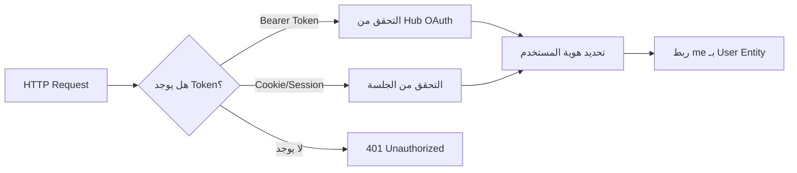
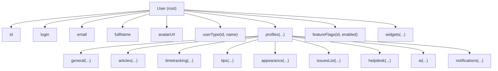
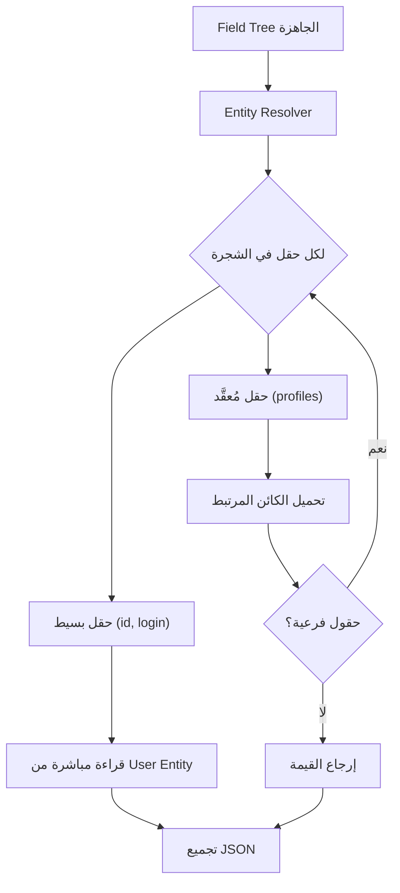
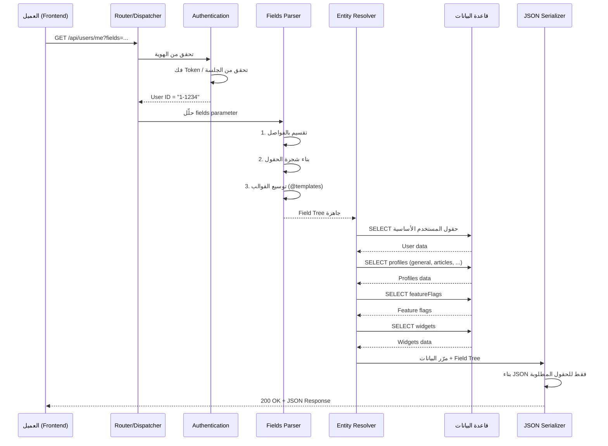
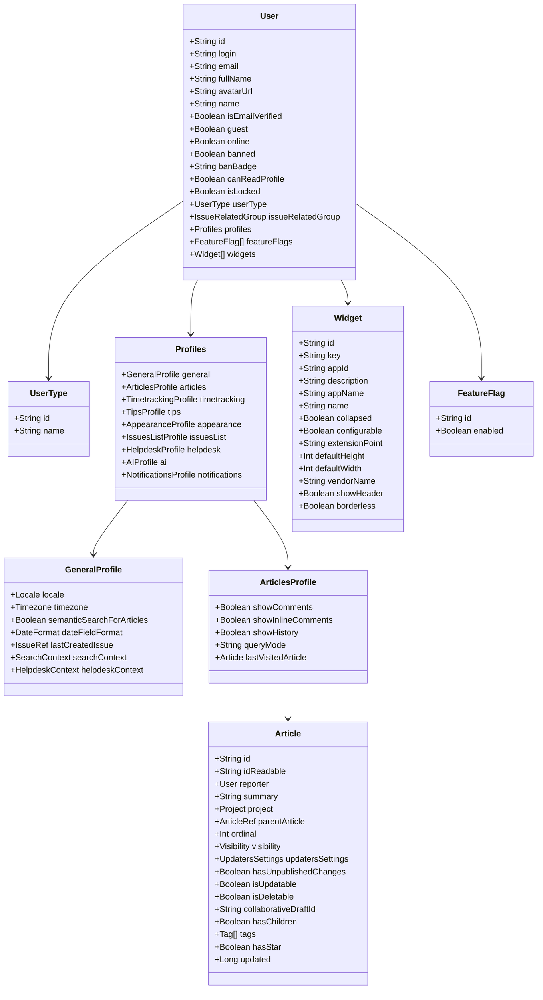

# تحليل شامل لرابط YouTrack API

## 1. تفكيك الرابط (URL Decomposition)

```
https://youtrack.jetbrains.com/api/users/me?$top=-1&fields=...
```

| الجزء | القيمة | الوظيفة |
|-------|--------|---------|
| **Protocol** | `https` | اتصال مشفّر |
| **Host** | `youtrack.jetbrains.com` | سيرفر YouTrack |
| **Base Path** | `/api` | نقطة دخول REST API |
| **Resource** | `/users/me` | المستخدم الحالي (المُصادَق عليه) |
| **$top** | `-1` | إلغاء الحد الأقصى للنتائج |
| **fields** | `(سلسلة ضخمة)` | تحديد الحقول المطلوبة بدقة |

---

## 2. كيف يعالج السيرفر الطلب — خطوة بخطوة

### الخطوة 1: استقبال الطلب (HTTP Request Reception)

```
GET /api/users/me?$top=-1&fields=id,login,email,...
Authorization: Bearer <token>  أو  Cookie: JSESSIONID=...
```

السيرفر (عادةً Java/Kotlin على Jetty أو Tomcat) يستقبل الطلب عبر **Servlet Filter Chain**.

### الخطوة 2: المصادقة (Authentication)



- كلمة `me` هي **alias** (اسم مستعار) يتم ترجمتها إلى `userId` الفعلي من التوكن/الجلسة
- السيرفر يستدعي شيئاً مشابهاً لـ:
  ```java
  User currentUser = authContext.getCurrentUser(); // يحوّل "me" إلى كائن User حقيقي
  ```

### الخطوة 3: توجيه الطلب (Routing)

```
/api/users/me  →  UsersResource.getCurrentUser()
```

السيرفر يستخدم **JAX-RS** أو framework مشابه:
```java
@Path("/api/users")
public class UsersResource {
    @GET
    @Path("/me")
    public Response getCurrentUser(@QueryParam("fields") String fields,
                                   @QueryParam("$top") int top) {
        // ...
    }
}
```

### الخطوة 4: تحليل معامل `fields` (Fields Parameter Parsing)

> [!IMPORTANT]
> هذا هو الجزء الأكثر تعقيداً — YouTrack يستخدم نظام **Field Projection** خاص يشبه GraphQL

السيرفر يحوّل سلسلة `fields` إلى **شجرة حقول (Field Tree)**:



**آلية التحليل (Parser)**:

```
fields=id,login,profiles(general(locale(id,name)),tips(...))
```

يتحول إلى:

```json
{
  "id": true,
  "login": true,
  "profiles": {
    "general": {
      "locale": {
        "id": true,
        "name": true
      }
    },
    "tips": { "...": true }
  }
}
```

**الخوارزمية**:
1. يقرأ حرفاً حرفاً
2. عند `,` → حقل جديد على نفس المستوى
3. عند `(` → دخول مستوى أعمق (sub-fields)
4. عند `)` → خروج من المستوى الحالي
5. عند `@templateName` → توسيع قالب مُعرَّف مسبقاً

### الخطوة 5: نظام القوالب (`@templates`)

> [!TIP]
> الرابط يحتوي على قوالب مُعرَّفة بعد الفاصلة المنقوطة `;`

في نهاية الرابط (بعد URL decode):

```
;@helpdeskContext:id,name,issuesUrl,pinned,...
;@permittedUsers:id,login,email,fullName,avatarUrl,...
;@permittedGroups:id,name,$type(),auditTargetId,...
```

هذه **تعريفات قوالب (Template Definitions)** تعمل كـ **macros**:

| القالب | يُستخدم في | الحقول |
|--------|-----------|--------|
| `@helpdeskContext` | `searchContext`, `helpdeskContext` | `id, name, issuesUrl, pinned, pinnedInHelpdesk, owner, $type, query, isUpdatable, shortName` |
| `@permittedUsers` | `implicitPermittedUsers`, `permittedUsers`, `owner`, `reporter` | `id, login, email, fullName, avatarUrl, userType(id,name), name, isEmailVerified, guest, online, banned, banBadge, canReadProfile, isLocked` |
| `@permittedGroups` | `permittedGroups`, جميع مجموعات الصلاحيات | `id, name, $type(), auditTargetId, description, allUsersGroup, icon, teamForProject(id,name,icon), isUpdatable, isRemovable` |

**كيف تعمل**: عندما يصادف السيرفر `reporter(@permittedUsers)` يستبدلها بـ:
```
reporter(id,login,email,fullName,avatarUrl,userType(id,name),name,isEmailVerified,guest,online,banned,banBadge,canReadProfile,isLocked)
```

### الخطوة 6: جلب البيانات من قاعدة البيانات



السيرفر يستخدم **Lazy Loading** مع **Projection**:
- لا يُحمِّل الكائن كاملاً من الداتابيس
- يُحمِّل **فقط** الحقول المطلوبة في `fields`
- هذا يشبه `SELECT id, login, email FROM users` بدلاً من `SELECT *`

### الخطوة 7: التسلسل والإرجاع (Serialization & Response)

```
HTTP/1.1 200 OK
Content-Type: application/json;charset=UTF-8
Cache-Control: no-cache
```

السيرفر يمشي على Field Tree ويبني JSON فقط للحقول المطلوبة.

---

## 3. الهيكل الكامل للبيانات (Full Data Schema)

### المستوى الأول — User Entity

```json
{
  "id": "1-1234",                          // معرّف فريد
  "login": "john.doe",                     // اسم المستخدم
  "email": "john@example.com",             // البريد الإلكتروني
  "fullName": "John Doe",                  // الاسم الكامل
  "avatarUrl": "https://.../avatar.png",   // رابط الصورة الشخصية
  "name": "John Doe",                      // اسم العرض
  "isEmailVerified": true,                 // هل البريد مُوثَّق
  "guest": false,                          // هل هو زائر
  "online": true,                          // هل متصل حالياً
  "banned": false,                         // هل محظور
  "banBadge": null,                        // شارة الحظر
  "canReadProfile": true,                  // هل يمكن قراءة الملف الشخصي
  "isLocked": false,                       // هل الحساب مقفل
  
  "userType": {                            // نوع المستخدم
    "id": "...",
    "name": "STANDARD"                     // STANDARD | REPORTER | ...
  },

  "issueRelatedGroup": {                   // مجموعات مرتبطة بالمشاكل
    "permittedGroups": [/* @permittedGroups */]
  },

  "profiles": { /* تفصيل أدناه */ },
  "featureFlags": [/* تفصيل أدناه */],
  "widgets": [/* تفصيل أدناه */]
}
```

---

### المستوى الثاني — `profiles` (ملفات الإعدادات)

#### `profiles.general` — الإعدادات العامة

```json
{
  "general": {
    "locale": {
      "id": "en",
      "community": false,
      "language": "English",
      "locale": "en_US",
      "name": "English"
    },
    "timezone": { "id": "Asia/Riyadh" },
    "semanticSearchForArticles": true,
    "dateFieldFormat": {
      "pattern": "yyyy-MM-dd HH:mm",
      "datePattern": "yyyy-MM-dd"
    },
    "lastCreatedIssue": {
      "project": { "id": "0-0", "shortName": "PROJ" }
    },
    "searchContext": {/* @helpdeskContext */},
    "helpdeskContext": {/* @helpdeskContext */}
  }
}
```

#### `profiles.articles` — إعدادات المقالات (Knowledge Base)

```json
{
  "articles": {
    "showComments": true,
    "showInlineComments": true,
    "showHistory": true,
    "queryMode": "manual",
    "lastVisitedArticle": {
      "id": "123-456",
      "idReadable": "KB-42",
      "reporter": {/* @permittedUsers */},
      "summary": "How to configure...",
      "project": {
        "id": "0-1",
        "name": "My Project",
        "shortName": "MP",
        "projectType": { "id": "..." },
        "pinned": true,
        "iconUrl": "https://...",
        "template": false,
        "archived": false,
        "restricted": false,
        "team": { "id": "..." }
      },
      "parentArticle": { "idReadable": "KB-40" },
      "ordinal": 3,
      "visibility": {
        "$type": "LimitedVisibility",
        "implicitPermittedUsers": [/* @permittedUsers */],
        "permittedGroups": [/* @permittedGroups */],
        "permittedUsers": [/* @permittedUsers */]
      },
      "updatersSettings": {
        "permittedGroups": [/* @permittedGroups */],
        "permittedUsers": [/* @permittedUsers */]
      },
      "hasUnpublishedChanges": false,
      "isUpdatable": true,
      "isDeletable": true,
      "collaborativeDraftId": null,
      "hasChildren": true,
      "tags": [{
        "id": "tag-1",
        "name": "important",
        "color": { "id": "1", "background": "#e6f7ff", "foreground": "#0050b3" },
        "isDeletable": true,
        "isUpdatable": true,
        "isUsable": true
      }],
      "hasStar": true,
      "updated": 1693000000000
    }
  }
}
```

#### `profiles.timetracking` — تتبع الوقت

```json
{
  "timetracking": {
    "periodFormat": { "id": "..." },
    "periodFieldPattern": "1w 2d 3h 30m",
    "isTimeTrackingAvailable": true,
    "ownTimesheets": true
  }
}
```

#### `profiles.tips` — حالة التلميحات (Onboarding Tips)

> [!NOTE]
> هذا القسم يتتبع أي تلميحات/نصائح UI شاهدها المستخدم حتى لا تُعرض مرة أخرى

```json
{
  "tips": {
    "aiTipsShown": true,
    "surveyShown": false,
    "pmfShown": false,
    "textRecognitionTipsShown": true,
    "aiPromoShown": true,
    "inlineCommentPromoShown": false,
    // ... (50+ حقل boolean)
    "onboardingTourState": "COMPLETED",
    "onboardingTourAIBlockDismissed": true
  }
}
```

**القائمة الكاملة لحقول tips** (كلها `boolean` إلا `onboardingTourState` فهو `string`):

| الفئة | الحقول |
|-------|--------|
| **AI** | `aiTipsShown`, `aiPromoShown`, `aiWritingAssistantPromoShown`, `textCompletionPromoShown`, `issueAiActionsTipShown`, `articleAiAssistantTipShown` |
| **Issues** | `issueListPageCompleted`, `issuePageCompleted`, `issueFieldsTipShown`, `issueTextRecognitionTipShown` |
| **Agile Board** | `agileBoardBacklogTipShown`, `agileBoardVisibilityTipShown`, `agileBoardCardsTipShown`, `agileBoardSwimlanesTipShown`, `agileBoardColumnsTipShown`, `agileBoardPageCompleted` |
| **Articles/KB** | `articleSidebarTipShown`, `articleCommentsTipShown`, `articleVisibilityTipShown`, `articleInlineCommentsTipShown`, `articlesPageCompleted` |
| **Project** | `projectContentTipShown`, `projectOverviewTipShown`, `projectSettingsTipShown`, `projectSettingsPeopleTipShown`, `projectSettingsFieldsTipShown`, `projectSettingsVcsTipShown`, `projectSettingsTimeTrackingTipShown`, `projectSettingsTeamcityTipShown`, `projectSettingsWorkflowTipShown`, `projectSettingsAppsTipShown`, `projectOverviewPageCompleted`, `projectSettingsPageCompleted` |
| **Helpdesk** | `helpdeskTeamTipShown`, `helpdeskSlaTipShown`, `helpdeskChannelsTipShown`, `helpdeskOverviewTipShown`, `helpdeskPinnedCommentsTipShown`, `helpdeskProjectPageCompleted` |
| **UI عام** | `commandsTipShown`, `timeTrackingTipShown`, `activityTypesTipShown`, `visibilityRestrictionsTipShown`, `votesTipShown`, `visibleFieldsTipShown`, `searchOptionsTipShown`, `savedSearchesTipShown`, `collapsibleSidebarTipShown` |
| **Onboarding** | `onboardingTourState`, `onboardingTourAIBlockDismissed`, `delayedDemoModalShown`, `pricingAdminPopupShown`, `appsProjectTabTipShown`, `changeRuleTypeTipShown` |

#### `profiles.appearance` — مظهر الواجهة

```json
{
  "appearance": {
    "firstDayOfWeek": 1,              // 0=أحد, 1=اثنين
    "showTooltips": true,
    "showRecentEntities": true,
    "showSidebarResizerTip": false,
    "showToolbar": true,
    "showInlineEditorToolbar": true,
    "useMarkdownEditor": true,
    "useSummaryInIssueLinks": true,
    "showQuickView": true,
    "lastUsedColor": "#4CAF50",
    "tableViewColumns": "...",
    "naturalCommentsOrder": true,      // true=أقدم أولاً, false=أحدث أولاً
    "showCommentsInActivityStream": true,
    "showVcsChangesInActivityStream": true,
    "showWorkItemsInActivityStream": true,
    "showHistoryInActivityStream": true,
    "expandChangesInActivityStream": false,
    "useAbsoluteDates": false,
    "showSimilarIssues": true,
    "exceptionsExpanded": false,
    "knowledgeBaseSidebarWidth": 300,
    "sivSidebarWidth": 350,
    "quickViewSidebarWidth": 400,
    "modalSidebarWidth": 500,
    "issueListSidebarWidth": 350,
    "quickViewWidth": 600,
    "showKnowledgeBaseSidebar": true,
    "showSIVSidebar": true,
    "attachmentsCollapsed": false,
    "showLinksUnderDescription": true,
    "openCwOnTyping": true,
    "compactMode": false,
    "recognizedTextSidebarExpanded": false,
    "attachmentsSorting": "date",
    "hideEmbeddedAttachments": false,
    "hideCommentAttachments": false,
    "attachmentsListLayout": "grid",
    "expandNavigation": true,
    "issuesTableViewMode": "table",
    "sidebarQuickViewMode": "sidebar",
    "dashboardHeaderCollapsed": false,
    "knowledgeBaseSubarticlesCollapsed": false,
    "aiLinkSuggestionsCollapsed": false,
    "onboardingTourPanelWidth": 350
  }
}
```

#### `profiles.issuesList` — إعدادات قائمة المشاكل

```json
{
  "issuesList": {
    "sortTextByRelevance": true,
    "showSidebar": true,
    "unresolvedIssuesOnly": false,
    "queryMode": "query",
    "issueListView": {
      "treeView": false,
      "treeViewCollapsed": false,
      "detailLevel": "normal"
    },
    "projectsExpanded": true,
    "savedSearchesExpanded": true,
    "tagsExpanded": true
  }
}
```

#### `profiles.helpdesk` — إعدادات مكتب المساعدة

```json
{
  "helpdesk": {
    "isAgent": true,
    "isReporter": false,
    "agentInProjects": [{ "id": "0-1" }, { "id": "0-2" }],
    "reporterInProjects": [],
    "tableViewTicketColumns": "..."
  }
}
```

#### `profiles.ai` — إعدادات الذكاء الاصطناعي

```json
{
  "ai": {
    "disableChat": false,
    "chatSidebarShow": true,
    "chatsListShow": false,
    "chatSidebarWidth": 400,
    "chatFloatingOffsetX": 100,
    "chatFloatingOffsetY": 100,
    "chatFloatingAnchor": "bottom-right",
    "chatFloatingWidth": 400,
    "chatFloatingHeight": 600,
    "chatMode": "sidebar"
  }
}
```

#### `profiles.notifications` — إعدادات الإشعارات

```json
{
  "notifications": {
    "emailNotificationsEnabled": true,
    "disabledDirect": false,
    "disabledSubscription": false,
    "disabledSystem": false,
    "showSystem": true,
    "showUnreadOnly": false,
    "emailBlocked": false,
    "emailBlockReason": null,
    "usePlainTextEmails": false,
    "notifyOnOwnChanges": false,
    "mentionNotificationsEnabled": true,
    "duplicateClusterNotificationsEnabled": true,
    "mailboxIntegrationNotificationsEnabled": true,
    "autoWatchOnComment": true,
    "autoWatchOnCreate": true,
    "autoWatchOnUpdate": false,
    "autoWatchOnFieldSet": false,
    "autoWatchOnVote": true
  }
}
```

---

### المستوى الثاني — `featureFlags` (أعلام الميزات)

```json
{
  "featureFlags": [
    { "id": "ring.ai-assistant", "enabled": true },
    { "id": "ring.semantic-search", "enabled": true },
    { "id": "ring.new-editor", "enabled": false }
  ]
}
```

---

### المستوى الثاني — `widgets` (الودجات/الأدوات)

```json
{
  "widgets": [
    {
      "id": "widget-1",
      "key": "issues-list-widget",
      "appId": "app-123",
      "description": "Shows recent issues",
      "appName": "Issues Widget",
      "appTitle": "Issues",
      "name": "Recent Issues",
      "collapsed": false,
      "configurable": true,
      "indexPath": "/widgets/issues",
      "extensionPoint": "DASHBOARD",
      "iconPath": "/icons/issues.svg",
      "guard": null,
      "appIconPath": "/icons/app.svg",
      "appDarkIconPath": "/icons/app-dark.svg",
      "defaultHeight": 300,
      "defaultWidth": 400,
      "expectedHeight": 350,
      "expectedWidth": 450,
      "vendorName": "JetBrains",
      "vendorEmail": "support@jetbrains.com",
      "vendorUrl": "https://jetbrains.com",
      "marketplaceId": "mp-123",
      "showHeader": true,
      "borderless": false
    }
  ]
}
```

---

## 4. مخطط تدفق المعالجة الكامل



---

## 5. لماذا هذا التصميم؟

### مزايا نظام `fields`

| الميزة | الشرح |
|--------|-------|
| **تقليل حجم الاستجابة** | بدلاً من إرسال كل البيانات، يُرسل فقط المطلوب |
| **طلب واحد بدل عشرات** | الـ Frontend يحصل على كل ما يحتاجه في طلب واحد |
| **مرونة** | كل صفحة في الـ UI تطلب الحقول التي تحتاجها فقط |
| **أداء** | السيرفر لا يُحمِّل كائنات لا حاجة لها من الداتابيس |

### لماذا `$top=-1`؟

- `$top` يُحدد العدد الأقصى للنتائج في القوائم
- القيمة `-1` تعني **"بلا حد"** — أعطني كل النتائج
- في حالة `/users/me` النتيجة دائماً مستخدم واحد، لكن الـ sub-collections (مثل `widgets`, `featureFlags`) قد تحتوي على عناصر متعددة

### لماذا القوالب (`@templates`)؟

- كائن `User` يظهر في أماكن كثيرة (reporter, owner, permittedUsers)
- بدلاً من تكرار قائمة الحقول كل مرة، يُعرَّف قالب `@permittedUsers` مرة واحدة
- هذا يُقلل حجم الـ URL بشكل كبير

---

## 6. ملخص أنواع البيانات



---

## 7. مقارنة مع بدائل

| الأسلوب | YouTrack Fields | GraphQL | REST التقليدي |
|---------|----------------|---------|---------------|
| **التحكم بالحقول** | ✅ عبر `fields` parameter | ✅ عبر Query Language | ❌ ثابت |
| **طلب واحد** | ✅ | ✅ | ❌ يحتاج طلبات متعددة |
| **القوالب** | ✅ `@template` | ❌ Fragments (مشابه) | ❌ |
| **التعقيد** | متوسط | عالي | منخفض |
| **الأدوات** | محدودة | غنية | غنية |

> [!NOTE]
> نظام YouTrack يقع بين REST التقليدي و GraphQL — يُعطي مرونة GraphQL في تحديد الحقول، لكن يبقى على بنية REST البسيطة.
