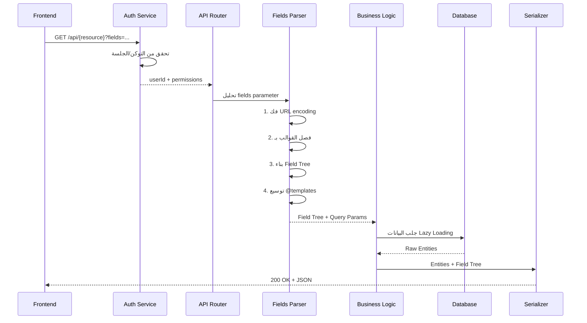
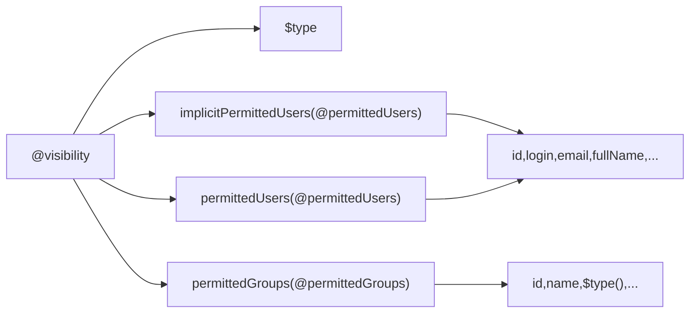
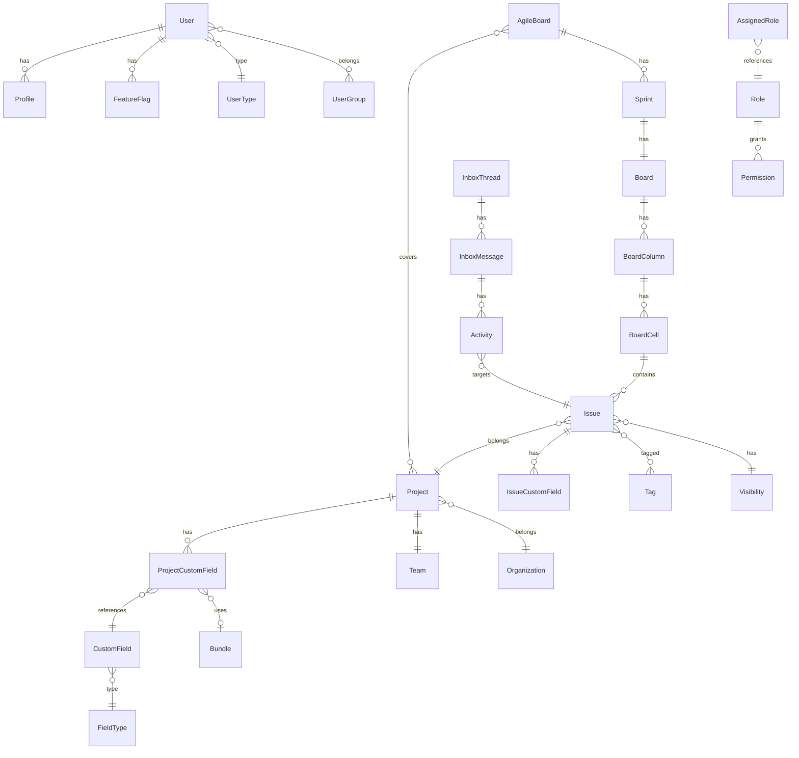

# تحليل شامل لـ YouTrack REST API — 69 طلب

> [!NOTE]
> هذا المستند يحلل جميع الـ 69 طلب API المُلتقطة من واجهة YouTrack الأمامية.
> يشرح كيف يفسر السيرفر كل طلب، وما هيكل البيانات المُرجَعة.

---

## الفهرس

1. [نظرة عامة](#1-نظرة-عامة)
2. [فهرس جميع الطلبات مُصنَّفة](#2-فهرس-الطلبات)
3. [آلية عمل السيرفر](#3-آلية-عمل-السيرفر)
4. [تحليل مُفصَّل حسب الفئة](#4-تحليل-مفصل)
5. [نظام القوالب @templates](#5-نظام-القوالب)
6. [خريطة الكيانات والعلاقات](#6-خريطة-الكيانات)
7. [ملخص أنماط الـ API](#7-ملخص-الأنماط)

---

## 1. نظرة عامة

### بنية الـ URL العامة

```
https://{host}/api/{resource}?$top={n}&fields={projection}&{extra_params}
              ↑                  ↑              ↑                ↑
          نقطة الدخول      عدد النتائج    شجرة الحقول     معاملات إضافية
```

### إحصائيات سريعة

| المقياس | القيمة |
|---------|--------|
| **إجمالي الطلبات** | 69 |
| **الخوادم المُستخدمة** | `youtrack.jetbrains.com`, `osm.youtrack.cloud`, `resources.jetbrains.com` |
| **عدد الـ Endpoints الفريدة** | ~45 |
| **الطلبات التي تستخدم `fields`** | 66 من 69 (~96%) |
| **الطلبات التي تستخدم `$top`** | 30 (~43%) |
| **الطلبات التي تستخدم `@templates`** | 15 (~22%) |
| **أعقد طلب** | request9 (inbox/threads) — ~6000 حرف |
| **أبسط طلب** | request3 (config) — `fields=helpdeskEnabled` |

---

## 2. فهرس الطلبات

### 🔵 المستخدمون والملفات الشخصية (Users & Profiles)

| # | الملف | Endpoint | الوصف |
|---|-------|----------|-------|
| 1 | request1 | `GET /api/users/me` | الملف الشخصي الكامل للمستخدم الحالي مع كل الإعدادات |
| 4 | request4 | `GET /api/users/me/profiles/grazie` | إعدادات الذكاء الاصطناعي / التدقيق اللغوي |
| 29 | request29 | `GET /api/users/me/profiles/general` | تنسيق التاريخ |
| 32 | request32 | `GET /api/users/?query=&$top=50` | قائمة المستخدمين مع بحث |
| 33 | request33 | `GET /api/users/2-1` | بيانات مستخدم محدد |
| 38 | request38 | `GET /hub/api/rest/users/me` | ملف المستخدم من Hub |
| 40 | request40 | `GET /hub/api/rest/users/{uuid}/groups` | مجموعات المستخدم في Hub |
| 43 | request43 | `GET /hub/api/rest/users/{uuid}/groups` | مكرر من request40 |
| 66 | request66 | `GET /api/users/me/profiles/questionnaire` | استبيانات/استطلاعات |
| 67 | request67 | `GET /api/users/me/recent/issues` | المشاكل المُشاهدة مؤخراً |
| 68 | request68 | `GET /api/users/me/recent/articles` | المقالات المُشاهدة مؤخراً |

### 🟢 الإعدادات والتهيئة (Config & Settings)

| # | الملف | Endpoint | الوصف |
|---|-------|----------|-------|
| 2 | request2 | `GET /api/admin/timeTrackingSettings/workTimeSettings` | إعدادات وقت العمل |
| 3 | request3 | `GET /api/config` | هل Helpdesk مفعّل |
| 5 | request5 | `GET /api/admin/globalSettings` | إعدادات عامة (REST, OCR, إشعارات) |
| 11 | request11 | `GET /api/config` | بانرات/إعلانات النظام |
| 19 | request19 | `GET /api/admin/globalSettings` | مثل request5 لسيرفر مختلف |
| 46 | request46 | `GET /api/admin/globalSettings` | إعدادات البريد الإلكتروني |
| 49 | request49 | `GET /api/admin/apps/predefinedScriptsRestoreStatus` | حالة السكربتات الافتراضية |
| 59 | request59 | `GET /hub/api/rest/settings/public` | إعدادات Hub العامة |
| 60 | request60 | `GET /api/config` | تهيئة كاملة (ring, l10n, system, shortcuts) |

### 🟡 المشاريع (Projects)

| # | الملف | Endpoint | الوصف |
|---|-------|----------|-------|
| 12 | request12 | `GET /api/admin/projects/OC` | تفاصيل مشروع كاملة |
| 13 | request13 | `GET /api/admin/projects/{id}/dashboard` | ودجات لوحة المشروع |
| 21 | request21 | `GET /api/admin/projects/DEMO` | تفاصيل مشروع DEMO |
| 23 | request23 | `GET /api/admin/projects/0-0/dashboard` | ودجات لوحة المشروع |
| 25 | request25 | `GET /api/admin/projects?orderBy=name` | قائمة كل المشاريع |
| 27 | request27 | `GET /api/admin/projects/0-0` | فريق المشروع والقائد |
| 34 | request34 | `GET /api/admin/projects/0-0/customFields` | حقول المشروع المخصصة |
| 35 | request35 | `GET /api/admin/projects/0-0/people` | أعضاء المشروع وصلاحياتهم |
| 39 | request39 | `GET /api/admin/projects/0-0/fields` | حقول المشروع التفصيلية |
| 50 | request50 | `GET /api/admin/projects/0-0/appConfigurations` | تطبيقات/سير عمل |
| 51 | request51 | `GET /api/admin/projects/DEMO` | مكرر من request21 |
| 61 | request61 | `GET /api/admin/projects/0-0/appConfigurations` | تطبيقات (حقول مختلفة) |
| 62 | request62 | `GET /api/admin/projects/FIN` | بيانات مشروع أساسية |

### 🔴 المشاكل/التذاكر (Issues)

| # | الملف | Endpoint | الوصف |
|---|-------|----------|-------|
| 14 | request14 | `GET /api/sortedIssues` | قائمة مشاكل مُرتبة مع ML scoring |
| 17 | request17 | `GET /api/issuesGetter/count` | عدد المشاكل |
| 18 | request18 | `GET /api/issueListSubscription` | اشتراك تحديثات قائمة المشاكل (SSE) |
| 28 | request28 | `GET /api/issuesGetter` | جلب المشاكل مع كل الحقول |

### 🟣 البحث والتصفية (Search & Filters)

| # | الملف | Endpoint | الوصف |
|---|-------|----------|-------|
| 16 | request16 | `GET /api/search/assist` | اقتراحات البحث التلقائي (autocomplete) |
| 30 | request30 | `GET /api/securitySearch/filterFields` | حقول تصفية الأمان |
| 69 | request69 | `GET /api/filterFields` | حقول التصفية |

### 🟤 الاستعلامات المحفوظة (Saved Queries)

| # | الملف | Endpoint | الوصف |
|---|-------|----------|-------|
| 15 | request15 | `GET /api/savedQueries` | الاستعلامات المحفوظة مع صلاحيات المشاركة |

### 🔶 الصلاحيات والأدوار (Permissions & Roles)

| # | الملف | Endpoint | الوصف |
|---|-------|----------|-------|
| 7 | request7 | `GET /api/permissions/cache` | كاش الصلاحيات |
| 20 | request20 | `GET /api/permissions/cache` | مثل request7 لسيرفر مختلف |
| 26 | request26 | `GET /api/permissions/cache` | كاش مع تفاصيل الصلاحية |
| 31 | request31 | `GET /api/roles` | كل الأدوار مع صلاحياتها |
| 36 | request36 | `GET /api/assignedRoles` | الأدوار المُعيَّنة |

### 📬 الإشعارات وصندوق الوارد (Notifications & Inbox)

| # | الملف | Endpoint | الوصف |
|---|-------|----------|-------|
| 8 | request8 | `GET /api/inbox/folders` | مجلدات صندوق الوارد |
| 9 | request9 | `GET /api/inbox/threads` | سلاسل الإشعارات (الأعقد) |
| 45 | request45 | `GET /api/admin/notificationSupplement` | ملحقات الإشعارات |
| 47 | request47 | `GET /api/admin/projects/0-0/notificationTemplates` | قوالب الإشعارات |
| 48 | request48 | `GET /api/admin/projects/0-0/notificationTemplateGroups` | مجموعات قوالب الإشعارات |

### ⚙️ الحقول المخصصة (Custom Fields)

| # | الملف | Endpoint | الوصف |
|---|-------|----------|-------|
| 37 | request37 | `GET /api/admin/customFieldSettings/bundles/user/{id}/aggregatedUsers` | مستخدمو حزمة حقل |
| 52 | request52 | `GET /api/admin/customFieldSettings/customFields` | كل الحقول (أساسي) |
| 53 | request53 | `GET /api/admin/customFieldSettings/customFields/161-9` | تفاصيل حقل مخصص |
| 54 | request54 | `GET /api/admin/customFieldSettings/customFields/161-10` | تفاصيل حقل مخصص آخر |

### ⏱ تتبع الوقت (Time Tracking)

| # | الملف | Endpoint | الوصف |
|---|-------|----------|-------|
| 55 | request55 | `GET /api/admin/projects/0-0/timeTrackingSettings` | إعدادات تتبع الوقت الكاملة |
| 56 | request56 | `GET /api/admin/timeTrackingSettings/attributePrototypes` | نماذج خصائص الوقت |
| 57 | request57 | `GET /api/admin/projects/0-0/timeTrackingSettings` | أنواع عناصر العمل |
| 58 | request58 | `GET /api/admin/projects/0-0/timeTrackingSettings/attributes` | خصائص تتبع الوقت |

### 📊 لوحات Agile (Agile Boards)

| # | الملف | Endpoint | الوصف |
|---|-------|----------|-------|
| 63 | request63 | `GET /api/agiles/204-1` | تهيئة لوحة Agile الكاملة |
| 64 | request64 | `GET /api/agileUserProfile` | ملف المستخدم في Agile |
| 65 | request65 | `GET /api/agiles/204-1/sprints/current` | السبرنت الحالي مع اللوحة |

### 📦 موارد ثابتة وخدمات (Static & Services)

| # | الملف | Endpoint | الوصف |
|---|-------|----------|-------|
| 6 | request6 | `GET /api/admin/widgets/general` | الودجات المتاحة |
| 10 | request10 | `GET resources.jetbrains.com/.../features-en_US.json` | ملف ميزات ثابت |
| 22 | request22 | `GET /api/admin/organizations?$top=1` | المنظمات |
| 24 | request24 | `GET /hub/api/rest/services` | خدمات Hub |
| 41/44 | request41/44 | `GET /static/translations/locale_en.youtrack.json` | ملف الترجمة |
| 42 | request42 | `GET /api/admin/integrations/vcsHostingServers` | سيرفرات VCS |

---

## 3. آلية عمل السيرفر

### 3.1 مسار الطلب الكامل



### 3.2 تحليل الـ URL — خطوة بخطوة

#### المرحلة 1: فك التشفير (URL Decode)

```
%40 → @     %3B → ;     %2F → /     %24 → $
%28 → (     %29 → )     %2C → ,     %3A → :
```

مثال من request35:
```
قبل: fields=usersInTeam%3A0%3A16(%40users)
بعد: fields=usersInTeam:0:16(@users)
```

#### المرحلة 2: فصل القوالب عن الحقول

الفاصلة المنقوطة `;` تفصل بين الحقول الرئيسية وتعريفات القوالب:

```
fields=reporter(@updater),project(@project);@updater:id,login,email;@project:id,name
       |---- الحقول الرئيسية ----||- تعريف @updater -||- @project -|
```

#### المرحلة 3: بناء شجرة الحقول (Field Tree)

```
id,name,project(id,shortName,team(id,name))
```

تتحول إلى:

```json
{
  "id": {},
  "name": {},
  "project": {
    "id": {},
    "shortName": {},
    "team": { "id": {}, "name": {} }
  }
}
```

**القواعد**:

| الرمز | المعنى | مثال |
|-------|--------|------|
| `,` | فاصل بين حقول نفس المستوى | `id,name,login` |
| `(` | بداية حقول فرعية | `project(id,name)` |
| `)` | نهاية حقول فرعية | `project(id,name)` |
| `@name` | إشارة لقالب | `reporter(@permittedUsers)` |
| `;` | فاصل للقوالب | `...;@tpl:id,name` |
| `:` بعد `@` | بداية تعريف القالب | `@permittedUsers:id,login` |
| `$type` | نوع الكيان polymorphism | `$type` |
| `$type()` | اسم النوع كدالة | `$type()` |
| `:N:M` | تقسيم الصفحات | `usersInTeam:0:16(@users)` |

#### المرحلة 4: توسيع القوالب

```
قبل:  reporter(@permittedUsers)
بعد:  reporter(id,login,email,fullName,avatarUrl,userType(id,name),...)
```

### 3.3 أنماط التوجيه (Routing Patterns)

| النمط | مثال | Handler المتوقع |
|-------|------|----------------|
| `/api/users/me` | request1 | `CurrentUserHandler` |
| `/api/users/me/{sub}` | request4,29,66,67,68 | `UserProfileHandler` |
| `/api/users/{id}` | request33 | `UserHandler` |
| `/api/users/` | request32 | `UsersListHandler` |
| `/api/config` | request3,11,60 | `ConfigHandler` |
| `/api/admin/globalSettings` | request5,19,46 | `GlobalSettingsHandler` |
| `/api/admin/projects/{id}` | request12,21,27,51,62 | `ProjectHandler` |
| `/api/admin/projects/{id}/{sub}` | request13,23,34,35,39... | `ProjectSubResourceHandler` |
| `/api/admin/customFieldSettings/...` | request37,52,53,54 | `CustomFieldHandler` |
| `/api/agiles/{id}` | request63 | `AgileHandler` |
| `/api/agiles/{id}/sprints/{id}` | request65 | `SprintHandler` |
| `/api/inbox/{sub}` | request8,9 | `InboxHandler` |
| `/api/permissions/cache` | request7,20,26 | `PermissionsCacheHandler` |
| `/api/roles` | request31 | `RolesHandler` |
| `/api/savedQueries` | request15 | `SavedQueriesHandler` |
| `/api/sortedIssues` | request14 | `SortedIssuesHandler` |
| `/api/issuesGetter` | request17,28 | `IssuesGetterHandler` |
| `/api/search/assist` | request16 | `SearchAssistHandler` |
| `/hub/api/rest/...` | request24,38,40,59 | `HubAPIProxy` |

### 3.4 معاملات الاستعلام (Query Parameters)

| المعامل | الوظيفة | أمثلة |
|---------|---------|-------|
| `fields` | تحديد الحقول المُرجعة | كل الطلبات تقريباً |
| `$top` | الحد الأقصى (`-1` = بلا حد) | `$top=-1`, `$top=50` |
| `$skip` | تخطي نتائج (pagination) | `$skip=0` |
| `query` | نص البحث | `query=` |
| `orderBy` | حقل الترتيب | `orderBy=name` |
| `sort` | اتجاه الترتيب | `sort=true`, `sort=asc` |
| `$topLinks` | حد أقصى للروابط | `$topLinks=3` |
| `$topSwimlanes` | حد للـ swimlanes | `$topSwimlanes=50` |
| `topRoot` / `skipRoot` | pagination للعناصر الجذرية | `topRoot=101` |
| `flatten` | تسطيح الشجرة | `flatten=false` |
| `folderId` | تصفية حسب المجلد | `folderId=22-59` |
| `fieldTypes` | أنواع الحقول | `fieldTypes=predefined&fieldTypes=custom` |
| `helpdesk` | تصفية helpdesk | `helpdesk=false` |
| `reverse` | عكس الترتيب | `reverse=true` |
| `unresolvedOnly` | فقط غير المحلولة | `unresolvedOnly=false` |
| `tags` | تصفية بالوسوم | `tags=workflow,sla` |
| `userType` | نوع المستخدم | `userType=any` |
| `entityType` | نوع الكيان | `entityType=ProjectPeopleResponse` |

---

## 4. تحليل مُفصَّل حسب الفئة

### 4.1 🔵 المستخدمون — User Entity Schema

#### `GET /api/users/me` (request1 — الأشمل)

```json
{
  "id": "1-1234",
  "login": "john.doe",
  "email": "john@example.com",
  "fullName": "John Doe",
  "avatarUrl": "https://.../avatar.png",
  "name": "John Doe",
  "isEmailVerified": true,
  "guest": false,
  "online": true,
  "banned": false,
  "banBadge": null,
  "canReadProfile": true,
  "isLocked": false,
  "userType": { "id": "standard", "name": "STANDARD" },
  "issueRelatedGroup": { "permittedGroups": [/*@permittedGroups*/] },

  "profiles": {
    "general": {
      "locale": { "id": "en", "community": false, "language": "English", "locale": "en_US", "name": "English" },
      "timezone": { "id": "Asia/Riyadh" },
      "semanticSearchForArticles": true,
      "dateFieldFormat": { "pattern": "yyyy-MM-dd HH:mm", "datePattern": "yyyy-MM-dd" },
      "lastCreatedIssue": { "project": { "id": "0-0", "shortName": "PROJ" } },
      "searchContext": {/*@helpdeskContext*/},
      "helpdeskContext": {/*@helpdeskContext*/}
    },
    "articles": {
      "showComments": true, "showInlineComments": true, "showHistory": true, "queryMode": "manual",
      "lastVisitedArticle": {
        "id": "123-456", "idReadable": "KB-42", "summary": "How to configure...",
        "reporter": {/*@permittedUsers*/},
        "project": { "id": "0-1", "name": "My Project", "shortName": "MP", "projectType": {"id":"..."}, "pinned": true, "iconUrl": "...", "template": false, "archived": false, "restricted": false, "team": {"id":"..."} },
        "parentArticle": { "idReadable": "KB-40" }, "ordinal": 3,
        "visibility": { "$type": "LimitedVisibility", "implicitPermittedUsers": [], "permittedGroups": [], "permittedUsers": [] },
        "updatersSettings": { "permittedGroups": [], "permittedUsers": [] },
        "hasUnpublishedChanges": false, "isUpdatable": true, "isDeletable": true,
        "collaborativeDraftId": null, "hasChildren": true,
        "tags": [{ "id": "tag-1", "name": "important", "color": {"id":"1","background":"#e6f7ff","foreground":"#0050b3"}, "isDeletable": true, "isUpdatable": true, "isUsable": true }],
        "hasStar": true, "updated": 1693000000000
      }
    },
    "timetracking": { "periodFormat": {"id":"..."}, "periodFieldPattern": "1w 2d 3h 30m", "isTimeTrackingAvailable": true, "ownTimesheets": true },
    "tips": { "aiTipsShown": true, "surveyShown": false, "onboardingTourState": "COMPLETED", "/* 50+ boolean fields */": "..." },
    "appearance": { "firstDayOfWeek": 1, "showTooltips": true, "useMarkdownEditor": true, "compactMode": false, "naturalCommentsOrder": true, "/* 30+ UI settings */": "..." },
    "issuesList": { "sortTextByRelevance": true, "showSidebar": true, "queryMode": "query", "issueListView": { "treeView": false, "detailLevel": "normal" } },
    "helpdesk": { "isAgent": true, "isReporter": false, "agentInProjects": [{"id":"0-1"}], "reporterInProjects": [] },
    "ai": { "disableChat": false, "chatSidebarShow": true, "chatSidebarWidth": 400, "chatMode": "sidebar" },
    "notifications": { "emailNotificationsEnabled": true, "mentionNotificationsEnabled": true, "autoWatchOnComment": true, "autoWatchOnCreate": true, "notifyOnOwnChanges": false }
  },
  "featureFlags": [{ "id": "ring.ai-assistant", "enabled": true }],
  "widgets": [{ "id": "w-1", "key": "issues-list", "name": "Recent Issues", "extensionPoint": "DASHBOARD", "vendorName": "JetBrains" }]
}
```

#### `GET /api/users/me/profiles/grazie` (request4)

```json
{
  "hasMoreTokens": false, "enabled": true, "excludedIssueTypes": [],
  "cycleRestart": false, "enableSpellChecker": true, "spellCheckerEnabledInSystem": true,
  "freeLicense": false, "enableTextCompletion": true, "textCompletionEnabledInSystem": true
}
```

#### `GET /hub/api/rest/users/me` (request38 — Hub Service)

```json
{
  "guest": false, "id": "0d1219ff-dae2-4722-aa17-00381eb6be68",
  "name": "John Doe", "login": "john.doe",
  "profile": { "avatar": { "url": "https://...", "type": "defaultAvatar" }, "email": "john@example.com" },
  "requiredTwoFactorAuthentication": false,
  "twoFactorAuthentication": { "enabled": false },
  "webauthnDevice": { "enabled": false }
}
```

---

### 4.2 🟢 الإعدادات — Config Schema

#### `GET /api/config` (request60 — الأشمل)

```json
{
  "ring": { "serviceId": "...", "url": "https://osm.youtrack.cloud/hub", "broken": false, "enabled": true, "hasEmbeddedHub": true, "services": {"dashboard":"..."} },
  "l10n": { "isRTL": false, "locale": "en", "language": "en", "predefinedQueries": ["Assigned to me","Reported by me","Unresolved"] },
  "licenseError": null,
  "system": { "maxUploadFileSize": 104857600, "maxExportItems": 500, "ssePingTimeoutMs": 30000 },
  "shortcuts": [{"id":"..."}],
  "readOnly": false,
  "hosted": { "hosted": true, "domain": "osm.youtrack.cloud", "availabilityZone": "EU" },
  "konnector": { "telegramBotUrl": "...", "url": "..." },
  "statisticsEnabled": true, "contextPath": "", "defaultPage": "issues",
  "logoUrl": null, "wideLogoUrl": null, "squareLogoUrl": null,
  "version": "2024.3", "build": "18194", "releaseDate": "2024-10-15",
  "featuresUrl": "https://resources.jetbrains.com/...", "marketplaceBaseUrl": "https://plugins.jetbrains.com",
  "redirectToWelcomeForm": false, "helpdeskEnabled": true
}
```

#### `GET /api/admin/globalSettings` (request5/19)

```json
{
  "restSettings": { "allowAllOrigins": false, "allowedOrigins": ["https://osm.youtrack.cloud"] },
  "imageTextRecognitionSettings": { "enabled": true },
  "systemSettings": { "ocrSupported": true },
  "notificationSettings": { "emailSettings": { "isEnabled": true } }
}
```

#### `GET /api/admin/timeTrackingSettings/workTimeSettings` (request2)

```json
{ "minutesADay": 480, "minutesADayPresentation": "8h", "workDays": [1,2,3,4,5], "firstDayOfWeek": 1, "daysAWeek": 5 }
```

---

### 4.3 🟡 المشاريع — Project Schema

#### `GET /api/admin/projects/{shortName}` (request12/21/51)

```json
{
  "id": "0-0", "name": "Demo Project", "shortName": "DEMO",
  "projectType": { "id": "standard" }, "pinned": true, "iconUrl": "...",
  "template": false, "archived": false, "restricted": false, "hasArticles": true,
  "team": { "id": "group-1", "name": "Team DEMO", "$type": "UserGroup", "allUsersGroup": false, "isUpdatable": true, "users": [/*@leader*/] },
  "isDemo": true, "fieldsSorted": true, "query": "", "issuesUrl": "...",
  "leader": {/*@leader*/}, "creationTime": 1693000000000,
  "widgets": [/*widget schema*/],
  "plugins": {
    "timeTrackingSettings": { "id": "...", "enabled": true },
    "helpDeskSettings": { "id": "...", "defaultForm": { "uuid": "...", "title": "Submit Request" } },
    "vcsIntegrationSettings": { "hasVcsIntegrations": false },
    "grazie": { "disabled": false }
  },
  "defaultVisibilityGroup": {/*@relevantVisibilityGroups*/},
  "relevantVisibilityGroups": [/*@relevantVisibilityGroups*/],
  "historicalShortNames": [], "description": "Demo project",
  "organization": { "id": "org-1", "key": "osm", "name": "OSM", "iconUrl": "...", "projectsCount": 5 },
  "fromEmail": "youtrack@osm.youtrack.cloud", "fromPersonal": "OSM YouTrack",
  "supportsEmailDelimiter": true, "emailDelimiter": "---", "useEmailDelimiter": true
}
```

#### `GET /api/admin/projects/{id}/people` (request35)

> [!TIP]
> يستخدم **range pagination**: `usersInTeam:0:16` = من 0 إلى 16

```json
{
  "usersInTeam": [{ "id": "1-1", "login": "admin", "email": "...", "transitiveRoles": [{"role":{"name":"Developer"},"scope":{"$type":"ProjectScope"}}] }],
  "groupsInTeam": [{ "id": "g-1", "name": "Developers", "usersCount": 5, "users": [/*@users*/], "transitiveRoles": [/*@transitiveRoles*/] }],
  "otherUsersWithAccess": [/*@users*/],
  "otherGroupsWithAccess": [/*@otherGroupsWithAccess*/],
  "totalUsersInTeamCount": 25
}
```

#### `GET /api/admin/projects/{id}/customFields` (request34)

```json
[{
  "$type": "ProjectCustomField", "id": "pcf-1",
  "field": { "id": "cf-1", "name": "Priority", "ordinal": 0, "aliases": "priority", "localizedName": "Priority",
    "fieldType": { "id": "enum[1]", "presentation": "enum", "isBundleType": true, "valueType": "enum", "isMultiValue": false }
  },
  "bundle": { "id": "bundle-1", "$type": "EnumBundle" },
  "canBeEmpty": false, "emptyFieldText": "No priority",
  "hasRunningJob": false, "ordinal": 0,
  "isSpentTime": false, "isEstimation": false, "isPublic": true
}]
```

---

### 4.4 🔴 المشاكل — Issue Schema

#### `GET /api/issuesGetter` (request28)

```json
[{
  "id": "2-100", "idReadable": "DEMO-1", "summary": "First issue", "resolved": null,
  "fields": [{
    "id": "field-1",
    "value": { "id": "val-1", "name": "Open", "localizedName": "Open", "color": {"id":"c-1","foreground":"#fff","background":"#4caf50"} },
    "projectCustomField": { "id": "pcf-1", "bundle": {"id":"b-1"}, "field": { "id": "cf-1", "name": "State", "fieldType": {"id":"state[1]","valueType":"state"} } }
  }]
}]
```

#### `GET /api/sortedIssues` (request14)

> [!IMPORTANT]
> يستخدم **ML Scoring** — يتضمن `mlScore` و `searchFeatures`

```json
{
  "tree": [{
    "id": "2-100",
    "summaryTextSearchResult": { "highlightRanges": [{"startOffset":0,"endOffset":5}] },
    "matches": true, "ordered": true, "parentId": null,
    "searchFeatures": {
      "commentsCount": 5, "votesCount": 10, "isStarred": true, "isAssignee": true,
      "fullTextSearchScore": 0.95, "totalHits": 42, "promotionKind": "EXACT_MATCH"
    },
    "mlScore": 0.87, "promoted": false
  }]
}
```

---

### 4.5 📬 صندوق الوارد — Inbox Schema (request9)

> [!WARNING]
> **أعقد طلب** — يستخدم 15+ قالب مُتداخل

```json
[{
  "id": "thread-1",
  "messages": [{
    "author": {/*@permittedUsers*/},
    "reasons": [{ "id": "r-1", "name": "Mentioned", "type": "mention" }],
    "activities": [{
      "category": { "id": "CommentsCategory" },
      "added": [/*entities*/], "removed": [/*entities*/],
      "author": {/*with issueRelatedGroup*/},
      "timestamp": 1693000000000,
      "field": { "id": "f-1", "presentation": "State" },
      "target": { "id": "2-100", "$type": "Issue" },
      "type": "field_change"
    }],
    "id": "msg-1", "read": true, "targetType": "Issue", "timestamp": 1693000000000
  }],
  "muted": false, "notified": true,
  "subject": {
    "id": "subj-1",
    "target": { "id": "2-100", "$type": "Issue", "idReadable": "DEMO-1", "summary": "Fix login bug", "project": {/*@project1*/} }
  },
  "updated": 1693000000000
}]
```

---

### 4.6 🔶 الصلاحيات — Permissions Schema

#### `GET /api/permissions/cache` (request26)

```json
[{ "global": true, "permission": { "id": "p-1", "key": "jetbrains.youtrack.issue.read", "name": "Read Issue" }, "projects": [{"id":"0-0"}] }]
```

#### `GET /api/roles` (request31)

```json
[{
  "id": "role-1", "name": "Developer", "isUpdatable": true, "immutable": false,
  "permissions": [{ "id": "p-1", "name": "Create Issue", "permissionEntityType": "ISSUE", "operation": "CREATE", "isGlobal": false,
    "dependentPermissions": [{"id":"p-2","name":"Read Issue"}], "impliedPermissions": [{"id":"p-3","name":"View Project"}]
  }]
}]
```

---

### 4.7 📊 لوحات Agile — Board Schema

#### `GET /api/agiles/{id}` (request63)

```json
{
  "id": "204-1", "name": "DEMO Board", "isUpdatable": true, "favorite": true,
  "owner": { "fullName": "Admin", "id": "1-1", "login": "admin" },
  "projects": [{ "$type": "Project", "id": "0-0", "shortName": "DEMO", "plugins": {"timeTrackingSettings":{"enabled":true}} }],
  "columnSettings": {
    "field": { "id": "cf-1", "name": "State" },
    "columns": [{ "id": "col-1", "fieldValues": [{"name":"Open","isResolved":false}], "wipLimit": {"max":10,"min":0} }]
  },
  "swimlaneSettings": { "$type": "AttributeBasedSwimlaneSettings", "enabled": true, "field": {"name":"Assignee"} },
  "sprints": [{ "id": "sprint-1", "name": "Sprint 1", "isStarted": true, "start": 1693000000000, "finish": 1694000000000 }],
  "sprintsSettings": { "disableSprints": false, "cardOnSeveralSprints": false },
  "backlog": { "id": "bl-1", "name": "Backlog", "query": "" },
  "status": { "errors": [], "valid": true, "warnings": [] }
}
```

#### `GET /api/agiles/{id}/sprints/current` (request65)

> [!IMPORTANT]
> يجلب **اللوحة الكاملة** مع كل الأعمدة والصفوف والمشاكل

```json
{
  "id": "sprint-1", "name": "Sprint 1", "goal": "Complete auth module",
  "agile": { "id": "204-1", "name": "DEMO Board", "status": {"valid":true} },
  "board": {
    "columns": [{ "agileColumn": { "fieldValues": [{"name":"Open"}], "wipLimit": {"max":10} }, "timeTrackingData": {"estimation":480,"spentTime":240} }],
    "orphanRow": {
      "cells": [{ "column": {"id":"col-1"}, "issues": [{ "$type": "Issue", "id": "2-100", "idReadable": "DEMO-1", "summary": "Fix login bug",
        "fields": [{ "name": "State", "value": {"name":"Open","color":{"background":"#4caf50"}} }], "reporter": {/*user*/}, "watchers": {"hasStar":true}
      }], "issuesCount": 5, "tooManyIssues": false }]
    },
    "trimmedSwimlanes": [/*same structure with swimlane value*/]
  },
  "timeTrackingData": { "effectiveEstimation": 2400, "estimation": 2400, "spentTime": 1200 }
}
```

---

### 4.8 ⚙️ الحقول المخصصة — CustomField Schema

#### `GET /api/admin/customFieldSettings/customFields/{id}` (request53/54)

```json
{
  "id": "161-9", "name": "Priority", "ordinal": 0, "aliases": "priority", "localizedName": "Priority",
  "fieldType": { "id": "enum[1]", "presentation": "enum", "isBundleType": true, "valueType": "enum", "isMultiValue": false },
  "instances": [{
    "id": "pcf-1", "project": {"id":"0-0","name":"DEMO","$type":"Project"},
    "bundle": {"id":"b-1","name":"Priorities"},
    "visibleTo": { "id": "g-1", "name": "All Users", "usersCount": 25 },
    "isSpentTime": false, "isSlaField": false, "isPublic": true, "$type": "EnumProjectCustomField"
  }]
}
```

---

### 4.9 ⏱ تتبع الوقت — TimeTracking Schema

#### `GET /api/admin/projects/{id}/timeTrackingSettings` (request55)

```json
{
  "enabled": true,
  "workItemTypes": [{ "id": "wit-1", "name": "Development", "autoAttach": true, "color": {"background":"#4caf50"} }],
  "estimate": { "$type": "PeriodProjectCustomField", "field": {"name":"Estimation","fieldType":{"valueType":"period"}} },
  "timeSpent": { "$type": "PeriodProjectCustomField", "field": {"name":"Spent time"} }
}
```

---

### 4.10 🔍 البحث — Search Schema

#### `GET /api/search/assist` (request16)

```json
{
  "caret": 5, "query": "state",
  "styleRanges": [{ "length": 5, "start": 0, "style": "field", "title": "State" }],
  "suggestions": [{ "description": "Issue state", "group": "Fields", "option": "State: ", "matchingStart": 0, "matchingEnd": 5 }],
  "ast": { "expression": { "$type": "BinaryExpression", "operator": "AND", "left": {/*@exp*/} } }
}
```

---

## 5. نظام القوالب (@templates)

### جميع القوالب المُكتشفة

| القالب | التعريف المختصر | الاستخدام |
|--------|----------------|-----------|
| `@permittedUsers` | `id,login,email,fullName,avatarUrl,userType(id,name),name,isEmailVerified,guest,online,banned,banBadge,canReadProfile,isLocked` | 20+ مرة |
| `@permittedGroups` | `id,name,$type(),auditTargetId,description,allUsersGroup,icon,teamForProject(id,name,icon),isUpdatable,isRemovable` | 15+ |
| `@updater` | مثل `@permittedUsers` + `issueRelatedGroup(@permittedGroups)` | 5+ |
| `@user` | مثل `@permittedUsers` (بدون issueRelatedGroup) | 3+ |
| `@leader` | مثل `@permittedUsers` | 3+ |
| `@author` | `id,avatarUrl,canReadProfile,isLocked,login,name,email,fullName,...` | 2+ |
| `@color` | `id,background,foreground` | 10+ |
| `@visibility` | `$type,implicitPermittedUsers(@permittedUsers),permittedGroups(@permittedGroups),permittedUsers(@permittedUsers)` | 5+ |
| `@tags` | `id,name,color(@color),isDeletable,isUpdatable,isUsable` | 5+ |
| `@project` | `id,name,shortName,projectType(id),pinned,iconUrl,template,archived,restricted,team(id)` | 5+ |
| `@project1` | `id,projectType(id)` (مختصر) | 3+ |
| `@fields` | حقول المشكلة الكاملة | 3+ |
| `@attachments` | `id,name,author(...),mimeType,url,size,imageDimensions,...` | 3+ |
| `@comment` | `id,visibility(@visibility)` | 2+ |
| `@updatersSettings` | `permittedGroups(@permittedGroups),permittedUsers(@permittedUsers)` | 2+ |
| `@helpdeskContext` | `id,name,issuesUrl,pinned,owner(@permittedUsers),$type,query,shortName` | 2+ |
| `@highlightRanges` / `@textRange` | `startOffset,endOffset` | 3+ |
| `@fieldType` | `id,presentation,isBundleType,valueType,isMultiValue` | 3+ |
| `@value` / `@values` | `id,name,autoAttach,description,color(@color),attributes(...)` | 3+ |
| `@exp` | `$type,operator,left(@exp),right(@exp),terms(...)` (تكراري) | 1 |
| `@relevantVisibilityGroups` | مثل `@permittedGroups` | 2+ |
| `@transitiveRoles` | `id,role(...),scope($type,id),holder($type,id,name)` | 1 |

### كيف تعمل القوالب المتداخلة



---

## 6. خريطة الكيانات والعلاقات



---

## 7. ملخص أنماط الـ API

### 7.1 أنماط الـ ID

| الكيان | النمط | أمثلة |
|--------|-------|-------|
| User | `{n}-{n}` | `1-1`, `2-1` |
| Project | `{n}-{n}` أو `{SHORTNAME}` | `0-0`, `DEMO` |
| Issue | `{n}-{n}` أو `{SHORT}-{n}` | `2-100`, `DEMO-1` |
| Hub User | UUID | `0d1219ff-dae2-...` |
| Custom Field | `{n}-{n}` | `161-9` |

### 7.2 أنماط Polymorphism (`$type`)

| الكيان | الأنواع الممكنة |
|--------|----------------|
| Visibility | `UnlimitedVisibility`, `LimitedVisibility` |
| CustomField | `SingleEnumIssueCustomField`, `StateIssueCustomField`, `PeriodIssueCustomField`, ... |
| Bundle | `EnumBundle`, `StateBundle`, `OwnedBundle`, `VersionBundle` |
| Scope | `ProjectScope`, `GlobalScope` |
| SwimlaneSettings | `AttributeBasedSwimlaneSettings`, `IssueBasedSwimlaneSettings` |

### 7.3 نمط الاستجابة

| نوع الطلب | الاستجابة | أمثلة |
|-----------|----------|-------|
| كيان واحد | `200 + JSON Object` | `/users/me`, `/projects/0-0` |
| قائمة | `200 + JSON Array` | `/users/`, `/roles` |
| عملية | `200 + Result Object` | `/search/assist`, `/issuesGetter/count` |

### 7.4 مبادئ التصميم

| المبدأ | الشرح |
|--------|-------|
| **Field Projection** | العميل يحدد بالضبط ما يريده — لا over-fetching |
| **Template Reuse** | `@template` يمنع التكرار ويُصغِّر الـ URL |
| **Pagination Flexibility** | `$top/$skip` و `:start:count` |
| **Polymorphic Types** | `$type` يحل مشكلة الوراثة في JSON |
| **Nested Resources** | `/projects/{id}/customFields` — RESTful هرمي |
| **Hub Separation** | المصادقة في `/hub/api/rest` منفصلة |
| **Admin Namespace** | `/api/admin/` للعمليات الإدارية |
| **SSE for Realtime** | `issueListSubscription` يستخدم Server-Sent Events |
| **All GETs** | كل الـ 69 طلب قراءة فقط |
