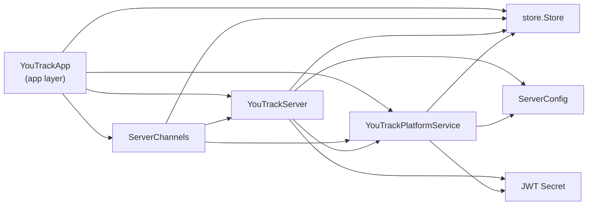

# مخطط ترابط طبقة app

## تفسير مختصر

- `YouTrackApp` هو نقطة الدخول داخل طبقة التطبيق.
- `ServerChannels` يعمل كـ "مجمع خدمات" يربط التطبيق بالخادم.
- `YouTrackServer` يحتوي على `platform` وهو `YouTrackPlatformService`.
- `YouTrackPlatformService` هو المكان الذي يحمل `store.Store` و`config` و`jwtSecret`.
- `store.Store` هو الواجهة التي توفر الوصول إلى قواعد البيانات والمستودعات الفرعية.

## العلاقة الفعلية

التدفق الأساسي يكون كالتالي:

- `YouTrackApp.Store()` → `ServerChannels.Store()` → `YouTrackServer.Store()` → `YouTrackPlatformService.Store()`
- `YouTrackApp.Platform()` → `ServerChannels.Platform()` → `YouTrackServer.platform`

وهذا يعني أن التطبيق لا يصل إلى المستودع مباشرة، بل يمر أولاً عبر الـ `Channels` ثم الـ `Server` ثم الـ `PlatformService`.
