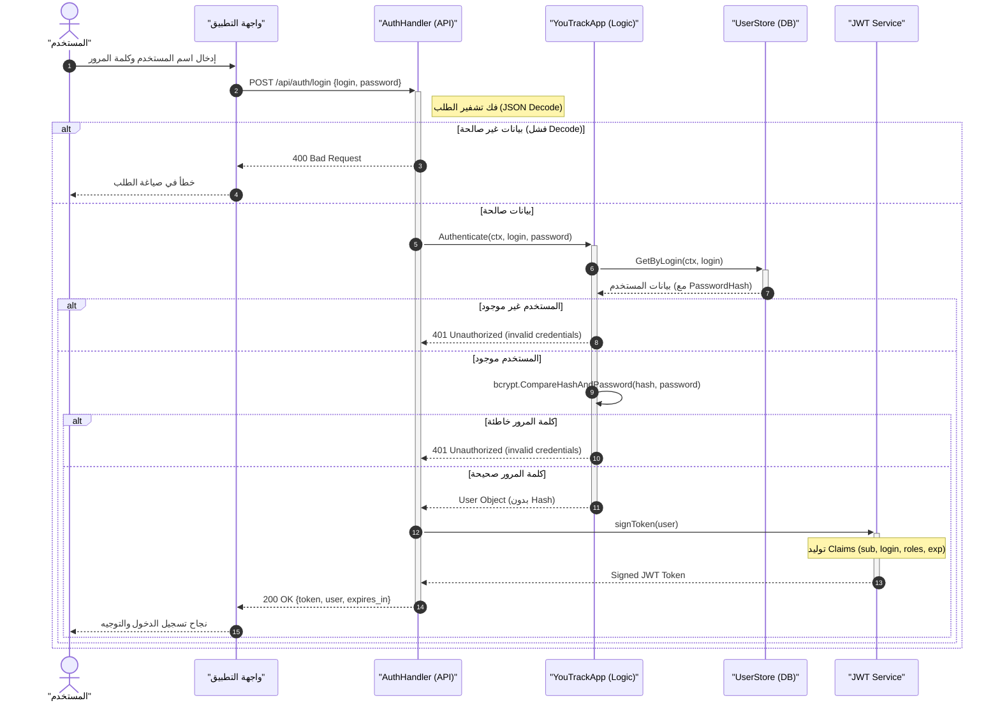

# مخطط تسلسل عملية تسجيل الدخول (Login Process)

هذا المخطط يوضح التفاعل بين مكونات النظام المختلفة عند محاولة مستخدم تسجيل الدخول.

## ملاحظات فنية

- يتم استخدام **bcrypt** لمقارنة كلمة المرور بأمان.
- يتم إصدار توكن **JWT** بصلاحية 72 ساعة.
- يتم تجريد `PasswordHash` من كائن المستخدم قبل إرساله في الاستجابة لضمان الخصوصية.
